# Hipache+Nginx SSL no Keepalive
## 10500-conc-350

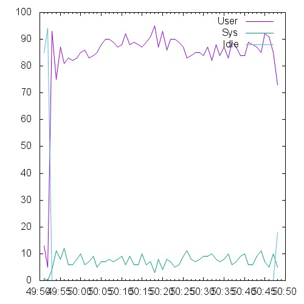 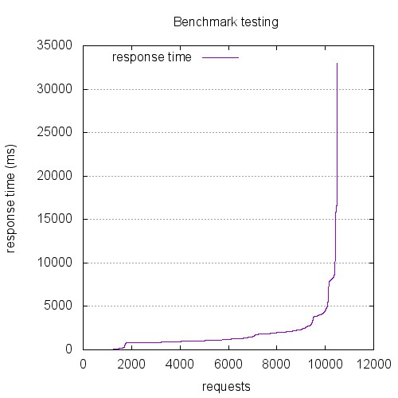 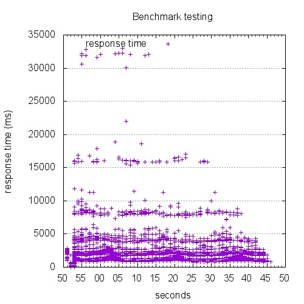

```
This is ApacheBench, Version 2.3 <$Revision: 1528965 $>
Copyright 1996 Adam Twiss, Zeus Technology Ltd, http://www.zeustech.net/
Licensed to The Apache Software Foundation, http://www.apache.org/

Benchmarking 10.129.0.72 (be patient)


Server Software:        
Server Hostname:        10.129.0.72
Server Port:            443
SSL/TLS Protocol:       TLSv1.2,ECDHE-RSA-AES256-GCM-SHA384,2048,256

Document Path:          /index.html
Document Length:        0 bytes

Concurrency Level:      350
Time taken for tests:   55.512 seconds
Complete requests:      10500
Failed requests:        125
   (Connect: 0, Receive: 0, Length: 0, Exceptions: 125)
Total transferred:      1929180 bytes
HTML transferred:       0 bytes
Requests per second:    189.15 [#/sec] (mean)
Time per request:       1850.394 [ms] (mean)
Time per request:       5.287 [ms] (mean, across all concurrent requests)
Transfer rate:          33.94 [Kbytes/sec] received

Connection Times (ms)
              min  mean[+/-sd] median   max
Connect:        0 1522 2280.2    900   32759
Processing:     0  138 234.1     55    1878
Waiting:        0  139 239.4     51    1878
Total:          7 1659 2291.9   1072   32950

Percentage of the requests served within a certain time (ms)
  50%   1072
  66%   1483
  75%   1923
  80%   2066
  90%   3054
  95%   4406
  98%   8190
  99%   9284
 100%  32950 (longest request)
```

## 1200-conc-40

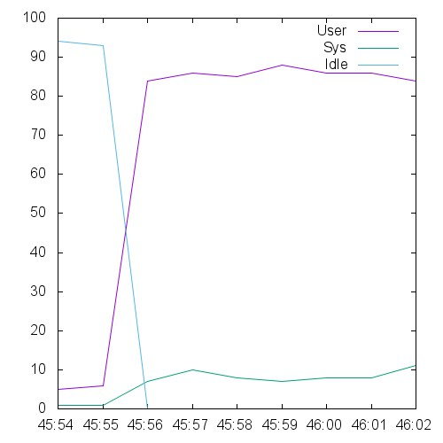 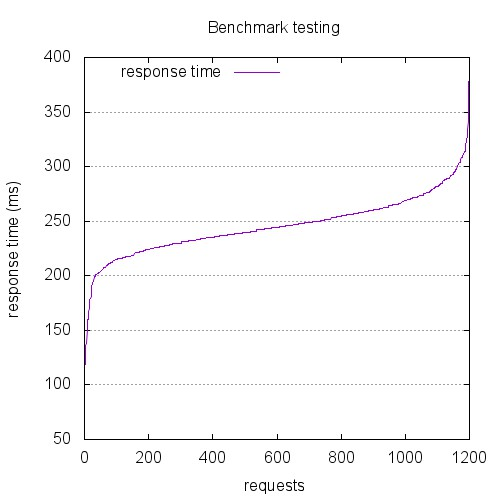 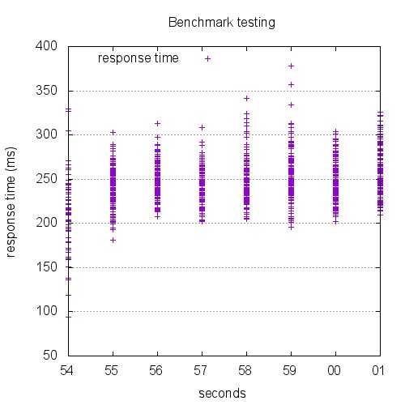

```
This is ApacheBench, Version 2.3 <$Revision: 1528965 $>
Copyright 1996 Adam Twiss, Zeus Technology Ltd, http://www.zeustech.net/
Licensed to The Apache Software Foundation, http://www.apache.org/

Benchmarking 10.129.0.72 (be patient)


Server Software:        nginx
Server Hostname:        10.129.0.72
Server Port:            443
SSL/TLS Protocol:       TLSv1.2,ECDHE-RSA-AES256-GCM-SHA384,2048,256

Document Path:          /index.html
Document Length:        0 bytes

Concurrency Level:      40
Time taken for tests:   7.473 seconds
Complete requests:      1200
Failed requests:        0
Total transferred:      266400 bytes
HTML transferred:       0 bytes
Requests per second:    160.58 [#/sec] (mean)
Time per request:       249.091 [ms] (mean)
Time per request:       6.227 [ms] (mean, across all concurrent requests)
Transfer rate:          34.81 [Kbytes/sec] received

Connection Times (ms)
              min  mean[+/-sd] median   max
Connect:       39  194  25.8    198     246
Processing:    19   51  21.5     47     202
Waiting:       19   51  21.4     47     202
Total:         93  245  27.7    244     378

Percentage of the requests served within a certain time (ms)
  50%    244
  66%    254
  75%    260
  80%    264
  90%    278
  95%    290
  98%    308
  99%    316
 100%    378 (longest request)
```

## 12000-conc-400

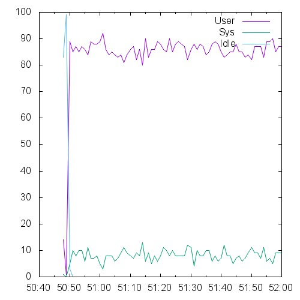 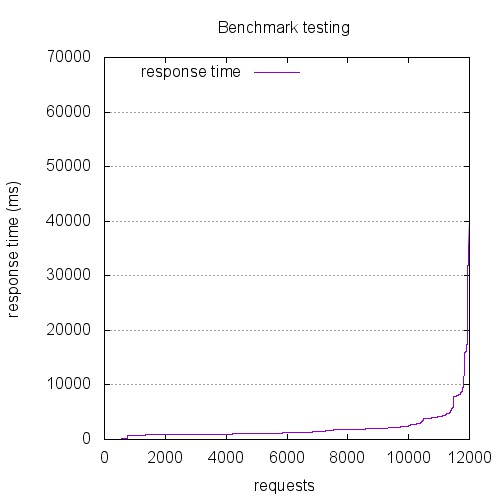 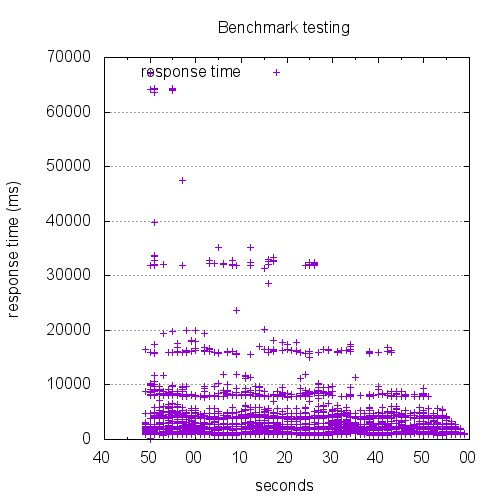

```
This is ApacheBench, Version 2.3 <$Revision: 1528965 $>
Copyright 1996 Adam Twiss, Zeus Technology Ltd, http://www.zeustech.net/
Licensed to The Apache Software Foundation, http://www.apache.org/

Benchmarking 10.129.0.72 (be patient)


Server Software:        
Server Hostname:        10.129.0.72
Server Port:            443
SSL/TLS Protocol:       TLSv1.2,ECDHE-RSA-AES256-GCM-SHA384,2048,256

Document Path:          /index.html
Document Length:        0 bytes

Concurrency Level:      400
Time taken for tests:   71.136 seconds
Complete requests:      12000
Failed requests:        27
   (Connect: 0, Receive: 0, Length: 0, Exceptions: 27)
Total transferred:      2468862 bytes
HTML transferred:       0 bytes
Requests per second:    168.69 [#/sec] (mean)
Time per request:       2371.188 [ms] (mean)
Time per request:       5.928 [ms] (mean, across all concurrent requests)
Transfer rate:          33.89 [Kbytes/sec] received

Connection Times (ms)
              min  mean[+/-sd] median   max
Connect:        0 1935 3534.6    929   67023
Processing:     0  156 233.3     60    1653
Waiting:        0  144 221.6     56    1653
Total:         14 2091 3530.0   1227   67084

Percentage of the requests served within a certain time (ms)
  50%   1227
  66%   1829
  75%   2033
  80%   2241
  90%   3988
  95%   5302
  98%   8910
  99%  16122
 100%  67084 (longest request)
```

## 13500-conc-450

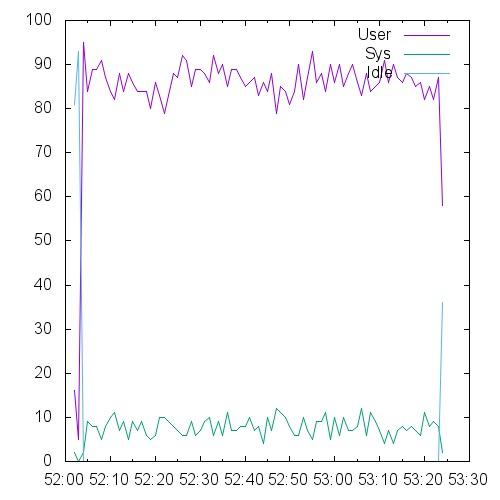 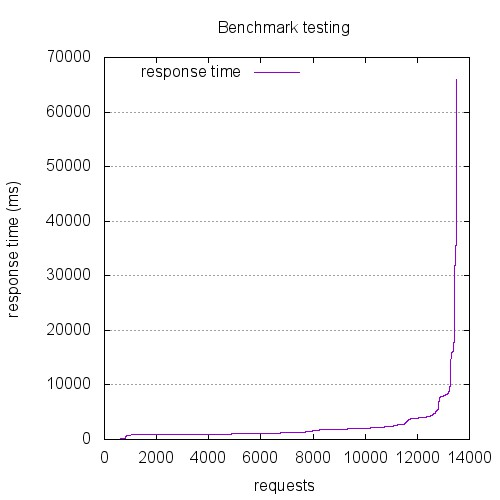 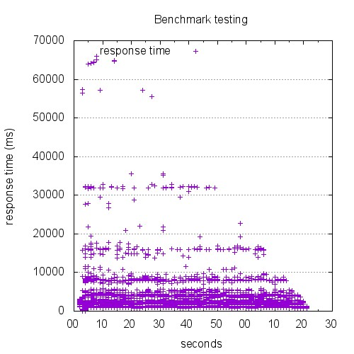

```
This is ApacheBench, Version 2.3 <$Revision: 1528965 $>
Copyright 1996 Adam Twiss, Zeus Technology Ltd, http://www.zeustech.net/
Licensed to The Apache Software Foundation, http://www.apache.org/

Benchmarking 10.129.0.72 (be patient)


Server Software:        
Server Hostname:        10.129.0.72
Server Port:            443
SSL/TLS Protocol:       TLSv1.2,ECDHE-RSA-AES256-GCM-SHA384,2048,256

Document Path:          /index.html
Document Length:        0 bytes

Concurrency Level:      450
Time taken for tests:   80.319 seconds
Complete requests:      13500
Failed requests:        173
   (Connect: 0, Receive: 0, Length: 0, Exceptions: 173)
Total transferred:      2769672 bytes
HTML transferred:       0 bytes
Requests per second:    168.08 [#/sec] (mean)
Time per request:       2677.296 [ms] (mean)
Time per request:       5.950 [ms] (mean, across all concurrent requests)
Transfer rate:          33.68 [Kbytes/sec] received

Connection Times (ms)
              min  mean[+/-sd] median   max
Connect:        0 2038 3617.1   1032   65729
Processing:     0  122 220.0     56    2100
Waiting:        0  113 213.8     52    2100
Total:         12 2160 3612.2   1184   65987

Percentage of the requests served within a certain time (ms)
  50%   1184
  66%   1873
  75%   2092
  80%   2308
  90%   4021
  95%   5710
  98%   8968
  99%  16059
 100%  65987 (longest request)
```

## 15000-conc-500

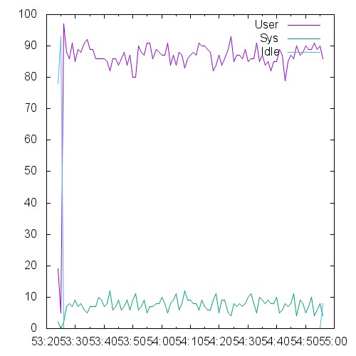 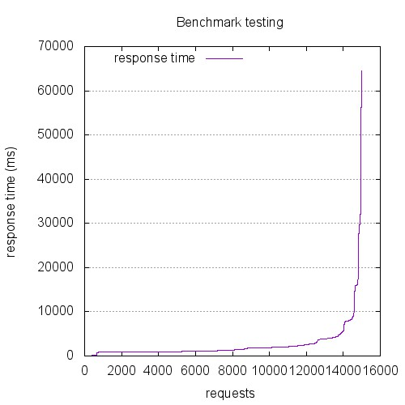 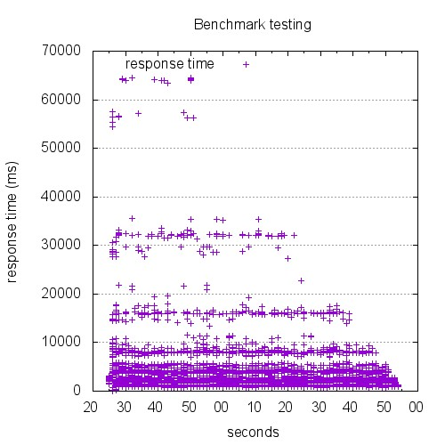

```
This is ApacheBench, Version 2.3 <$Revision: 1528965 $>
Copyright 1996 Adam Twiss, Zeus Technology Ltd, http://www.zeustech.net/
Licensed to The Apache Software Foundation, http://www.apache.org/

Benchmarking 10.129.0.72 (be patient)


Server Software:        
Server Hostname:        10.129.0.72
Server Port:            443
SSL/TLS Protocol:       TLSv1.2,ECDHE-RSA-AES256-GCM-SHA384,2048,256

Document Path:          /index.html
Document Length:        0 bytes

Concurrency Level:      500
Time taken for tests:   90.573 seconds
Complete requests:      15000
Failed requests:        244
   (Connect: 0, Receive: 0, Length: 0, Exceptions: 244)
Total transferred:      3116658 bytes
HTML transferred:       0 bytes
Requests per second:    165.61 [#/sec] (mean)
Time per request:       3019.107 [ms] (mean)
Time per request:       6.038 [ms] (mean, across all concurrent requests)
Transfer rate:          33.60 [Kbytes/sec] received

Connection Times (ms)
              min  mean[+/-sd] median   max
Connect:        0 2246 4049.0   1085   64418
Processing:     0  254 2338.5     57   56375
Waiting:        0  103 182.0     52    1691
Total:         10 2500 4598.8   1269   64550

Percentage of the requests served within a certain time (ms)
  50%   1269
  66%   1900
  75%   2174
  80%   2571
  90%   4246
  95%   7936
  98%  15926
  99%  28225
 100%  64550 (longest request)
```

## 1800-conc-60

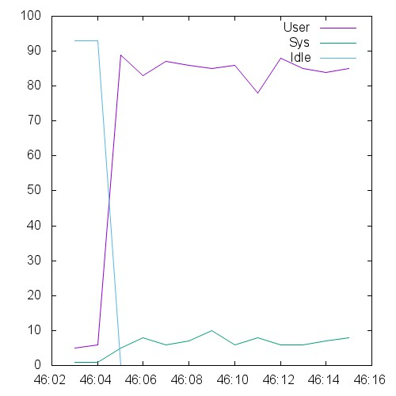 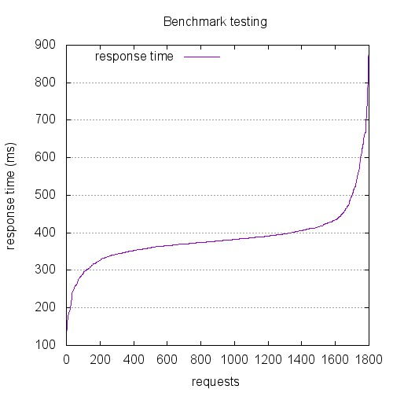 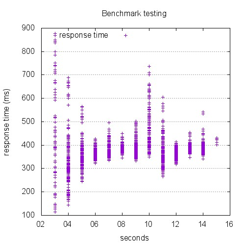

```
This is ApacheBench, Version 2.3 <$Revision: 1528965 $>
Copyright 1996 Adam Twiss, Zeus Technology Ltd, http://www.zeustech.net/
Licensed to The Apache Software Foundation, http://www.apache.org/

Benchmarking 10.129.0.72 (be patient)


Server Software:        nginx
Server Hostname:        10.129.0.72
Server Port:            443
SSL/TLS Protocol:       TLSv1.2,ECDHE-RSA-AES256-GCM-SHA384,2048,256

Document Path:          /index.html
Document Length:        0 bytes

Concurrency Level:      60
Time taken for tests:   11.733 seconds
Complete requests:      1800
Failed requests:        0
Total transferred:      399600 bytes
HTML transferred:       0 bytes
Requests per second:    153.42 [#/sec] (mean)
Time per request:       391.095 [ms] (mean)
Time per request:       6.518 [ms] (mean, across all concurrent requests)
Transfer rate:          33.26 [Kbytes/sec] received

Connection Times (ms)
              min  mean[+/-sd] median   max
Connect:        6  293  75.9    326     412
Processing:    20   91  91.3     56     742
Waiting:       19   91  91.3     56     742
Total:         78  385  75.5    378     878

Percentage of the requests served within a certain time (ms)
  50%    378
  66%    391
  75%    401
  80%    410
  90%    441
  95%    515
  98%    632
  99%    675
 100%    878 (longest request)
```

## 2400-conc-80

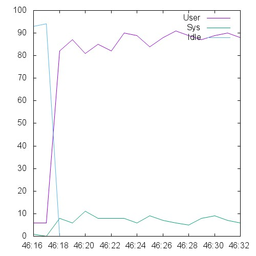 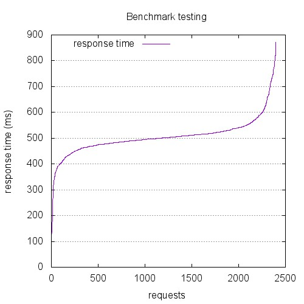 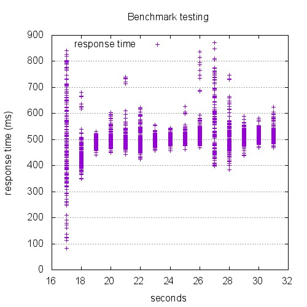

```
This is ApacheBench, Version 2.3 <$Revision: 1528965 $>
Copyright 1996 Adam Twiss, Zeus Technology Ltd, http://www.zeustech.net/
Licensed to The Apache Software Foundation, http://www.apache.org/

Benchmarking 10.129.0.72 (be patient)


Server Software:        nginx
Server Hostname:        10.129.0.72
Server Port:            443
SSL/TLS Protocol:       TLSv1.2,ECDHE-RSA-AES256-GCM-SHA384,2048,256

Document Path:          /index.html
Document Length:        0 bytes

Concurrency Level:      80
Time taken for tests:   15.391 seconds
Complete requests:      2400
Failed requests:        0
Total transferred:      532800 bytes
HTML transferred:       0 bytes
Requests per second:    155.94 [#/sec] (mean)
Time per request:       513.022 [ms] (mean)
Time per request:       6.413 [ms] (mean, across all concurrent requests)
Transfer rate:          33.81 [Kbytes/sec] received

Connection Times (ms)
              min  mean[+/-sd] median   max
Connect:        5  416  87.5    448     503
Processing:    18   89  95.3     55     622
Waiting:       18   89  95.2     54     622
Total:         59  505  70.9    501     871

Percentage of the requests served within a certain time (ms)
  50%    501
  66%    514
  75%    524
  80%    533
  90%    567
  95%    619
  98%    730
  99%    771
 100%    871 (longest request)
```

## 300-conc-10

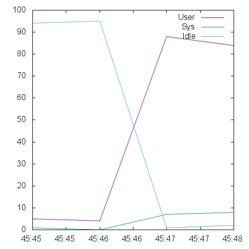 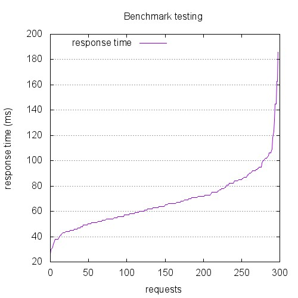 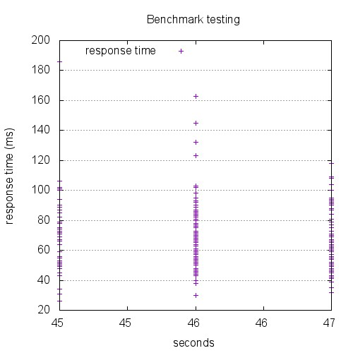

```
This is ApacheBench, Version 2.3 <$Revision: 1528965 $>
Copyright 1996 Adam Twiss, Zeus Technology Ltd, http://www.zeustech.net/
Licensed to The Apache Software Foundation, http://www.apache.org/

Benchmarking 10.129.0.72 (be patient)


Server Software:        nginx
Server Hostname:        10.129.0.72
Server Port:            443
SSL/TLS Protocol:       TLSv1.2,ECDHE-RSA-AES256-GCM-SHA384,2048,256

Document Path:          /index.html
Document Length:        0 bytes

Concurrency Level:      10
Time taken for tests:   2.037 seconds
Complete requests:      300
Failed requests:        0
Total transferred:      66600 bytes
HTML transferred:       0 bytes
Requests per second:    147.26 [#/sec] (mean)
Time per request:       67.906 [ms] (mean)
Time per request:       6.791 [ms] (mean, across all concurrent requests)
Transfer rate:          31.93 [Kbytes/sec] received

Connection Times (ms)
              min  mean[+/-sd] median   max
Connect:        5   24   7.8     24      48
Processing:     7   44  20.2     40     155
Waiting:        6   44  20.2     40     155
Total:         26   68  21.6     64     186

Percentage of the requests served within a certain time (ms)
  50%     64
  66%     72
  75%     78
  80%     82
  90%     93
  95%    103
  98%    132
  99%    163
 100%    186 (longest request)
```

## 3000-conc-100

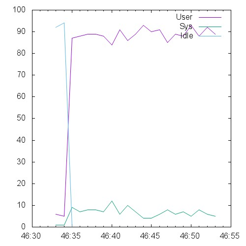 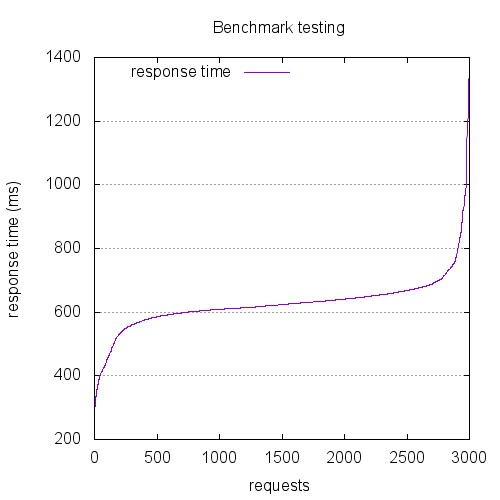 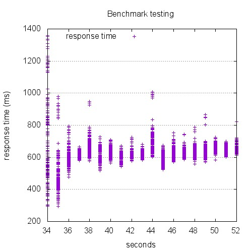

```
This is ApacheBench, Version 2.3 <$Revision: 1528965 $>
Copyright 1996 Adam Twiss, Zeus Technology Ltd, http://www.zeustech.net/
Licensed to The Apache Software Foundation, http://www.apache.org/

Benchmarking 10.129.0.72 (be patient)


Server Software:        nginx
Server Hostname:        10.129.0.72
Server Port:            443
SSL/TLS Protocol:       TLSv1.2,ECDHE-RSA-AES256-GCM-SHA384,2048,256

Document Path:          /index.html
Document Length:        0 bytes

Concurrency Level:      100
Time taken for tests:   19.168 seconds
Complete requests:      3000
Failed requests:        0
Total transferred:      666000 bytes
HTML transferred:       0 bytes
Requests per second:    156.51 [#/sec] (mean)
Time per request:       638.927 [ms] (mean)
Time per request:       6.389 [ms] (mean, across all concurrent requests)
Transfer rate:          33.93 [Kbytes/sec] received

Connection Times (ms)
              min  mean[+/-sd] median   max
Connect:      106  537 102.4    570     635
Processing:    19   91 117.2     55    1020
Waiting:       19   90 117.2     54    1019
Total:        281  628  92.2    624    1359

Percentage of the requests served within a certain time (ms)
  50%    624
  66%    640
  75%    652
  80%    661
  90%    688
  95%    739
  98%    881
  99%    978
 100%   1359 (longest request)
```

## 4500-conc-150

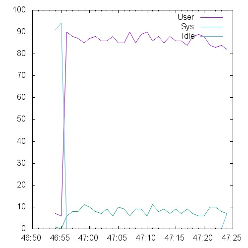 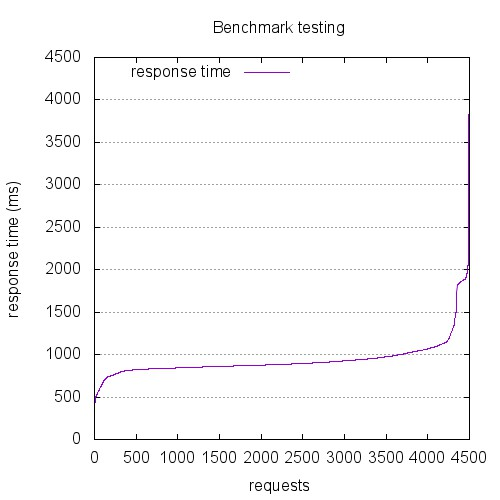 

```
This is ApacheBench, Version 2.3 <$Revision: 1528965 $>
Copyright 1996 Adam Twiss, Zeus Technology Ltd, http://www.zeustech.net/
Licensed to The Apache Software Foundation, http://www.apache.org/

Benchmarking 10.129.0.72 (be patient)


Server Software:        nginx
Server Hostname:        10.129.0.72
Server Port:            443
SSL/TLS Protocol:       TLSv1.2,ECDHE-RSA-AES256-GCM-SHA384,2048,256

Document Path:          /index.html
Document Length:        0 bytes

Concurrency Level:      150
Time taken for tests:   28.738 seconds
Complete requests:      4500
Failed requests:        0
Total transferred:      999000 bytes
HTML transferred:       0 bytes
Requests per second:    156.59 [#/sec] (mean)
Time per request:       957.932 [ms] (mean)
Time per request:       6.386 [ms] (mean, across all concurrent requests)
Transfer rate:          33.95 [Kbytes/sec] received

Connection Times (ms)
              min  mean[+/-sd] median   max
Connect:       11  822 276.1    824    3874
Processing:    17  119 168.2     57    1390
Waiting:       17  118 168.2     56    1390
Total:        386  941 237.6    885    4088

Percentage of the requests served within a certain time (ms)
  50%    885
  66%    924
  75%    958
  80%    988
  90%   1081
  95%   1241
  98%   1867
  99%   1899
 100%   4088 (longest request)
```

## 600-conc-20

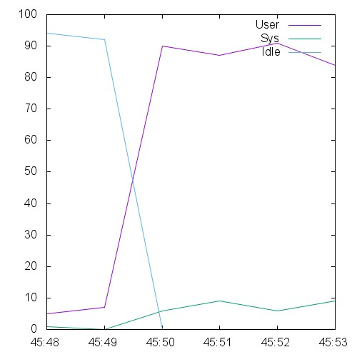 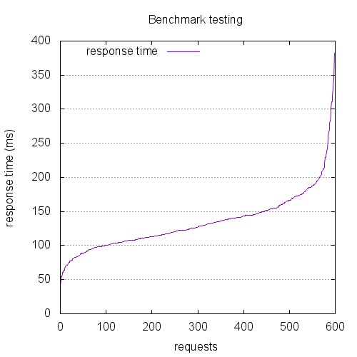 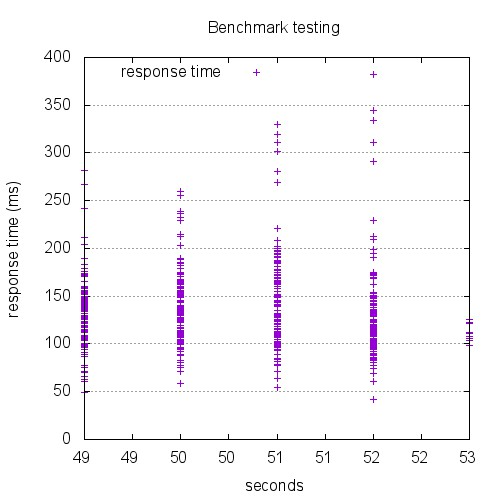

```
This is ApacheBench, Version 2.3 <$Revision: 1528965 $>
Copyright 1996 Adam Twiss, Zeus Technology Ltd, http://www.zeustech.net/
Licensed to The Apache Software Foundation, http://www.apache.org/

Benchmarking 10.129.0.72 (be patient)


Server Software:        nginx
Server Hostname:        10.129.0.72
Server Port:            443
SSL/TLS Protocol:       TLSv1.2,ECDHE-RSA-AES256-GCM-SHA384,2048,256

Document Path:          /index.html
Document Length:        0 bytes

Concurrency Level:      20
Time taken for tests:   4.072 seconds
Complete requests:      600
Failed requests:        0
Total transferred:      133200 bytes
HTML transferred:       0 bytes
Requests per second:    147.34 [#/sec] (mean)
Time per request:       135.744 [ms] (mean)
Time per request:       6.787 [ms] (mean, across all concurrent requests)
Transfer rate:          31.94 [Kbytes/sec] received

Connection Times (ms)
              min  mean[+/-sd] median   max
Connect:        4   44  23.7     39     114
Processing:    21   90  45.1     84     334
Waiting:       21   89  45.1     84     334
Total:         34  134  43.1    127     382

Percentage of the requests served within a certain time (ms)
  50%    127
  66%    141
  75%    152
  80%    159
  90%    183
  95%    203
  98%    269
  99%    311
 100%    382 (longest request)
```

## 6000-conc-200

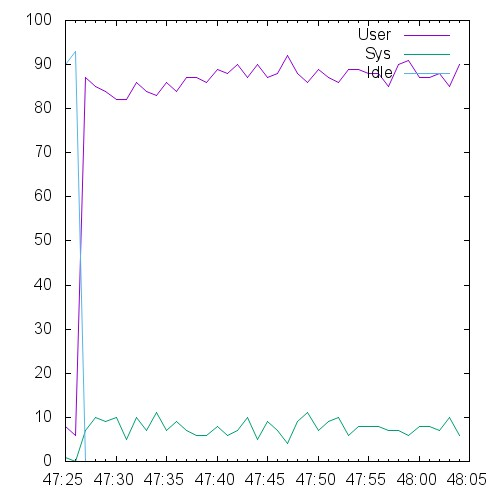 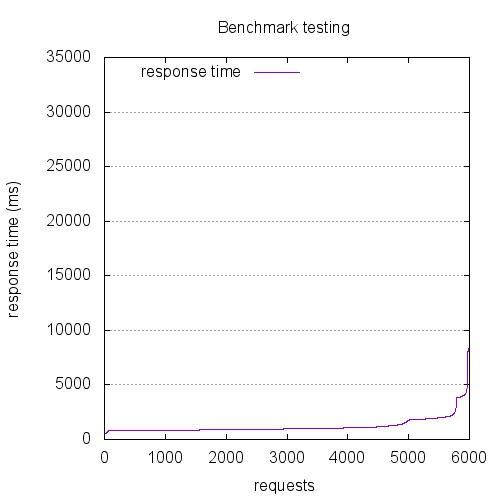 

```
This is ApacheBench, Version 2.3 <$Revision: 1528965 $>
Copyright 1996 Adam Twiss, Zeus Technology Ltd, http://www.zeustech.net/
Licensed to The Apache Software Foundation, http://www.apache.org/

Benchmarking 10.129.0.72 (be patient)


Server Software:        nginx
Server Hostname:        10.129.0.72
Server Port:            443
SSL/TLS Protocol:       TLSv1.2,ECDHE-RSA-AES256-GCM-SHA384,2048,256

Document Path:          /index.html
Document Length:        0 bytes

Concurrency Level:      200
Time taken for tests:   38.145 seconds
Complete requests:      6000
Failed requests:        0
Total transferred:      1332000 bytes
HTML transferred:       0 bytes
Requests per second:    157.29 [#/sec] (mean)
Time per request:       1271.506 [ms] (mean)
Time per request:       6.358 [ms] (mean, across all concurrent requests)
Transfer rate:          34.10 [Kbytes/sec] received

Connection Times (ms)
              min  mean[+/-sd] median   max
Connect:      151 1135 912.8    867   31866
Processing:    16  103 130.8     58    1158
Waiting:       16  103 130.8     58    1158
Total:        296 1238 909.6    966   31907

Percentage of the requests served within a certain time (ms)
  50%    966
  66%   1056
  75%   1153
  80%   1308
  90%   1922
  95%   2176
  98%   3958
  99%   4224
 100%  31907 (longest request)
```

## 7500-conc-250

 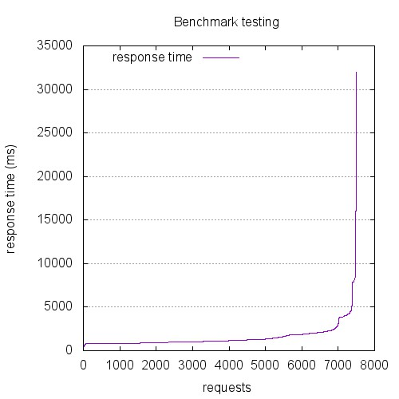 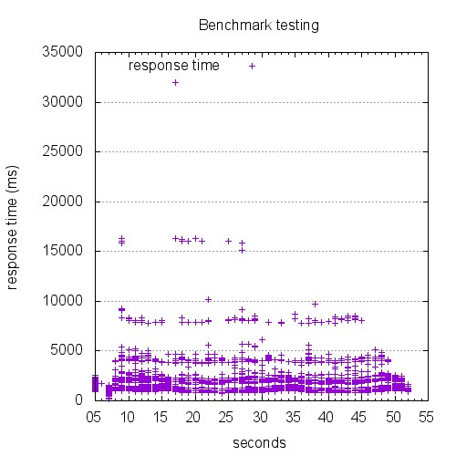

```
This is ApacheBench, Version 2.3 <$Revision: 1528965 $>
Copyright 1996 Adam Twiss, Zeus Technology Ltd, http://www.zeustech.net/
Licensed to The Apache Software Foundation, http://www.apache.org/

Benchmarking 10.129.0.72 (be patient)


Server Software:        nginx
Server Hostname:        10.129.0.72
Server Port:            443
SSL/TLS Protocol:       TLSv1.2,ECDHE-RSA-AES256-GCM-SHA384,2048,256

Document Path:          /index.html
Document Length:        0 bytes

Concurrency Level:      250
Time taken for tests:   47.734 seconds
Complete requests:      7500
Failed requests:        0
Total transferred:      1665000 bytes
HTML transferred:       0 bytes
Requests per second:    157.12 [#/sec] (mean)
Time per request:       1591.145 [ms] (mean)
Time per request:       6.365 [ms] (mean, across all concurrent requests)
Transfer rate:          34.06 [Kbytes/sec] received

Connection Times (ms)
              min  mean[+/-sd] median   max
Connect:        3 1342 1362.7    891   31935
Processing:    16  182 247.1     78    1900
Waiting:       15  181 247.1     77    1891
Total:        205 1524 1355.7   1098   32018

Percentage of the requests served within a certain time (ms)
  50%   1098
  66%   1320
  75%   1740
  80%   1868
  90%   2272
  95%   3875
  98%   4572
  99%   8005
 100%  32018 (longest request)
```

## 9000-conc-300

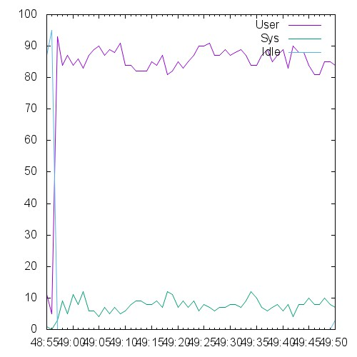 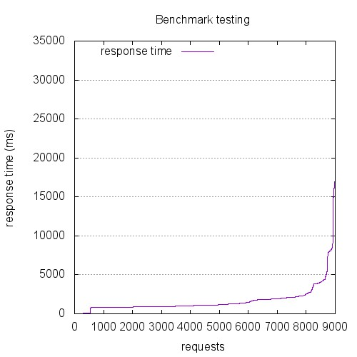 

```
This is ApacheBench, Version 2.3 <$Revision: 1528965 $>
Copyright 1996 Adam Twiss, Zeus Technology Ltd, http://www.zeustech.net/
Licensed to The Apache Software Foundation, http://www.apache.org/

Benchmarking 10.129.0.72 (be patient)


Server Software:        
Server Hostname:        10.129.0.72
Server Port:            443
SSL/TLS Protocol:       TLSv1.2,ECDHE-RSA-AES256-GCM-SHA384,2048,256

Document Path:          /index.html
Document Length:        0 bytes

Concurrency Level:      300
Time taken for tests:   53.661 seconds
Complete requests:      9000
Failed requests:        73
   (Connect: 0, Receive: 0, Length: 0, Exceptions: 73)
Total transferred:      1866576 bytes
HTML transferred:       0 bytes
Requests per second:    167.72 [#/sec] (mean)
Time per request:       1788.693 [ms] (mean)
Time per request:       5.962 [ms] (mean, across all concurrent requests)
Transfer rate:          33.97 [Kbytes/sec] received

Connection Times (ms)
              min  mean[+/-sd] median   max
Connect:        0 1529 1972.4    892   33165
Processing:     0  137 215.9     54    1550
Waiting:        0  134 216.8     52    1550
Total:          5 1665 1972.3   1088   33247

Percentage of the requests served within a certain time (ms)
  50%   1088
  66%   1436
  75%   1875
  80%   2019
  90%   2710
  95%   4176
  98%   8053
  99%   8822
 100%  33247 (longest request)
```

