# Vulcand SSL no Keepalive
## 10500-conc-350

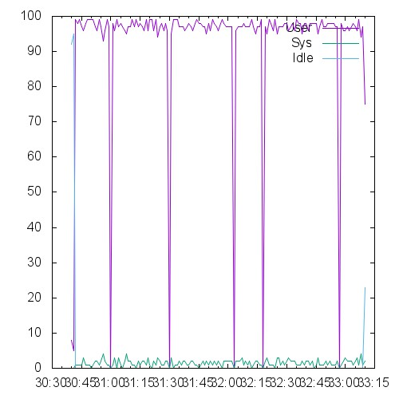 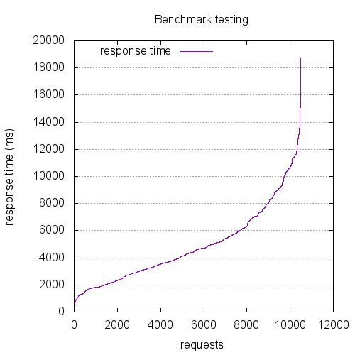 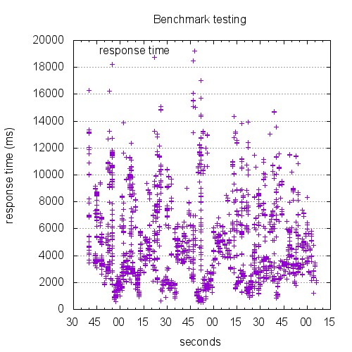

```
This is ApacheBench, Version 2.3 <$Revision: 1528965 $>
Copyright 1996 Adam Twiss, Zeus Technology Ltd, http://www.zeustech.net/
Licensed to The Apache Software Foundation, http://www.apache.org/

Benchmarking 10.129.0.26 (be patient)


Server Software:        nginx/1.4.6
Server Hostname:        10.129.0.26
Server Port:            443
SSL/TLS Protocol:       TLSv1.2,ECDHE-RSA-AES256-SHA,2048,256

Document Path:          /index.html
Document Length:        0 bytes

Concurrency Level:      350
Time taken for tests:   148.433 seconds
Complete requests:      10500
Failed requests:        0
Total transferred:      2289000 bytes
HTML transferred:       0 bytes
Requests per second:    70.74 [#/sec] (mean)
Time per request:       4947.768 [ms] (mean)
Time per request:       14.136 [ms] (mean, across all concurrent requests)
Transfer rate:          15.06 [Kbytes/sec] received

Connection Times (ms)
              min  mean[+/-sd] median   max
Connect:      119 2628 2235.4   1826   15502
Processing:   154 2241 1712.6   1807   11497
Waiting:      154 2241 1712.5   1807   11497
Total:        527 4869 2813.4   4302   18743

Percentage of the requests served within a certain time (ms)
  50%   4302
  66%   5349
  75%   6199
  80%   7053
  90%   9072
  95%  10622
  98%  11707
  99%  13094
 100%  18743 (longest request)
```

## 1200-conc-40

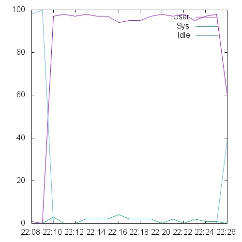 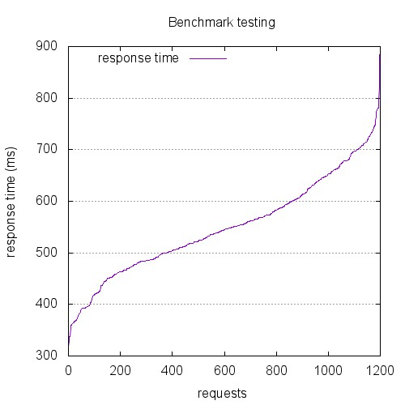 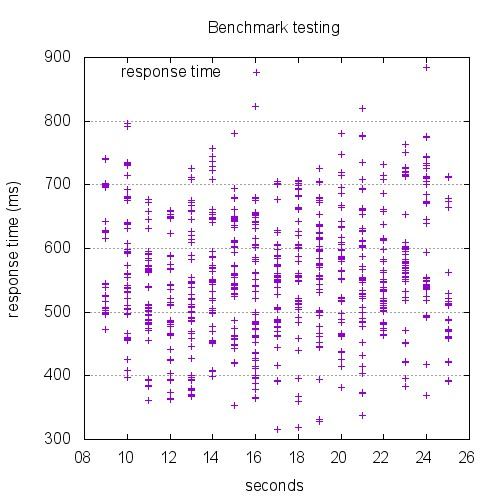

```
This is ApacheBench, Version 2.3 <$Revision: 1528965 $>
Copyright 1996 Adam Twiss, Zeus Technology Ltd, http://www.zeustech.net/
Licensed to The Apache Software Foundation, http://www.apache.org/

Benchmarking 10.129.0.26 (be patient)


Server Software:        nginx/1.4.6
Server Hostname:        10.129.0.26
Server Port:            443
SSL/TLS Protocol:       TLSv1.2,ECDHE-RSA-AES256-SHA,2048,256

Document Path:          /index.html
Document Length:        0 bytes

Concurrency Level:      40
Time taken for tests:   16.604 seconds
Complete requests:      1200
Failed requests:        0
Total transferred:      261600 bytes
HTML transferred:       0 bytes
Requests per second:    72.27 [#/sec] (mean)
Time per request:       553.464 [ms] (mean)
Time per request:       13.837 [ms] (mean, across all concurrent requests)
Transfer rate:          15.39 [Kbytes/sec] received

Connection Times (ms)
              min  mean[+/-sd] median   max
Connect:       35  233  77.1    226     513
Processing:    49  316  78.9    319     547
Waiting:       49  316  78.9    319     546
Total:        288  549  95.3    545     884

Percentage of the requests served within a certain time (ms)
  50%    545
  66%    580
  75%    613
  80%    639
  90%    681
  95%    712
  98%    743
  99%    776
 100%    884 (longest request)
```

## 12000-conc-400

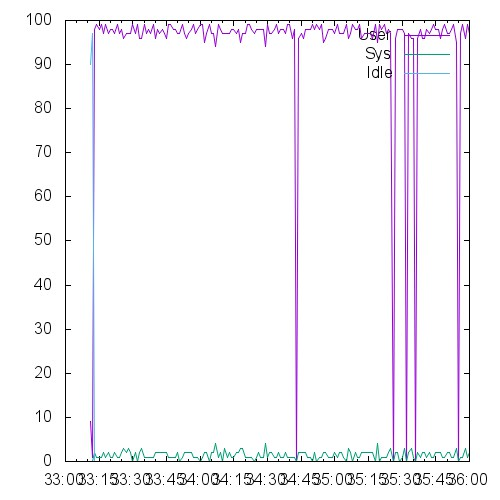 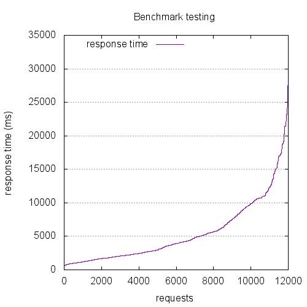 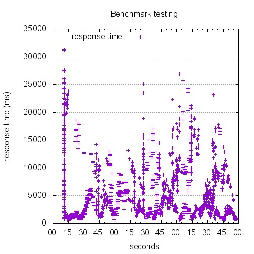

```
This is ApacheBench, Version 2.3 <$Revision: 1528965 $>
Copyright 1996 Adam Twiss, Zeus Technology Ltd, http://www.zeustech.net/
Licensed to The Apache Software Foundation, http://www.apache.org/

Benchmarking 10.129.0.26 (be patient)


Server Software:        nginx/1.4.6
Server Hostname:        10.129.0.26
Server Port:            443
SSL/TLS Protocol:       TLSv1.2,ECDHE-RSA-AES256-SHA,2048,256

Document Path:          /index.html
Document Length:        0 bytes

Concurrency Level:      400
Time taken for tests:   167.709 seconds
Complete requests:      12000
Failed requests:        0
Total transferred:      2616000 bytes
HTML transferred:       0 bytes
Requests per second:    71.55 [#/sec] (mean)
Time per request:       5590.301 [ms] (mean)
Time per request:       13.976 [ms] (mean, across all concurrent requests)
Transfer rate:          15.23 [Kbytes/sec] received

Connection Times (ms)
              min  mean[+/-sd] median   max
Connect:      108 3211 3967.6   1559   29330
Processing:   175 2242 2475.8   1525   21250
Waiting:      175 2242 2475.7   1525   21250
Total:        320 5453 4719.0   3926   31311

Percentage of the requests served within a certain time (ms)
  50%   3926
  66%   5604
  75%   7530
  80%   9039
  90%  11462
  95%  15372
  98%  19364
  99%  21738
 100%  31311 (longest request)
```

## 13500-conc-450

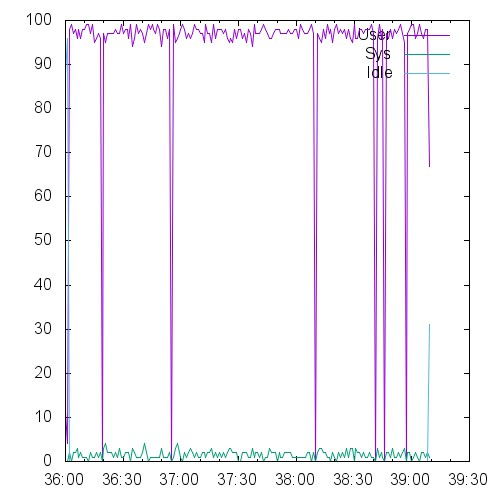 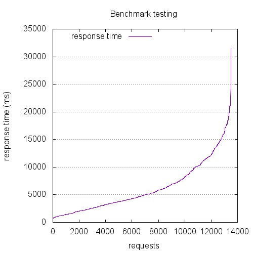 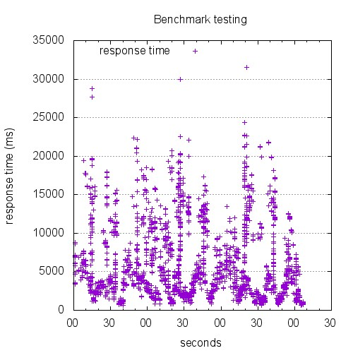

```
This is ApacheBench, Version 2.3 <$Revision: 1528965 $>
Copyright 1996 Adam Twiss, Zeus Technology Ltd, http://www.zeustech.net/
Licensed to The Apache Software Foundation, http://www.apache.org/

Benchmarking 10.129.0.26 (be patient)


Server Software:        nginx/1.4.6
Server Hostname:        10.129.0.26
Server Port:            443
SSL/TLS Protocol:       TLSv1.2,ECDHE-RSA-AES256-SHA,2048,256

Document Path:          /index.html
Document Length:        0 bytes

Concurrency Level:      450
Time taken for tests:   187.362 seconds
Complete requests:      13500
Failed requests:        0
Total transferred:      2934934 bytes
HTML transferred:       0 bytes
Requests per second:    72.05 [#/sec] (mean)
Time per request:       6245.391 [ms] (mean)
Time per request:       13.879 [ms] (mean, across all concurrent requests)
Transfer rate:          15.30 [Kbytes/sec] received

Connection Times (ms)
              min  mean[+/-sd] median   max
Connect:        0 3345 3391.8   1910   27681
Processing:   223 2826 2724.5   2006   17464
Waiting:        0 2815 2728.8   2000   17464
Total:        565 6171 4509.1   4831   31543

Percentage of the requests served within a certain time (ms)
  50%   4831
  66%   6773
  75%   8410
  80%   9982
  90%  12827
  95%  15395
  98%  17962
  99%  19802
 100%  31543 (longest request)
```

## 15000-conc-500

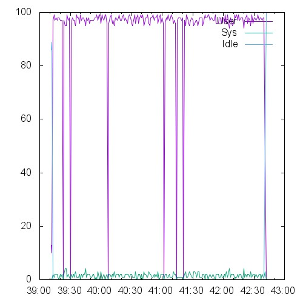 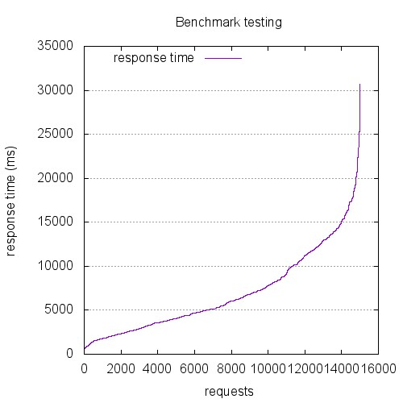 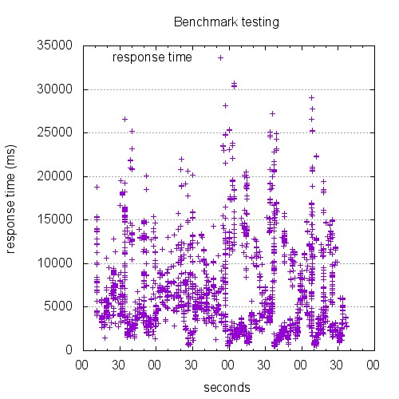

```
This is ApacheBench, Version 2.3 <$Revision: 1528965 $>
Copyright 1996 Adam Twiss, Zeus Technology Ltd, http://www.zeustech.net/
Licensed to The Apache Software Foundation, http://www.apache.org/

Benchmarking 10.129.0.26 (be patient)


Server Software:        nginx/1.4.6
Server Hostname:        10.129.0.26
Server Port:            443
SSL/TLS Protocol:       TLSv1.2,ECDHE-RSA-AES256-SHA,2048,256

Document Path:          /index.html
Document Length:        0 bytes

Concurrency Level:      500
Time taken for tests:   208.592 seconds
Complete requests:      15000
Failed requests:        0
Total transferred:      3270000 bytes
HTML transferred:       0 bytes
Requests per second:    71.91 [#/sec] (mean)
Time per request:       6953.063 [ms] (mean)
Time per request:       13.906 [ms] (mean, across all concurrent requests)
Transfer rate:          15.31 [Kbytes/sec] received

Connection Times (ms)
              min  mean[+/-sd] median   max
Connect:      146 3936 3737.9   2508   27464
Processing:   113 3001 2808.9   2287   17358
Waiting:      113 3001 2808.7   2286   17358
Total:        455 6937 4704.8   5494   30681

Percentage of the requests served within a certain time (ms)
  50%   5494
  66%   7583
  75%   9917
  80%  11152
  90%  13681
  95%  15949
  98%  18752
  99%  20816
 100%  30681 (longest request)
```

## 1800-conc-60

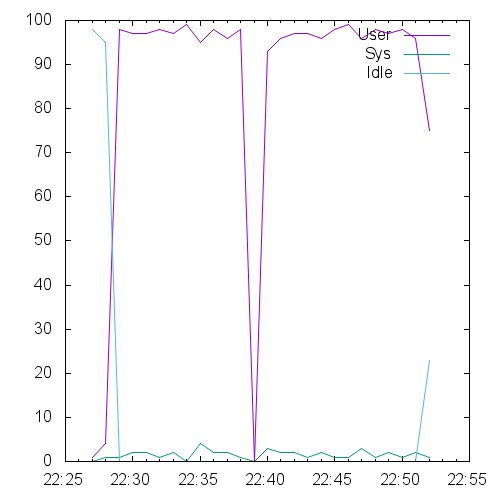 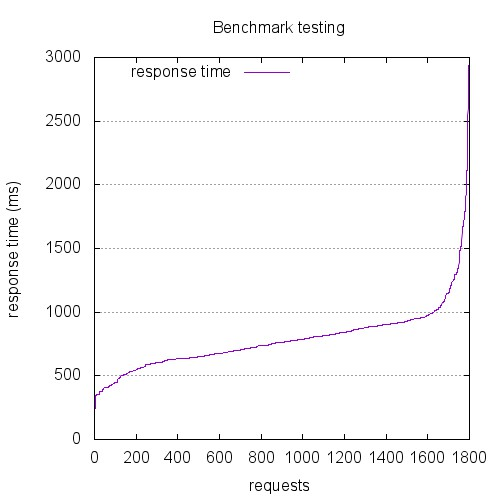 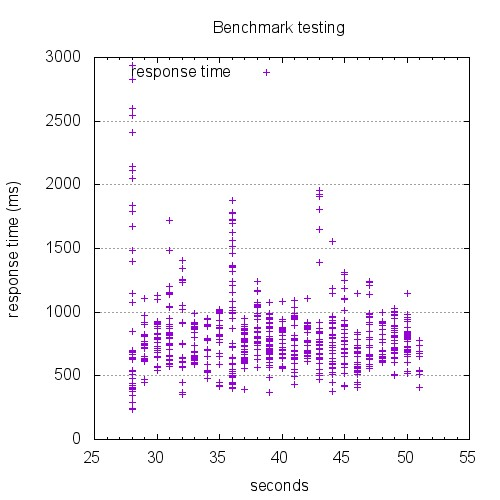

```
This is ApacheBench, Version 2.3 <$Revision: 1528965 $>
Copyright 1996 Adam Twiss, Zeus Technology Ltd, http://www.zeustech.net/
Licensed to The Apache Software Foundation, http://www.apache.org/

Benchmarking 10.129.0.26 (be patient)


Server Software:        nginx/1.4.6
Server Hostname:        10.129.0.26
Server Port:            443
SSL/TLS Protocol:       TLSv1.2,ECDHE-RSA-AES256-SHA,2048,256

Document Path:          /index.html
Document Length:        0 bytes

Concurrency Level:      60
Time taken for tests:   23.810 seconds
Complete requests:      1800
Failed requests:        0
Total transferred:      392400 bytes
HTML transferred:       0 bytes
Requests per second:    75.60 [#/sec] (mean)
Time per request:       793.661 [ms] (mean)
Time per request:       13.228 [ms] (mean, across all concurrent requests)
Transfer rate:          16.09 [Kbytes/sec] received

Connection Times (ms)
              min  mean[+/-sd] median   max
Connect:       39  337 216.4    293    2413
Processing:   103  451 156.1    441    1760
Waiting:      102  451 156.1    441    1760
Total:        167  787 267.5    763    2938

Percentage of the requests served within a certain time (ms)
  50%    763
  66%    840
  75%    890
  80%    913
  90%    991
  95%   1204
  98%   1562
  99%   1834
 100%   2938 (longest request)
```

## 2400-conc-80

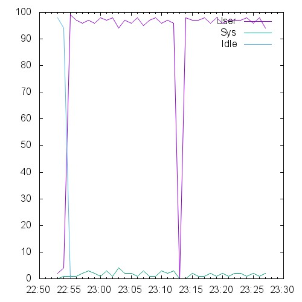 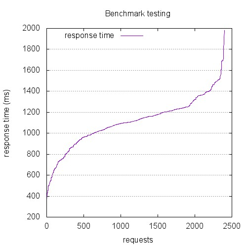 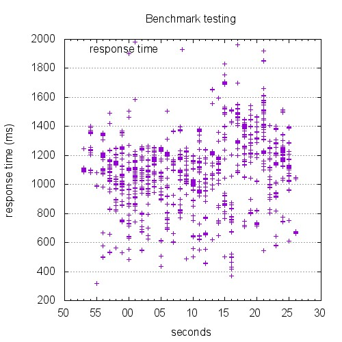

```
This is ApacheBench, Version 2.3 <$Revision: 1528965 $>
Copyright 1996 Adam Twiss, Zeus Technology Ltd, http://www.zeustech.net/
Licensed to The Apache Software Foundation, http://www.apache.org/

Benchmarking 10.129.0.26 (be patient)


Server Software:        nginx/1.4.6
Server Hostname:        10.129.0.26
Server Port:            443
SSL/TLS Protocol:       TLSv1.2,ECDHE-RSA-AES256-SHA,2048,256

Document Path:          /index.html
Document Length:        0 bytes

Concurrency Level:      80
Time taken for tests:   33.376 seconds
Complete requests:      2400
Failed requests:        0
Total transferred:      523200 bytes
HTML transferred:       0 bytes
Requests per second:    71.91 [#/sec] (mean)
Time per request:       1112.549 [ms] (mean)
Time per request:       13.907 [ms] (mean, across all concurrent requests)
Transfer rate:          15.31 [Kbytes/sec] received

Connection Times (ms)
              min  mean[+/-sd] median   max
Connect:       64  504 235.0    484    1468
Processing:    24  605 205.6    606    1612
Waiting:       24  605 205.6    605    1612
Total:        277 1109 236.8   1118    1983

Percentage of the requests served within a certain time (ms)
  50%   1118
  66%   1201
  75%   1235
  80%   1257
  90%   1394
  95%   1491
  98%   1565
  99%   1694
 100%   1983 (longest request)
```

## 300-conc-10

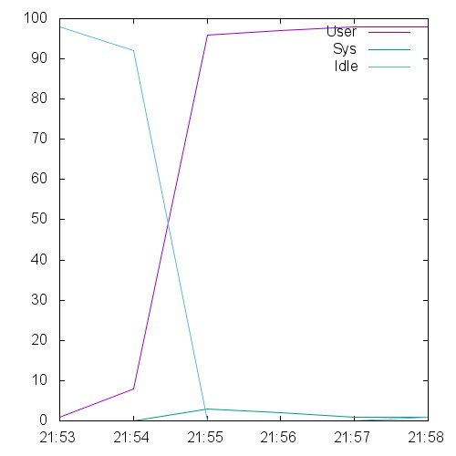 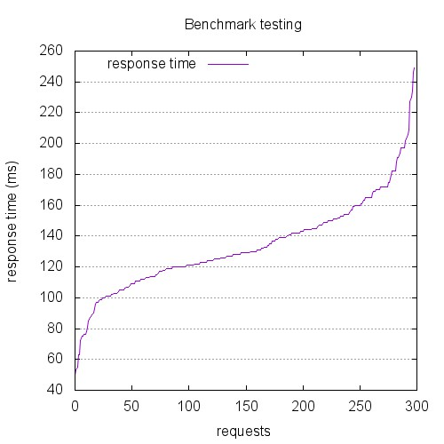 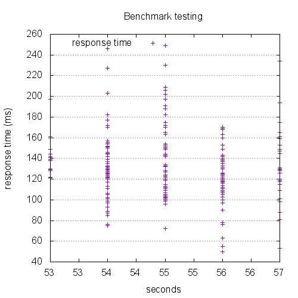

```
This is ApacheBench, Version 2.3 <$Revision: 1528965 $>
Copyright 1996 Adam Twiss, Zeus Technology Ltd, http://www.zeustech.net/
Licensed to The Apache Software Foundation, http://www.apache.org/

Benchmarking 10.129.0.26 (be patient)


Server Software:        nginx/1.4.6
Server Hostname:        10.129.0.26
Server Port:            443
SSL/TLS Protocol:       TLSv1.2,ECDHE-RSA-AES256-SHA,2048,256

Document Path:          /index.html
Document Length:        0 bytes

Concurrency Level:      10
Time taken for tests:   4.068 seconds
Complete requests:      300
Failed requests:        0
Total transferred:      65400 bytes
HTML transferred:       0 bytes
Requests per second:    73.74 [#/sec] (mean)
Time per request:       135.607 [ms] (mean)
Time per request:       13.561 [ms] (mean, across all concurrent requests)
Transfer rate:          15.70 [Kbytes/sec] received

Connection Times (ms)
              min  mean[+/-sd] median   max
Connect:       13   78  27.5     77     154
Processing:     5   55  29.3     54     139
Waiting:        5   55  29.3     54     139
Total:         45  133  31.1    129     249

Percentage of the requests served within a certain time (ms)
  50%    129
  66%    142
  75%    150
  80%    154
  90%    172
  95%    191
  98%    209
  99%    234
 100%    249 (longest request)
```

## 3000-conc-100

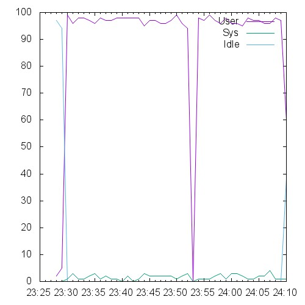 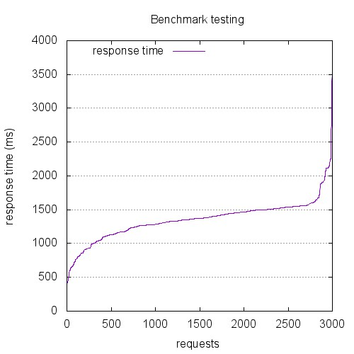 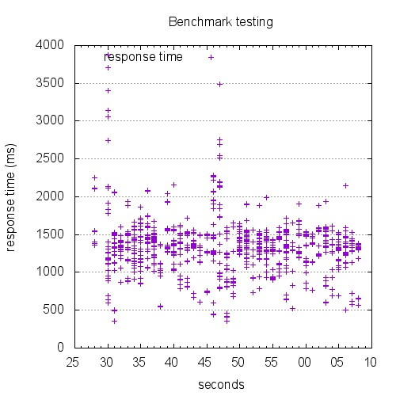

```
This is ApacheBench, Version 2.3 <$Revision: 1528965 $>
Copyright 1996 Adam Twiss, Zeus Technology Ltd, http://www.zeustech.net/
Licensed to The Apache Software Foundation, http://www.apache.org/

Benchmarking 10.129.0.26 (be patient)


Server Software:        nginx/1.4.6
Server Hostname:        10.129.0.26
Server Port:            443
SSL/TLS Protocol:       TLSv1.2,ECDHE-RSA-AES256-SHA,2048,256

Document Path:          /index.html
Document Length:        0 bytes

Concurrency Level:      100
Time taken for tests:   40.667 seconds
Complete requests:      3000
Failed requests:        0
Total transferred:      654000 bytes
HTML transferred:       0 bytes
Requests per second:    73.77 [#/sec] (mean)
Time per request:       1355.581 [ms] (mean)
Time per request:       13.556 [ms] (mean, across all concurrent requests)
Transfer rate:          15.70 [Kbytes/sec] received

Connection Times (ms)
              min  mean[+/-sd] median   max
Connect:       42  631 298.5    641    2855
Processing:    40  722 252.7    699    1302
Waiting:       40  722 252.7    699    1302
Total:        350 1354 295.6   1372    3879

Percentage of the requests served within a certain time (ms)
  50%   1372
  66%   1465
  75%   1502
  80%   1521
  90%   1564
  95%   1714
  98%   2114
  99%   2193
 100%   3879 (longest request)
```

## 4500-conc-150

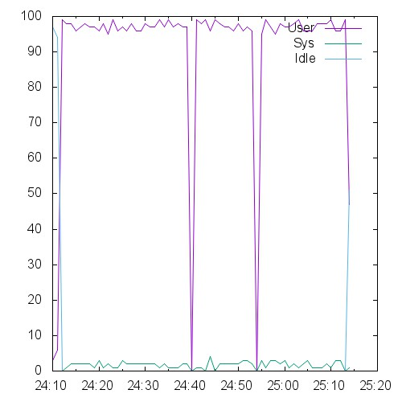 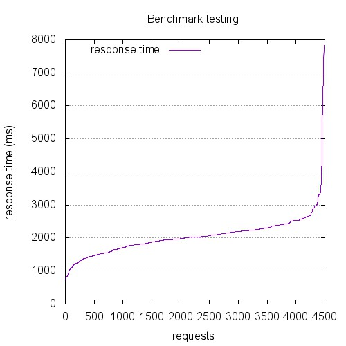 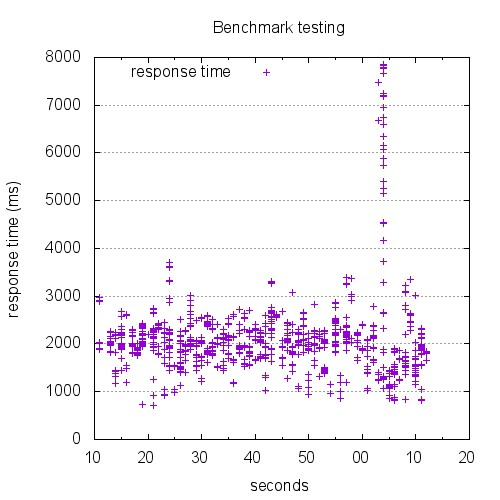

```
This is ApacheBench, Version 2.3 <$Revision: 1528965 $>
Copyright 1996 Adam Twiss, Zeus Technology Ltd, http://www.zeustech.net/
Licensed to The Apache Software Foundation, http://www.apache.org/

Benchmarking 10.129.0.26 (be patient)


Server Software:        nginx/1.4.6
Server Hostname:        10.129.0.26
Server Port:            443
SSL/TLS Protocol:       TLSv1.2,ECDHE-RSA-AES256-SHA,2048,256

Document Path:          /index.html
Document Length:        0 bytes

Concurrency Level:      150
Time taken for tests:   62.531 seconds
Complete requests:      4500
Failed requests:        0
Total transferred:      981000 bytes
HTML transferred:       0 bytes
Requests per second:    71.96 [#/sec] (mean)
Time per request:       2084.350 [ms] (mean)
Time per request:       13.896 [ms] (mean, across all concurrent requests)
Transfer rate:          15.32 [Kbytes/sec] received

Connection Times (ms)
              min  mean[+/-sd] median   max
Connect:       81 1014 686.1    901    7249
Processing:   141 1054 399.6   1042    7017
Waiting:      141 1054 399.6   1042    7017
Total:        667 2068 673.0   2030    7851

Percentage of the requests served within a certain time (ms)
  50%   2030
  66%   2194
  75%   2272
  80%   2367
  90%   2540
  95%   2767
  98%   3328
  99%   5255
 100%   7851 (longest request)
```

## 600-conc-20

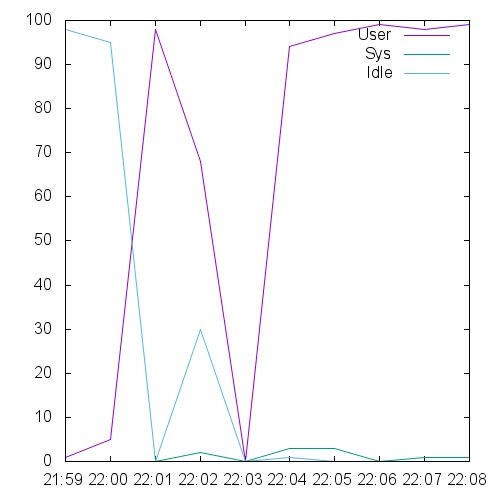 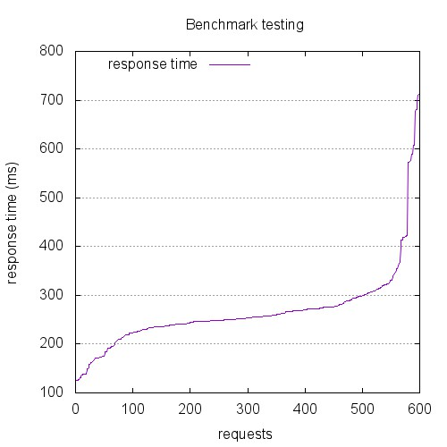 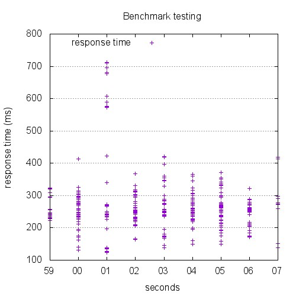

```
This is ApacheBench, Version 2.3 <$Revision: 1528965 $>
Copyright 1996 Adam Twiss, Zeus Technology Ltd, http://www.zeustech.net/
Licensed to The Apache Software Foundation, http://www.apache.org/

Benchmarking 10.129.0.26 (be patient)


Server Software:        nginx/1.4.6
Server Hostname:        10.129.0.26
Server Port:            443
SSL/TLS Protocol:       TLSv1.2,ECDHE-RSA-AES256-SHA,2048,256

Document Path:          /index.html
Document Length:        0 bytes

Concurrency Level:      20
Time taken for tests:   8.119 seconds
Complete requests:      600
Failed requests:        0
Total transferred:      130800 bytes
HTML transferred:       0 bytes
Requests per second:    73.90 [#/sec] (mean)
Time per request:       270.648 [ms] (mean)
Time per request:       13.532 [ms] (mean, across all concurrent requests)
Transfer rate:          15.73 [Kbytes/sec] received

Connection Times (ms)
              min  mean[+/-sd] median   max
Connect:       32  144  85.2    124     587
Processing:     1  122  49.6    128     259
Waiting:        1  122  49.6    128     259
Total:        111  266  83.0    254     712

Percentage of the requests served within a certain time (ms)
  50%    254
  66%    269
  75%    276
  80%    290
  90%    321
  95%    414
  98%    589
  99%    681
 100%    712 (longest request)
```

## 6000-conc-200

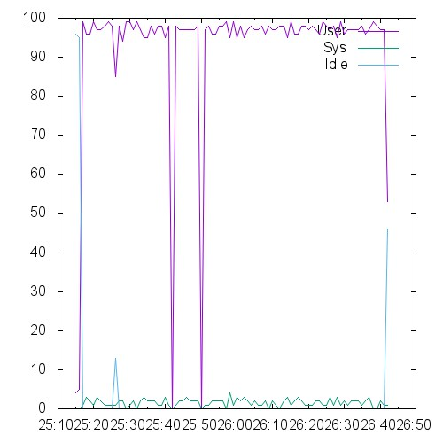 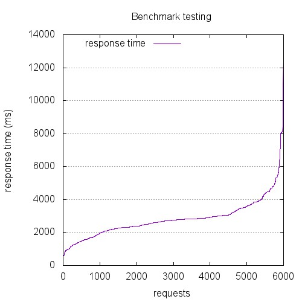 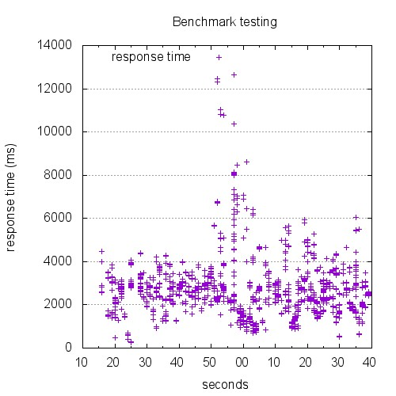

```
This is ApacheBench, Version 2.3 <$Revision: 1528965 $>
Copyright 1996 Adam Twiss, Zeus Technology Ltd, http://www.zeustech.net/
Licensed to The Apache Software Foundation, http://www.apache.org/

Benchmarking 10.129.0.26 (be patient)


Server Software:        nginx/1.4.6
Server Hostname:        10.129.0.26
Server Port:            443
SSL/TLS Protocol:       TLSv1.2,ECDHE-RSA-AES256-SHA,2048,256

Document Path:          /index.html
Document Length:        0 bytes

Concurrency Level:      200
Time taken for tests:   85.578 seconds
Complete requests:      6000
Failed requests:        0
Total transferred:      1308000 bytes
HTML transferred:       0 bytes
Requests per second:    70.11 [#/sec] (mean)
Time per request:       2852.602 [ms] (mean)
Time per request:       14.263 [ms] (mean, across all concurrent requests)
Transfer rate:          14.93 [Kbytes/sec] received

Connection Times (ms)
              min  mean[+/-sd] median   max
Connect:      100 1428 1021.3   1179    8087
Processing:    34 1401 729.6   1355    7466
Waiting:       34 1401 729.5   1355    7466
Total:        273 2829 1194.8   2744   12656

Percentage of the requests served within a certain time (ms)
  50%   2744
  66%   2905
  75%   3060
  80%   3442
  90%   4005
  95%   4782
  98%   6041
  99%   8055
 100%  12656 (longest request)
```

## 7500-conc-250

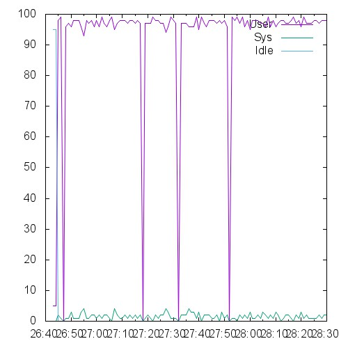  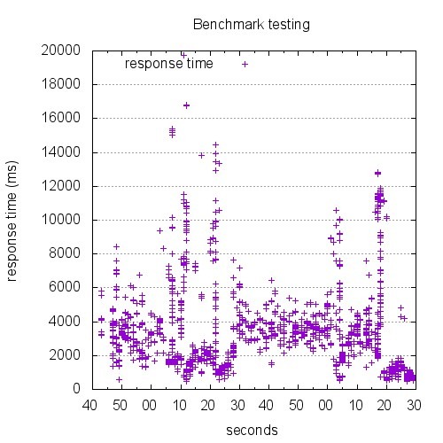

```
This is ApacheBench, Version 2.3 <$Revision: 1528965 $>
Copyright 1996 Adam Twiss, Zeus Technology Ltd, http://www.zeustech.net/
Licensed to The Apache Software Foundation, http://www.apache.org/

Benchmarking 10.129.0.26 (be patient)


Server Software:        nginx/1.4.6
Server Hostname:        10.129.0.26
Server Port:            443
SSL/TLS Protocol:       TLSv1.2,ECDHE-RSA-AES256-SHA,2048,256

Document Path:          /index.html
Document Length:        0 bytes

Concurrency Level:      250
Time taken for tests:   106.409 seconds
Complete requests:      7500
Failed requests:        0
Total transferred:      1635000 bytes
HTML transferred:       0 bytes
Requests per second:    70.48 [#/sec] (mean)
Time per request:       3546.973 [ms] (mean)
Time per request:       14.188 [ms] (mean, across all concurrent requests)
Transfer rate:          15.01 [Kbytes/sec] received

Connection Times (ms)
              min  mean[+/-sd] median   max
Connect:      108 1677 1586.2   1342   17275
Processing:   162 1725 1301.0   1465   11064
Waiting:      162 1725 1300.9   1465   11064
Total:        489 3403 2033.5   3235   19750

Percentage of the requests served within a certain time (ms)
  50%   3235
  66%   3683
  75%   3984
  80%   4155
  90%   5486
  95%   7430
  98%   9755
  99%  11198
 100%  19750 (longest request)
```

## 9000-conc-300

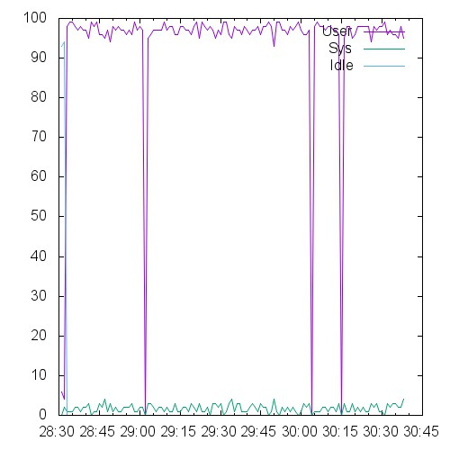 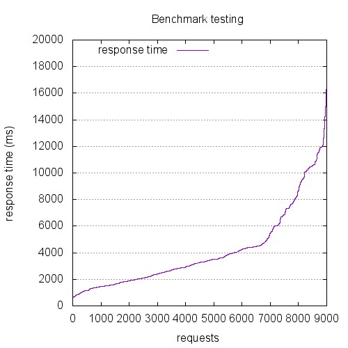 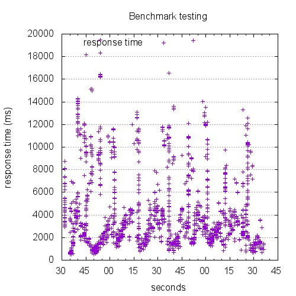

```
This is ApacheBench, Version 2.3 <$Revision: 1528965 $>
Copyright 1996 Adam Twiss, Zeus Technology Ltd, http://www.zeustech.net/
Licensed to The Apache Software Foundation, http://www.apache.org/

Benchmarking 10.129.0.26 (be patient)


Server Software:        nginx/1.4.6
Server Hostname:        10.129.0.26
Server Port:            443
SSL/TLS Protocol:       TLSv1.2,ECDHE-RSA-AES256-SHA,2048,256

Document Path:          /index.html
Document Length:        0 bytes

Concurrency Level:      300
Time taken for tests:   126.382 seconds
Complete requests:      9000
Failed requests:        0
Total transferred:      1962000 bytes
HTML transferred:       0 bytes
Requests per second:    71.21 [#/sec] (mean)
Time per request:       4212.728 [ms] (mean)
Time per request:       14.042 [ms] (mean, across all concurrent requests)
Transfer rate:          15.16 [Kbytes/sec] received

Connection Times (ms)
              min  mean[+/-sd] median   max
Connect:      138 2255 2390.1   1327   16664
Processing:   168 1869 1737.8   1443   12382
Waiting:      168 1869 1737.7   1443   12382
Total:        523 4124 2997.0   3260   19453

Percentage of the requests served within a certain time (ms)
  50%   3260
  66%   4184
  75%   4698
  80%   6007
  90%   9394
  95%  10617
  98%  11960
  99%  13042
 100%  19453 (longest request)
```

