# Hipache+Nginx SSL with Keepalive
## 10500-conc-350-keepalive

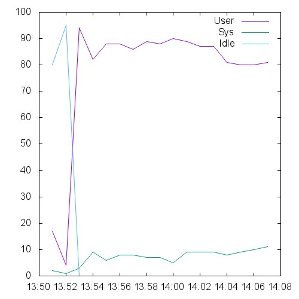 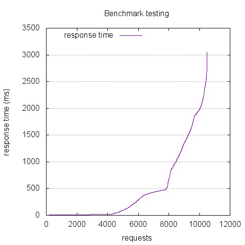 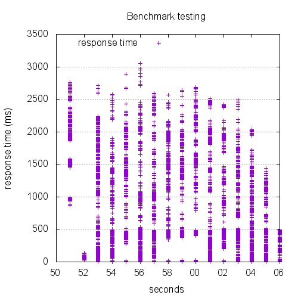

```
This is ApacheBench, Version 2.3 <$Revision: 1528965 $>
Copyright 1996 Adam Twiss, Zeus Technology Ltd, http://www.zeustech.net/
Licensed to The Apache Software Foundation, http://www.apache.org/

Benchmarking 10.129.0.72 (be patient)


Server Software:        
Server Hostname:        10.129.0.72
Server Port:            443
SSL/TLS Protocol:       TLSv1.2,ECDHE-RSA-AES256-GCM-SHA384,2048,256

Document Path:          /index.html
Document Length:        0 bytes

Concurrency Level:      350
Time taken for tests:   14.808 seconds
Complete requests:      10500
Failed requests:        1438
   (Connect: 0, Receive: 0, Length: 0, Exceptions: 1438)
Keep-Alive requests:    2531
Total transferred:      574537 bytes
HTML transferred:       0 bytes
Requests per second:    709.08 [#/sec] (mean)
Time per request:       493.596 [ms] (mean)
Time per request:       1.410 [ms] (mean, across all concurrent requests)
Transfer rate:          37.89 [Kbytes/sec] received

Connection Times (ms)
              min  mean[+/-sd] median   max
Connect:        0   88 192.9      0     985
Processing:     0  383 590.9     18    2595
Waiting:        0  317 610.2      0    2595
Total:          0  472 659.7    130    3053

Percentage of the requests served within a certain time (ms)
  50%    130
  66%    428
  75%    511
  80%    975
  90%   1613
  95%   1968
  98%   2250
  99%   2448
 100%   3053 (longest request)
```

## 1200-conc-40-keepalive

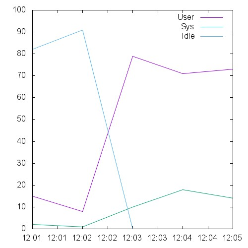 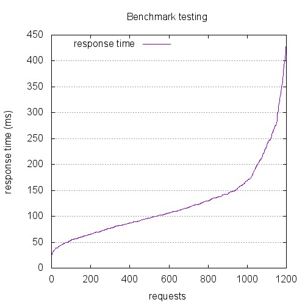 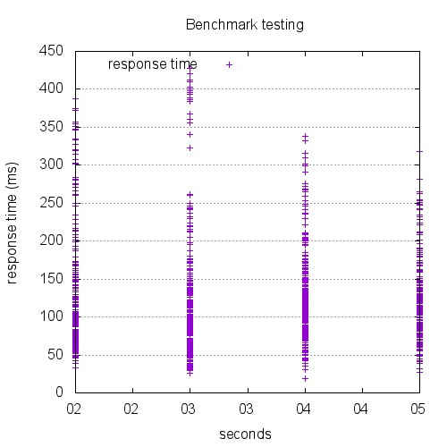

```
This is ApacheBench, Version 2.3 <$Revision: 1528965 $>
Copyright 1996 Adam Twiss, Zeus Technology Ltd, http://www.zeustech.net/
Licensed to The Apache Software Foundation, http://www.apache.org/

Benchmarking 10.129.0.72 (be patient)


Server Software:        nginx
Server Hostname:        10.129.0.72
Server Port:            443
SSL/TLS Protocol:       TLSv1.2,ECDHE-RSA-AES256-GCM-SHA384,2048,256

Document Path:          /index.html
Document Length:        0 bytes

Concurrency Level:      40
Time taken for tests:   3.720 seconds
Complete requests:      1200
Failed requests:        0
Keep-Alive requests:    1200
Total transferred:      272400 bytes
HTML transferred:       0 bytes
Requests per second:    322.56 [#/sec] (mean)
Time per request:       124.009 [ms] (mean)
Time per request:       3.100 [ms] (mean, across all concurrent requests)
Transfer rate:          71.50 [Kbytes/sec] received

Connection Times (ms)
              min  mean[+/-sd] median   max
Connect:        0    3  19.9      0     192
Processing:    19  119  65.9    106     428
Waiting:       19  119  65.9    106     428
Total:         19  123  69.9    106     428

Percentage of the requests served within a certain time (ms)
  50%    106
  66%    129
  75%    143
  80%    157
  90%    219
  95%    271
  98%    347
  99%    388
 100%    428 (longest request)
```

## 12000-conc-400-keepalive

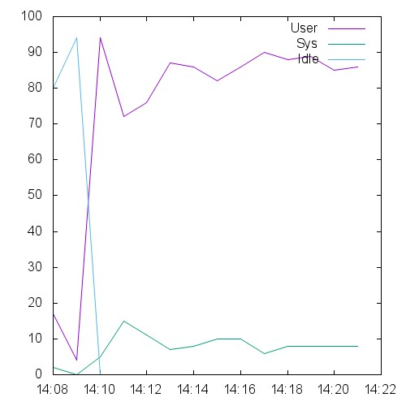 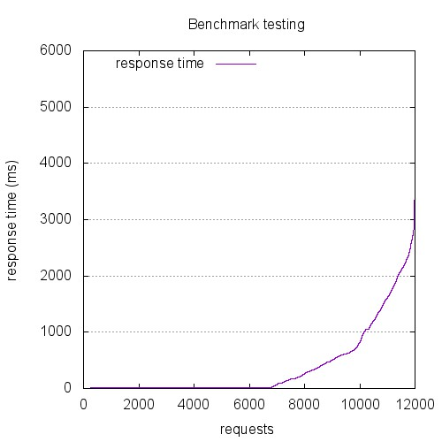 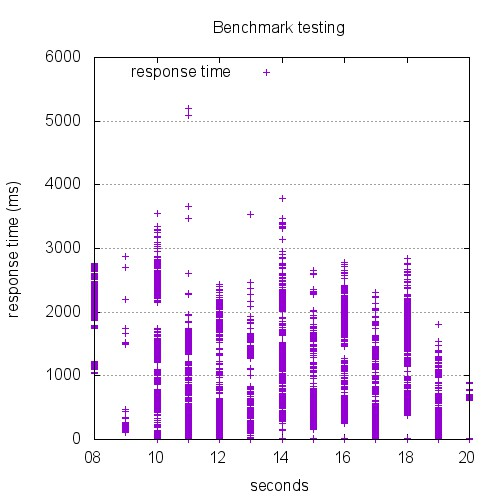

```
This is ApacheBench, Version 2.3 <$Revision: 1528965 $>
Copyright 1996 Adam Twiss, Zeus Technology Ltd, http://www.zeustech.net/
Licensed to The Apache Software Foundation, http://www.apache.org/

Benchmarking 10.129.0.72 (be patient)


Server Software:        
Server Hostname:        10.129.0.72
Server Port:            443
SSL/TLS Protocol:       TLSv1.2,ECDHE-RSA-AES256-GCM-SHA384,2048,256

Document Path:          /index.html
Document Length:        0 bytes

Concurrency Level:      400
Time taken for tests:   12.320 seconds
Complete requests:      12000
Failed requests:        1218
   (Connect: 0, Receive: 0, Length: 0, Exceptions: 1218)
Keep-Alive requests:    1952
Total transferred:      444012 bytes
HTML transferred:       0 bytes
Requests per second:    974.03 [#/sec] (mean)
Time per request:       410.663 [ms] (mean)
Time per request:       1.027 [ms] (mean, across all concurrent requests)
Transfer rate:          35.20 [Kbytes/sec] received

Connection Times (ms)
              min  mean[+/-sd] median   max
Connect:        0   83 234.1      0    3683
Processing:     0  304 556.7     19    3783
Waiting:        0  226 556.1      0    3044
Total:          0  388 651.7     21    5192

Percentage of the requests served within a certain time (ms)
  50%     21
  66%    235
  75%    501
  80%    632
  90%   1438
  95%   2013
  98%   2353
  99%   2634
 100%   5192 (longest request)
```

## 13500-conc-450-keepalive

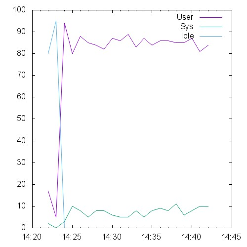 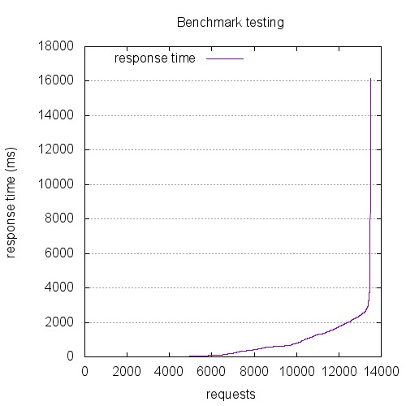 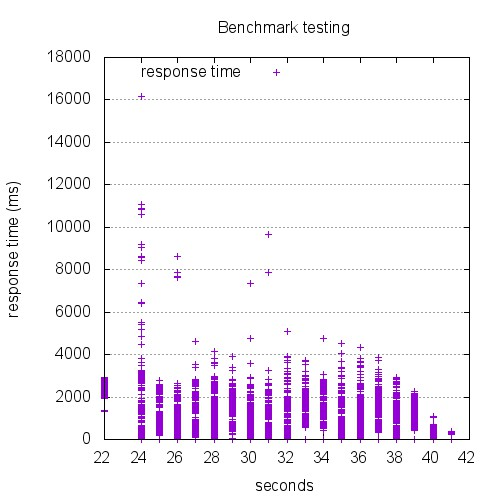

```
This is ApacheBench, Version 2.3 <$Revision: 1528965 $>
Copyright 1996 Adam Twiss, Zeus Technology Ltd, http://www.zeustech.net/
Licensed to The Apache Software Foundation, http://www.apache.org/

Benchmarking 10.129.0.72 (be patient)


Server Software:        
Server Hostname:        10.129.0.72
Server Port:            443
SSL/TLS Protocol:       TLSv1.2,ECDHE-RSA-AES256-GCM-SHA384,2048,256

Document Path:          /index.html
Document Length:        0 bytes

Concurrency Level:      450
Time taken for tests:   18.556 seconds
Complete requests:      13500
Failed requests:        1980
   (Connect: 0, Receive: 0, Length: 0, Exceptions: 1980)
Keep-Alive requests:    3089
Total transferred:      701203 bytes
HTML transferred:       0 bytes
Requests per second:    727.53 [#/sec] (mean)
Time per request:       618.531 [ms] (mean)
Time per request:       1.375 [ms] (mean, across all concurrent requests)
Transfer rate:          36.90 [Kbytes/sec] received

Connection Times (ms)
              min  mean[+/-sd] median   max
Connect:        0  148 419.8      0   10602
Processing:     0  438 724.7     36   16178
Waiting:        0  307 620.0      0    2804
Total:          0  586 864.5    165   16178

Percentage of the requests served within a certain time (ms)
  50%    165
  66%    591
  75%    834
  80%   1192
  90%   1842
  95%   2269
  98%   2619
  99%   2927
 100%  16178 (longest request)
```

## 15000-conc-500-keepalive

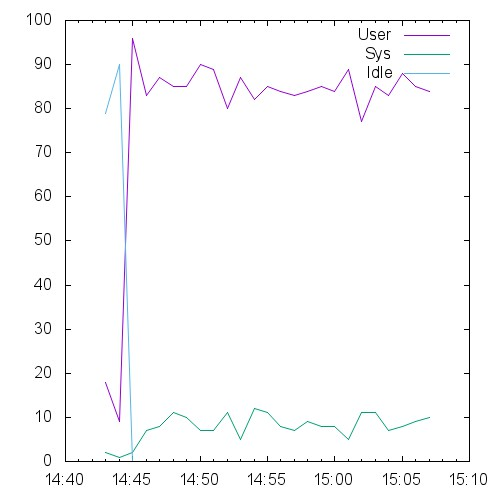 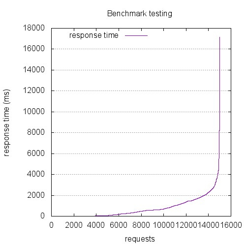 

```
This is ApacheBench, Version 2.3 <$Revision: 1528965 $>
Copyright 1996 Adam Twiss, Zeus Technology Ltd, http://www.zeustech.net/
Licensed to The Apache Software Foundation, http://www.apache.org/

Benchmarking 10.129.0.72 (be patient)


Server Software:        
Server Hostname:        10.129.0.72
Server Port:            443
SSL/TLS Protocol:       TLSv1.2,ECDHE-RSA-AES256-GCM-SHA384,2048,256

Document Path:          /index.html
Document Length:        0 bytes

Concurrency Level:      500
Time taken for tests:   23.004 seconds
Complete requests:      15000
Failed requests:        2470
   (Connect: 0, Receive: 0, Length: 0, Exceptions: 2470)
Keep-Alive requests:    3931
Total transferred:      892564 bytes
HTML transferred:       0 bytes
Requests per second:    652.07 [#/sec] (mean)
Time per request:       766.785 [ms] (mean)
Time per request:       1.534 [ms] (mean, across all concurrent requests)
Transfer rate:          37.89 [Kbytes/sec] received

Connection Times (ms)
              min  mean[+/-sd] median   max
Connect:        0  181 504.6      0    8917
Processing:     0  546 912.1    152   17157
Waiting:        0  352 689.5      0    4154
Total:          0  727 1045.5    375   17157

Percentage of the requests served within a certain time (ms)
  50%    375
  66%    664
  75%   1065
  80%   1354
  90%   1930
  95%   2536
  98%   3495
  99%   4188
 100%  17157 (longest request)
```

## 1800-conc-60-keepalive

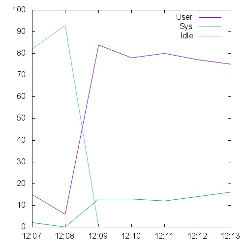 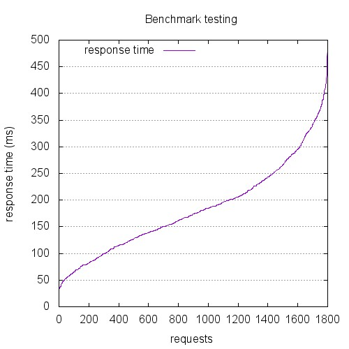 

```
This is ApacheBench, Version 2.3 <$Revision: 1528965 $>
Copyright 1996 Adam Twiss, Zeus Technology Ltd, http://www.zeustech.net/
Licensed to The Apache Software Foundation, http://www.apache.org/

Benchmarking 10.129.0.72 (be patient)


Server Software:        nginx
Server Hostname:        10.129.0.72
Server Port:            443
SSL/TLS Protocol:       TLSv1.2,ECDHE-RSA-AES256-GCM-SHA384,2048,256

Document Path:          /index.html
Document Length:        0 bytes

Concurrency Level:      60
Time taken for tests:   5.558 seconds
Complete requests:      1800
Failed requests:        0
Keep-Alive requests:    1800
Total transferred:      408600 bytes
HTML transferred:       0 bytes
Requests per second:    323.85 [#/sec] (mean)
Time per request:       185.269 [ms] (mean)
Time per request:       3.088 [ms] (mean, across all concurrent requests)
Transfer rate:          71.79 [Kbytes/sec] received

Connection Times (ms)
              min  mean[+/-sd] median   max
Connect:        0    5  28.9      0     269
Processing:    27  178  77.7    171     411
Waiting:       27  178  77.7    171     411
Total:         27  183  84.5    174     479

Percentage of the requests served within a certain time (ms)
  50%    174
  66%    205
  75%    233
  80%    251
  90%    303
  95%    347
  98%    381
  99%    407
 100%    479 (longest request)
```

## 2400-conc-80-keepalive

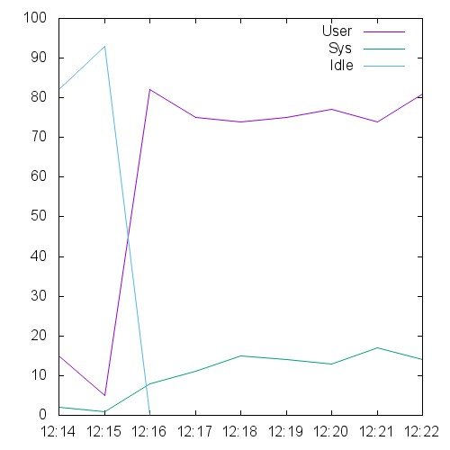 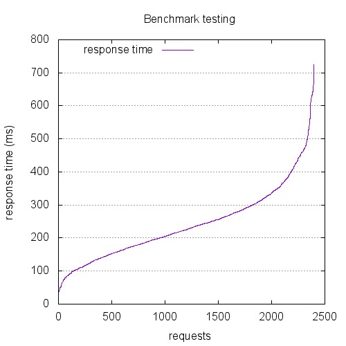 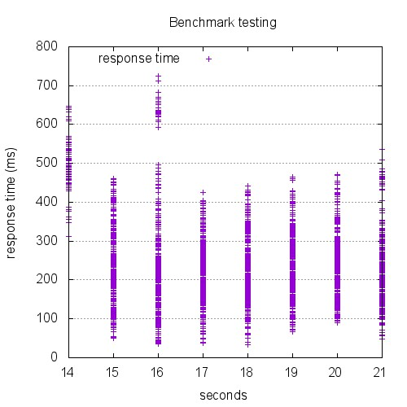

```
This is ApacheBench, Version 2.3 <$Revision: 1528965 $>
Copyright 1996 Adam Twiss, Zeus Technology Ltd, http://www.zeustech.net/
Licensed to The Apache Software Foundation, http://www.apache.org/

Benchmarking 10.129.0.72 (be patient)


Server Software:        nginx
Server Hostname:        10.129.0.72
Server Port:            443
SSL/TLS Protocol:       TLSv1.2,ECDHE-RSA-AES256-GCM-SHA384,2048,256

Document Path:          /index.html
Document Length:        0 bytes

Concurrency Level:      80
Time taken for tests:   7.303 seconds
Complete requests:      2400
Failed requests:        0
Keep-Alive requests:    2400
Total transferred:      544800 bytes
HTML transferred:       0 bytes
Requests per second:    328.65 [#/sec] (mean)
Time per request:       243.418 [ms] (mean)
Time per request:       3.043 [ms] (mean, across all concurrent requests)
Transfer rate:          72.86 [Kbytes/sec] received

Connection Times (ms)
              min  mean[+/-sd] median   max
Connect:        0    7  37.6      0     307
Processing:    26  234 100.6    225     725
Waiting:       25  234 100.6    225     725
Total:         26  241 110.9    225     725

Percentage of the requests served within a certain time (ms)
  50%    225
  66%    267
  75%    296
  80%    318
  90%    387
  95%    458
  98%    537
  99%    626
 100%    725 (longest request)
```

## 300-conc-10-keepalive

 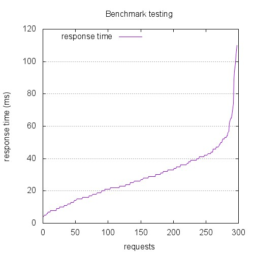 

```
This is ApacheBench, Version 2.3 <$Revision: 1528965 $>
Copyright 1996 Adam Twiss, Zeus Technology Ltd, http://www.zeustech.net/
Licensed to The Apache Software Foundation, http://www.apache.org/

Benchmarking 10.129.0.72 (be patient)


Server Software:        nginx
Server Hostname:        10.129.0.72
Server Port:            443
SSL/TLS Protocol:       TLSv1.2,ECDHE-RSA-AES256-GCM-SHA384,2048,256

Document Path:          /index.html
Document Length:        0 bytes

Concurrency Level:      10
Time taken for tests:   0.878 seconds
Complete requests:      300
Failed requests:        0
Keep-Alive requests:    300
Total transferred:      68100 bytes
HTML transferred:       0 bytes
Requests per second:    341.58 [#/sec] (mean)
Time per request:       29.276 [ms] (mean)
Time per request:       2.928 [ms] (mean, across all concurrent requests)
Transfer rate:          75.72 [Kbytes/sec] received

Connection Times (ms)
              min  mean[+/-sd] median   max
Connect:        0    1   5.3      0      47
Processing:     3   28  15.7     26     110
Waiting:        3   28  15.7     26     110
Total:          3   29  17.1     26     110

Percentage of the requests served within a certain time (ms)
  50%     26
  66%     33
  75%     38
  80%     40
  90%     47
  95%     56
  98%     89
  99%    104
 100%    110 (longest request)
```

## 3000-conc-100-keepalive

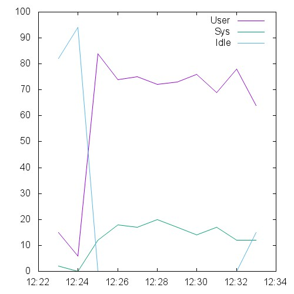 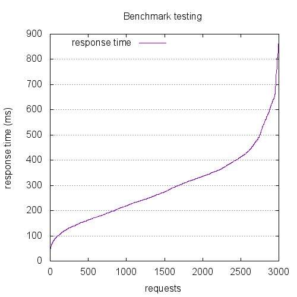 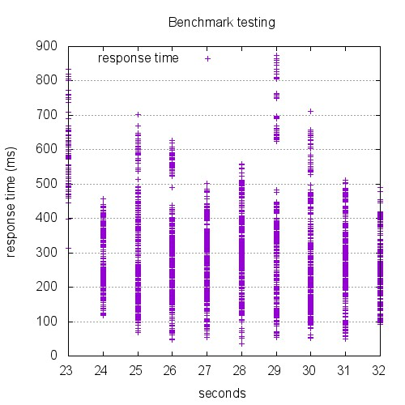

```
This is ApacheBench, Version 2.3 <$Revision: 1528965 $>
Copyright 1996 Adam Twiss, Zeus Technology Ltd, http://www.zeustech.net/
Licensed to The Apache Software Foundation, http://www.apache.org/

Benchmarking 10.129.0.72 (be patient)


Server Software:        nginx
Server Hostname:        10.129.0.72
Server Port:            443
SSL/TLS Protocol:       TLSv1.2,ECDHE-RSA-AES256-GCM-SHA384,2048,256

Document Path:          /index.html
Document Length:        0 bytes

Concurrency Level:      100
Time taken for tests:   8.910 seconds
Complete requests:      3000
Failed requests:        0
Keep-Alive requests:    3000
Total transferred:      681000 bytes
HTML transferred:       0 bytes
Requests per second:    336.70 [#/sec] (mean)
Time per request:       297.000 [ms] (mean)
Time per request:       2.970 [ms] (mean, across all concurrent requests)
Transfer rate:          74.64 [Kbytes/sec] received

Connection Times (ms)
              min  mean[+/-sd] median   max
Connect:        0    8  46.2      0     468
Processing:    26  287 128.9    273     874
Waiting:       26  287 128.9    273     874
Total:         26  295 140.1    274     874

Percentage of the requests served within a certain time (ms)
  50%    274
  66%    334
  75%    366
  80%    393
  90%    475
  95%    577
  98%    649
  99%    752
 100%    874 (longest request)
```

## 4500-conc-150-keepalive

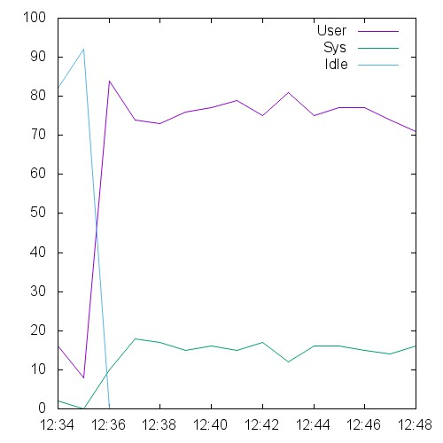 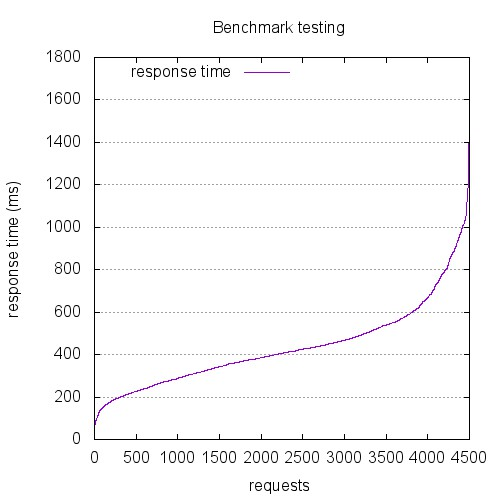 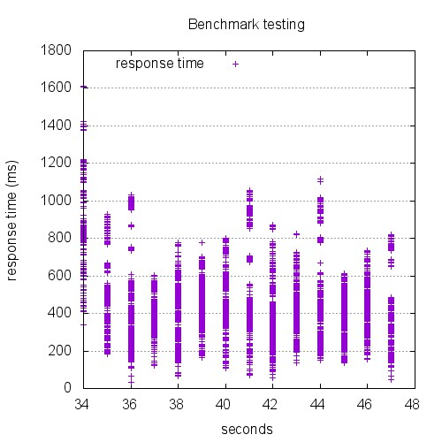

```
This is ApacheBench, Version 2.3 <$Revision: 1528965 $>
Copyright 1996 Adam Twiss, Zeus Technology Ltd, http://www.zeustech.net/
Licensed to The Apache Software Foundation, http://www.apache.org/

Benchmarking 10.129.0.72 (be patient)


Server Software:        nginx
Server Hostname:        10.129.0.72
Server Port:            443
SSL/TLS Protocol:       TLSv1.2,ECDHE-RSA-AES256-GCM-SHA384,2048,256

Document Path:          /index.html
Document Length:        0 bytes

Concurrency Level:      150
Time taken for tests:   13.153 seconds
Complete requests:      4500
Failed requests:        0
Keep-Alive requests:    4500
Total transferred:      1021500 bytes
HTML transferred:       0 bytes
Requests per second:    342.13 [#/sec] (mean)
Time per request:       438.428 [ms] (mean)
Time per request:       2.923 [ms] (mean, across all concurrent requests)
Transfer rate:          75.84 [Kbytes/sec] received

Connection Times (ms)
              min  mean[+/-sd] median   max
Connect:        0   12  76.1      0     785
Processing:    25  423 177.7    402    1119
Waiting:       25  423 177.7    402    1119
Total:         25  436 198.2    406    1610

Percentage of the requests served within a certain time (ms)
  50%    406
  66%    465
  75%    520
  80%    552
  90%    691
  95%    862
  98%    995
  99%   1044
 100%   1610 (longest request)
```

## 600-conc-20-keepalive

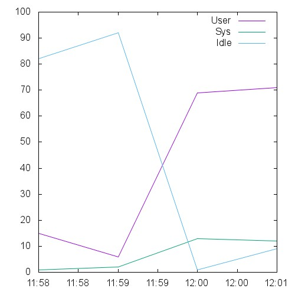 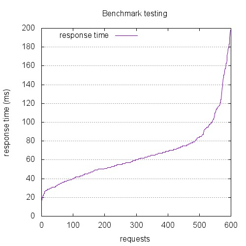 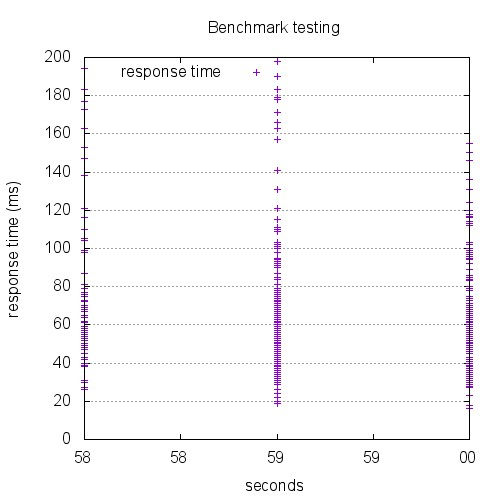

```
This is ApacheBench, Version 2.3 <$Revision: 1528965 $>
Copyright 1996 Adam Twiss, Zeus Technology Ltd, http://www.zeustech.net/
Licensed to The Apache Software Foundation, http://www.apache.org/

Benchmarking 10.129.0.72 (be patient)


Server Software:        nginx
Server Hostname:        10.129.0.72
Server Port:            443
SSL/TLS Protocol:       TLSv1.2,ECDHE-RSA-AES256-GCM-SHA384,2048,256

Document Path:          /index.html
Document Length:        0 bytes

Concurrency Level:      20
Time taken for tests:   1.975 seconds
Complete requests:      600
Failed requests:        0
Keep-Alive requests:    600
Total transferred:      136200 bytes
HTML transferred:       0 bytes
Requests per second:    303.74 [#/sec] (mean)
Time per request:       65.846 [ms] (mean)
Time per request:       3.292 [ms] (mean, across all concurrent requests)
Transfer rate:          67.33 [Kbytes/sec] received

Connection Times (ms)
              min  mean[+/-sd] median   max
Connect:        0    2  12.7      0     121
Processing:     8   63  27.3     59     198
Waiting:        8   63  27.4     59     198
Total:          8   65  30.5     60     198

Percentage of the requests served within a certain time (ms)
  50%     60
  66%     69
  75%     75
  80%     79
  90%    100
  95%    124
  98%    166
  99%    179
 100%    198 (longest request)
```

## 6000-conc-200-keepalive

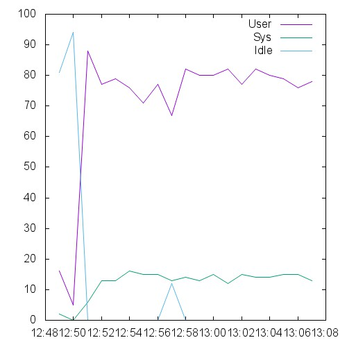 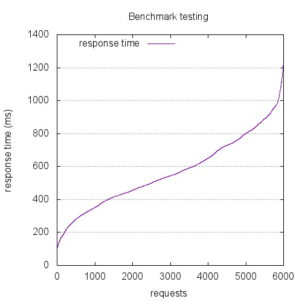 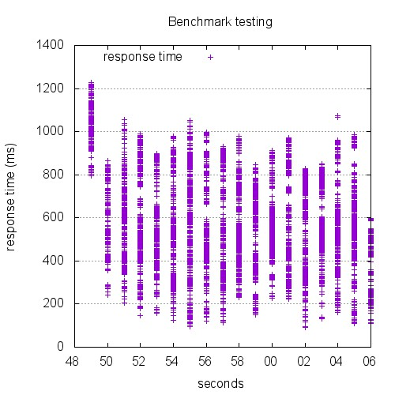

```
This is ApacheBench, Version 2.3 <$Revision: 1528965 $>
Copyright 1996 Adam Twiss, Zeus Technology Ltd, http://www.zeustech.net/
Licensed to The Apache Software Foundation, http://www.apache.org/

Benchmarking 10.129.0.72 (be patient)


Server Software:        nginx
Server Hostname:        10.129.0.72
Server Port:            443
SSL/TLS Protocol:       TLSv1.2,ECDHE-RSA-AES256-GCM-SHA384,2048,256

Document Path:          /index.html
Document Length:        0 bytes

Concurrency Level:      200
Time taken for tests:   17.143 seconds
Complete requests:      6000
Failed requests:        0
Keep-Alive requests:    6000
Total transferred:      1362000 bytes
HTML transferred:       0 bytes
Requests per second:    350.00 [#/sec] (mean)
Time per request:       571.424 [ms] (mean)
Time per request:       2.857 [ms] (mean, across all concurrent requests)
Transfer rate:          77.59 [Kbytes/sec] received

Connection Times (ms)
              min  mean[+/-sd] median   max
Connect:        0   17  92.7      0     689
Processing:    87  550 198.5    536    1072
Waiting:       87  550 198.5    536    1072
Total:         87  567 216.9    543    1228

Percentage of the requests served within a certain time (ms)
  50%    543
  66%    645
  75%    728
  80%    765
  90%    869
  95%    942
  98%   1020
  99%   1102
 100%   1228 (longest request)
```

## 7500-conc-250-keepalive

 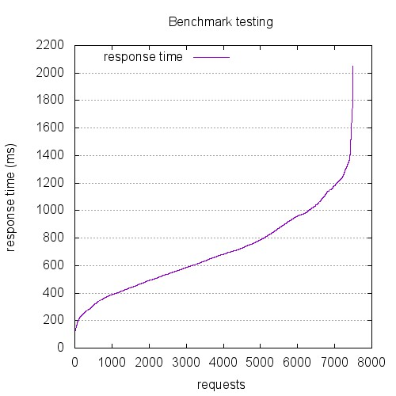 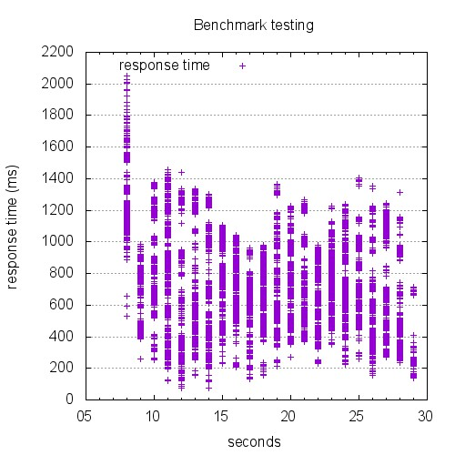

```
This is ApacheBench, Version 2.3 <$Revision: 1528965 $>
Copyright 1996 Adam Twiss, Zeus Technology Ltd, http://www.zeustech.net/
Licensed to The Apache Software Foundation, http://www.apache.org/

Benchmarking 10.129.0.72 (be patient)


Server Software:        nginx
Server Hostname:        10.129.0.72
Server Port:            443
SSL/TLS Protocol:       TLSv1.2,ECDHE-RSA-AES256-GCM-SHA384,2048,256

Document Path:          /index.html
Document Length:        0 bytes

Concurrency Level:      250
Time taken for tests:   21.034 seconds
Complete requests:      7500
Failed requests:        0
Keep-Alive requests:    7500
Total transferred:      1702500 bytes
HTML transferred:       0 bytes
Requests per second:    356.56 [#/sec] (mean)
Time per request:       701.141 [ms] (mean)
Time per request:       2.805 [ms] (mean, across all concurrent requests)
Transfer rate:          79.04 [Kbytes/sec] received

Connection Times (ms)
              min  mean[+/-sd] median   max
Connect:        0   18 108.9      0    1137
Processing:    49  678 266.4    654    1457
Waiting:       49  678 266.4    654    1457
Total:         49  697 292.1    660    2051

Percentage of the requests served within a certain time (ms)
  50%    660
  66%    781
  75%    896
  80%    960
  90%   1115
  95%   1218
  98%   1336
  99%   1431
 100%   2051 (longest request)
```

## 9000-conc-300-keepalive

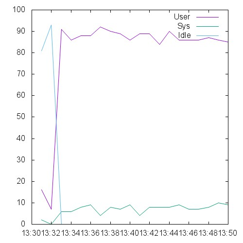 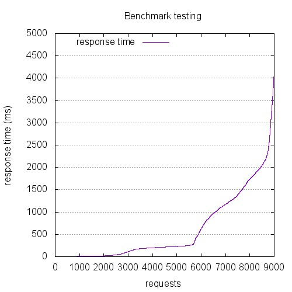 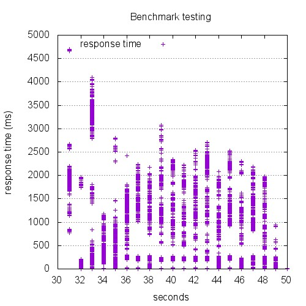

```
This is ApacheBench, Version 2.3 <$Revision: 1528965 $>
Copyright 1996 Adam Twiss, Zeus Technology Ltd, http://www.zeustech.net/
Licensed to The Apache Software Foundation, http://www.apache.org/

Benchmarking 10.129.0.72 (be patient)


Server Software:        
Server Hostname:        10.129.0.72
Server Port:            443
SSL/TLS Protocol:       TLSv1.2,ECDHE-RSA-AES256-GCM-SHA384,2048,256

Document Path:          /index.html
Document Length:        0 bytes

Concurrency Level:      300
Time taken for tests:   18.584 seconds
Complete requests:      9000
Failed requests:        1890
   (Connect: 0, Receive: 0, Length: 0, Exceptions: 1890)
Keep-Alive requests:    3321
Total transferred:      754094 bytes
HTML transferred:       0 bytes
Requests per second:    484.29 [#/sec] (mean)
Time per request:       619.467 [ms] (mean)
Time per request:       2.065 [ms] (mean, across all concurrent requests)
Transfer rate:          39.63 [Kbytes/sec] received

Connection Times (ms)
              min  mean[+/-sd] median   max
Connect:        0   76 141.6      0     845
Processing:     0  523 741.9    152    3962
Waiting:        0  485 761.9      0    3962
Total:          0  599 775.5    214    4697

Percentage of the requests served within a certain time (ms)
  50%    214
  66%    562
  75%   1080
  80%   1248
  90%   1796
  95%   2089
  98%   2719
  99%   3354
 100%   4697 (longest request)
```

