# Vulcand SSL with Keepalive
## 10500-conc-350-keepalive

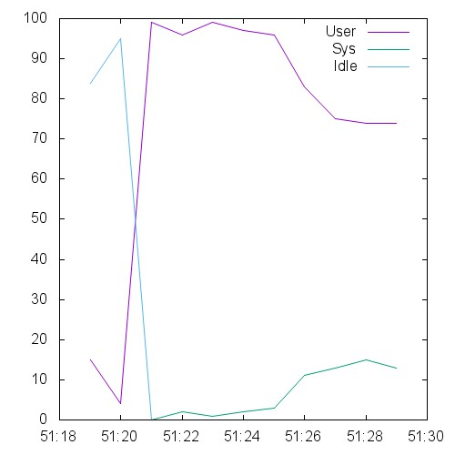 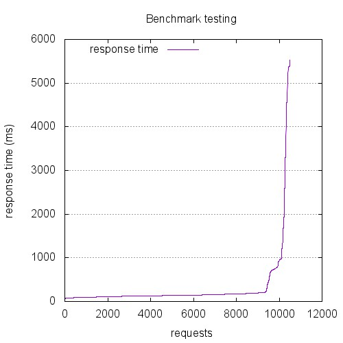 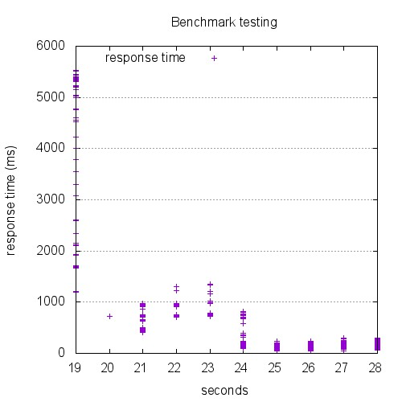

```
This is ApacheBench, Version 2.3 <$Revision: 1528965 $>
Copyright 1996 Adam Twiss, Zeus Technology Ltd, http://www.zeustech.net/
Licensed to The Apache Software Foundation, http://www.apache.org/

Benchmarking 10.129.0.26 (be patient)


Server Software:        nginx/1.4.6
Server Hostname:        10.129.0.26
Server Port:            443
SSL/TLS Protocol:       TLSv1.2,ECDHE-RSA-AES256-SHA,2048,256

Document Path:          /index.html
Document Length:        0 bytes

Concurrency Level:      350
Time taken for tests:   9.061 seconds
Complete requests:      10500
Failed requests:        0
Keep-Alive requests:    10500
Total transferred:      2541000 bytes
HTML transferred:       0 bytes
Requests per second:    1158.82 [#/sec] (mean)
Time per request:       302.030 [ms] (mean)
Time per request:       0.863 [ms] (mean, across all concurrent requests)
Transfer rate:          273.86 [Kbytes/sec] received

Connection Times (ms)
              min  mean[+/-sd] median   max
Connect:        0  104 625.0      0    5384
Processing:    38  197 193.5    139    1352
Waiting:       37  197 193.5    139    1352
Total:         38  300 714.4    139    5521

Percentage of the requests served within a certain time (ms)
  50%    139
  66%    155
  75%    170
  80%    179
  90%    354
  95%    915
  98%   3306
  99%   5147
 100%   5521 (longest request)
```

## 1200-conc-40-keepalive

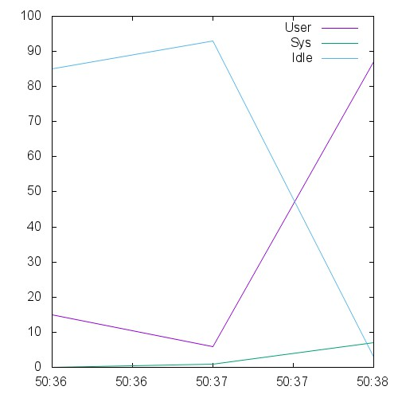 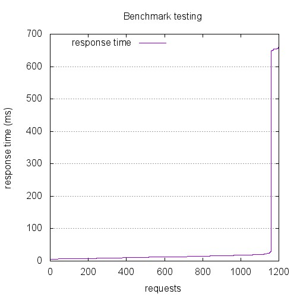 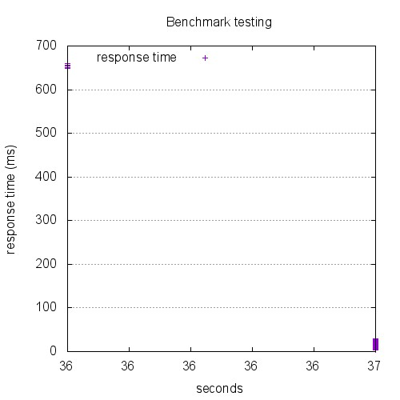

```
This is ApacheBench, Version 2.3 <$Revision: 1528965 $>
Copyright 1996 Adam Twiss, Zeus Technology Ltd, http://www.zeustech.net/
Licensed to The Apache Software Foundation, http://www.apache.org/

Benchmarking 10.129.0.26 (be patient)


Server Software:        nginx/1.4.6
Server Hostname:        10.129.0.26
Server Port:            443
SSL/TLS Protocol:       TLSv1.2,ECDHE-RSA-AES256-SHA,2048,256

Document Path:          /index.html
Document Length:        0 bytes

Concurrency Level:      40
Time taken for tests:   1.026 seconds
Complete requests:      1200
Failed requests:        0
Keep-Alive requests:    1200
Total transferred:      290400 bytes
HTML transferred:       0 bytes
Requests per second:    1169.22 [#/sec] (mean)
Time per request:       34.211 [ms] (mean)
Time per request:       0.855 [ms] (mean, across all concurrent requests)
Transfer rate:          276.32 [Kbytes/sec] received

Connection Times (ms)
              min  mean[+/-sd] median   max
Connect:        0   19 102.3      0     640
Processing:     3   15  15.7     12     145
Waiting:        3   15  15.7     12     145
Total:          3   34 115.1     12     660

Percentage of the requests served within a certain time (ms)
  50%     12
  66%     15
  75%     17
  80%     17
  90%     20
  95%     23
  98%    654
  99%    655
 100%    660 (longest request)
```

## 12000-conc-400-keepalive

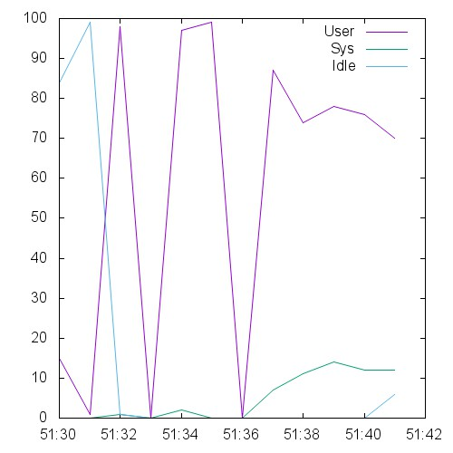 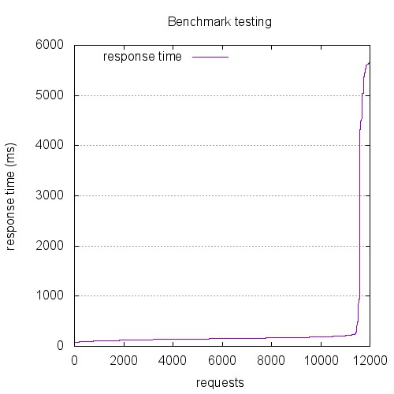 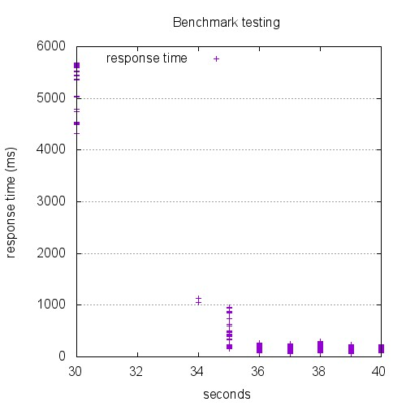

```
This is ApacheBench, Version 2.3 <$Revision: 1528965 $>
Copyright 1996 Adam Twiss, Zeus Technology Ltd, http://www.zeustech.net/
Licensed to The Apache Software Foundation, http://www.apache.org/

Benchmarking 10.129.0.26 (be patient)


Server Software:        nginx/1.4.6
Server Hostname:        10.129.0.26
Server Port:            443
SSL/TLS Protocol:       TLSv1.2,ECDHE-RSA-AES256-SHA,2048,256

Document Path:          /index.html
Document Length:        0 bytes

Concurrency Level:      400
Time taken for tests:   9.912 seconds
Complete requests:      12000
Failed requests:        0
Keep-Alive requests:    12000
Total transferred:      2904000 bytes
HTML transferred:       0 bytes
Requests per second:    1210.67 [#/sec] (mean)
Time per request:       330.394 [ms] (mean)
Time per request:       0.826 [ms] (mean, across all concurrent requests)
Transfer rate:          286.12 [Kbytes/sec] received

Connection Times (ms)
              min  mean[+/-sd] median   max
Connect:        0  143 806.2      0    5532
Processing:    45  186 238.5    153    3062
Waiting:       45  186 238.5    153    3062
Total:         45  329 925.8    153    5686

Percentage of the requests served within a certain time (ms)
  50%    153
  66%    166
  75%    175
  80%    182
  90%    205
  95%    248
  98%   5374
  99%   5608
 100%   5686 (longest request)
```

## 13500-conc-450-keepalive

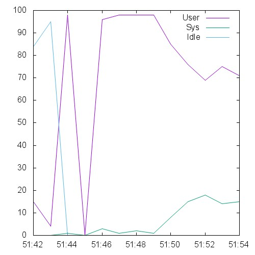 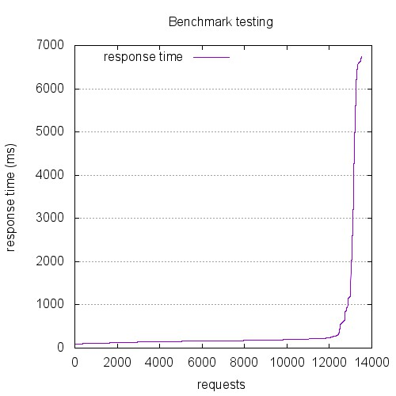 

```
This is ApacheBench, Version 2.3 <$Revision: 1528965 $>
Copyright 1996 Adam Twiss, Zeus Technology Ltd, http://www.zeustech.net/
Licensed to The Apache Software Foundation, http://www.apache.org/

Benchmarking 10.129.0.26 (be patient)


Server Software:        nginx/1.4.6
Server Hostname:        10.129.0.26
Server Port:            443
SSL/TLS Protocol:       TLSv1.2,ECDHE-RSA-AES256-SHA,2048,256

Document Path:          /index.html
Document Length:        0 bytes

Concurrency Level:      450
Time taken for tests:   11.149 seconds
Complete requests:      13500
Failed requests:        0
Non-2xx responses:      3
Keep-Alive requests:    13500
Total transferred:      3266721 bytes
HTML transferred:       0 bytes
Requests per second:    1210.91 [#/sec] (mean)
Time per request:       371.620 [ms] (mean)
Time per request:       0.826 [ms] (mean, across all concurrent requests)
Transfer rate:          286.15 [Kbytes/sec] received

Connection Times (ms)
              min  mean[+/-sd] median   max
Connect:        0  145 857.7      0    6539
Processing:    51  224 311.8    165    4275
Waiting:       51  224 311.8    165    4275
Total:         51  369 981.7    165    6745

Percentage of the requests served within a certain time (ms)
  50%    165
  66%    184
  75%    197
  80%    206
  90%    263
  95%    932
  98%   5602
  99%   6581
 100%   6745 (longest request)
```

## 15000-conc-500-keepalive

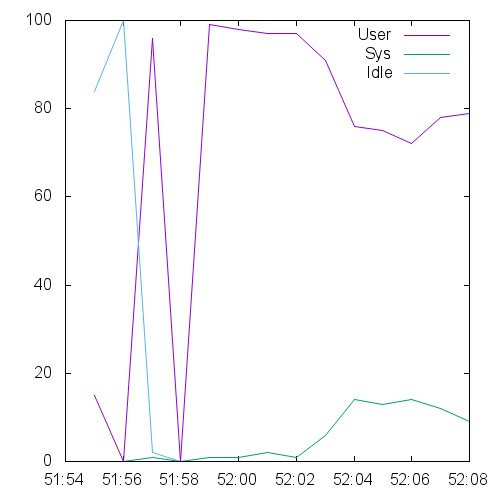  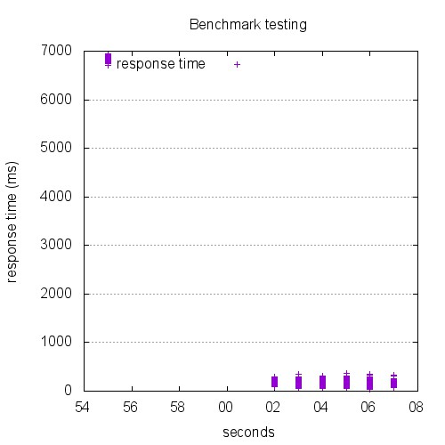

```
This is ApacheBench, Version 2.3 <$Revision: 1528965 $>
Copyright 1996 Adam Twiss, Zeus Technology Ltd, http://www.zeustech.net/
Licensed to The Apache Software Foundation, http://www.apache.org/

Benchmarking 10.129.0.26 (be patient)


Server Software:        nginx/1.4.6
Server Hostname:        10.129.0.26
Server Port:            443
SSL/TLS Protocol:       TLSv1.2,ECDHE-RSA-AES256-SHA,2048,256

Document Path:          /index.html
Document Length:        0 bytes

Concurrency Level:      500
Time taken for tests:   12.036 seconds
Complete requests:      15000
Failed requests:        0
Non-2xx responses:      581
Keep-Alive requests:    15000
Total transferred:      3575967 bytes
HTML transferred:       0 bytes
Requests per second:    1246.26 [#/sec] (mean)
Time per request:       401.202 [ms] (mean)
Time per request:       0.802 [ms] (mean, across all concurrent requests)
Transfer rate:          290.14 [Kbytes/sec] received

Connection Times (ms)
              min  mean[+/-sd] median   max
Connect:        0  192 1046.3      0    6719
Processing:     3  207 216.0    179    3402
Waiting:        3  207 216.0    179    3402
Total:          3  399 1191.2    179    6944

Percentage of the requests served within a certain time (ms)
  50%    179
  66%    192
  75%    203
  80%    214
  90%    243
  95%    281
  98%   6800
  99%   6827
 100%   6944 (longest request)
```

## 1800-conc-60-keepalive

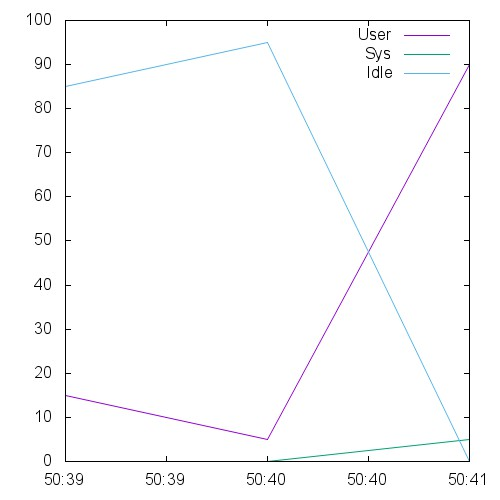  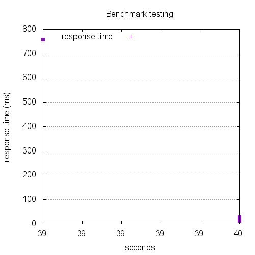

```
This is ApacheBench, Version 2.3 <$Revision: 1528965 $>
Copyright 1996 Adam Twiss, Zeus Technology Ltd, http://www.zeustech.net/
Licensed to The Apache Software Foundation, http://www.apache.org/

Benchmarking 10.129.0.26 (be patient)


Server Software:        nginx/1.4.6
Server Hostname:        10.129.0.26
Server Port:            443
SSL/TLS Protocol:       TLSv1.2,ECDHE-RSA-AES256-SHA,2048,256

Document Path:          /index.html
Document Length:        0 bytes

Concurrency Level:      60
Time taken for tests:   1.223 seconds
Complete requests:      1800
Failed requests:        0
Keep-Alive requests:    1800
Total transferred:      435600 bytes
HTML transferred:       0 bytes
Requests per second:    1472.19 [#/sec] (mean)
Time per request:       40.755 [ms] (mean)
Time per request:       0.679 [ms] (mean, across all concurrent requests)
Transfer rate:          347.92 [Kbytes/sec] received

Connection Times (ms)
              min  mean[+/-sd] median   max
Connect:        0   22 121.3      0     740
Processing:     6   18  14.8     16     140
Waiting:        6   18  14.8     16     140
Total:          6   41 133.6     16     764

Percentage of the requests served within a certain time (ms)
  50%     16
  66%     18
  75%     20
  80%     20
  90%     24
  95%     27
  98%    761
  99%    762
 100%    764 (longest request)
```

## 2400-conc-80-keepalive

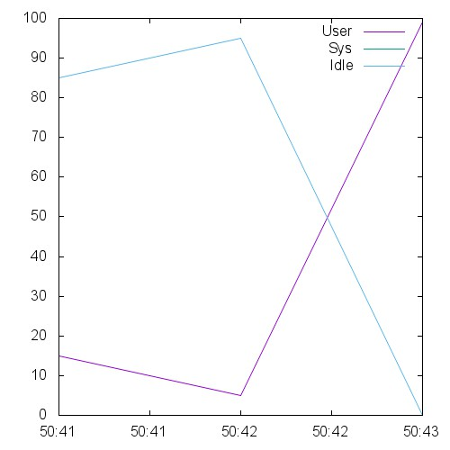 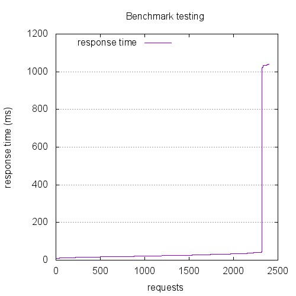 

```
This is ApacheBench, Version 2.3 <$Revision: 1528965 $>
Copyright 1996 Adam Twiss, Zeus Technology Ltd, http://www.zeustech.net/
Licensed to The Apache Software Foundation, http://www.apache.org/

Benchmarking 10.129.0.26 (be patient)


Server Software:        nginx/1.4.6
Server Hostname:        10.129.0.26
Server Port:            443
SSL/TLS Protocol:       TLSv1.2,ECDHE-RSA-AES256-SHA,2048,256

Document Path:          /index.html
Document Length:        0 bytes

Concurrency Level:      80
Time taken for tests:   1.737 seconds
Complete requests:      2400
Failed requests:        0
Keep-Alive requests:    2400
Total transferred:      580800 bytes
HTML transferred:       0 bytes
Requests per second:    1381.45 [#/sec] (mean)
Time per request:       57.910 [ms] (mean)
Time per request:       0.724 [ms] (mean, across all concurrent requests)
Transfer rate:          326.47 [Kbytes/sec] received

Connection Times (ms)
              min  mean[+/-sd] median   max
Connect:        0   30 163.5      0    1007
Processing:     8   27  22.0     24     205
Waiting:        8   27  22.0     24     205
Total:          8   58 181.4     24    1040

Percentage of the requests served within a certain time (ms)
  50%     24
  66%     27
  75%     30
  80%     32
  90%     37
  95%     41
  98%   1034
  99%   1036
 100%   1040 (longest request)
```

## 300-conc-10-keepalive

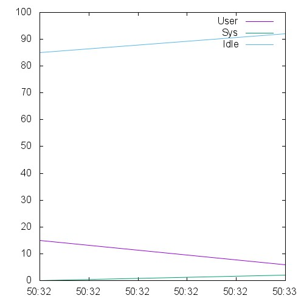 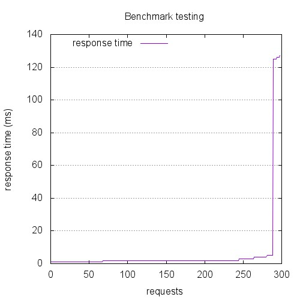 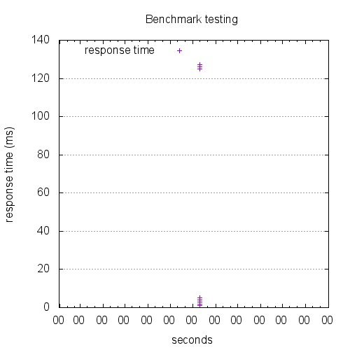

```
This is ApacheBench, Version 2.3 <$Revision: 1528965 $>
Copyright 1996 Adam Twiss, Zeus Technology Ltd, http://www.zeustech.net/
Licensed to The Apache Software Foundation, http://www.apache.org/

Benchmarking 10.129.0.26 (be patient)


Server Software:        nginx/1.4.6
Server Hostname:        10.129.0.26
Server Port:            443
SSL/TLS Protocol:       TLSv1.2,ECDHE-RSA-AES256-SHA,2048,256

Document Path:          /index.html
Document Length:        0 bytes

Concurrency Level:      10
Time taken for tests:   0.183 seconds
Complete requests:      300
Failed requests:        0
Keep-Alive requests:    300
Total transferred:      72600 bytes
HTML transferred:       0 bytes
Requests per second:    1638.16 [#/sec] (mean)
Time per request:       6.104 [ms] (mean)
Time per request:       0.610 [ms] (mean, across all concurrent requests)
Transfer rate:          387.14 [Kbytes/sec] received

Connection Times (ms)
              min  mean[+/-sd] median   max
Connect:        0    4  19.9      0     122
Processing:     1    2   2.8      2      25
Waiting:        1    2   2.8      2      25
Total:          1    6  22.2      2     127

Percentage of the requests served within a certain time (ms)
  50%      2
  66%      2
  75%      2
  80%      2
  90%      4
  95%      5
  98%    125
  99%    126
 100%    127 (longest request)
```

## 3000-conc-100-keepalive

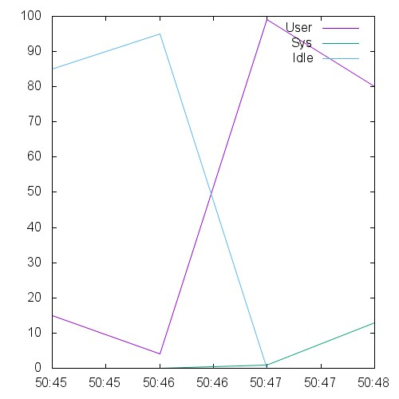 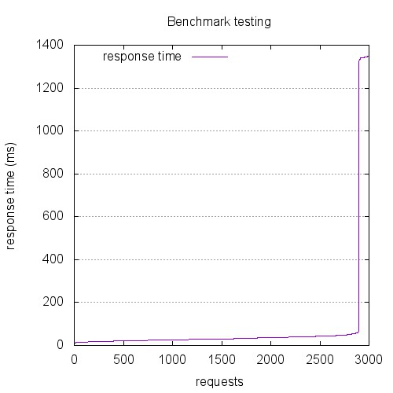 

```
This is ApacheBench, Version 2.3 <$Revision: 1528965 $>
Copyright 1996 Adam Twiss, Zeus Technology Ltd, http://www.zeustech.net/
Licensed to The Apache Software Foundation, http://www.apache.org/

Benchmarking 10.129.0.26 (be patient)


Server Software:        nginx/1.4.6
Server Hostname:        10.129.0.26
Server Port:            443
SSL/TLS Protocol:       TLSv1.2,ECDHE-RSA-AES256-SHA,2048,256

Document Path:          /index.html
Document Length:        0 bytes

Concurrency Level:      100
Time taken for tests:   2.254 seconds
Complete requests:      3000
Failed requests:        0
Keep-Alive requests:    3000
Total transferred:      726000 bytes
HTML transferred:       0 bytes
Requests per second:    1330.68 [#/sec] (mean)
Time per request:       75.149 [ms] (mean)
Time per request:       0.751 [ms] (mean, across all concurrent requests)
Transfer rate:          314.48 [Kbytes/sec] received

Connection Times (ms)
              min  mean[+/-sd] median   max
Connect:        0   39 213.3      0    1317
Processing:    10   36  34.6     30    1230
Waiting:       10   36  34.6     30    1230
Total:         10   75 235.6     30    1348

Percentage of the requests served within a certain time (ms)
  50%     30
  66%     36
  75%     39
  80%     41
  90%     46
  95%     55
  98%   1342
  99%   1346
 100%   1348 (longest request)
```

## 4500-conc-150-keepalive

 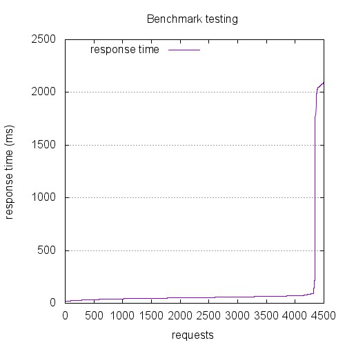 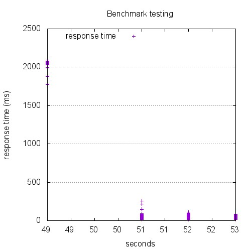

```
This is ApacheBench, Version 2.3 <$Revision: 1528965 $>
Copyright 1996 Adam Twiss, Zeus Technology Ltd, http://www.zeustech.net/
Licensed to The Apache Software Foundation, http://www.apache.org/

Benchmarking 10.129.0.26 (be patient)


Server Software:        nginx/1.4.6
Server Hostname:        10.129.0.26
Server Port:            443
SSL/TLS Protocol:       TLSv1.2,ECDHE-RSA-AES256-SHA,2048,256

Document Path:          /index.html
Document Length:        0 bytes

Concurrency Level:      150
Time taken for tests:   3.575 seconds
Complete requests:      4500
Failed requests:        0
Keep-Alive requests:    4500
Total transferred:      1089000 bytes
HTML transferred:       0 bytes
Requests per second:    1258.88 [#/sec] (mean)
Time per request:       119.154 [ms] (mean)
Time per request:       0.794 [ms] (mean, across all concurrent requests)
Transfer rate:          297.51 [Kbytes/sec] received

Connection Times (ms)
              min  mean[+/-sd] median   max
Connect:        0   60 336.0      0    2021
Processing:    16   58  77.9     53    1412
Waiting:       16   58  77.9     53    1412
Total:         16  118 354.3     53    2093

Percentage of the requests served within a certain time (ms)
  50%     53
  66%     59
  75%     63
  80%     65
  90%     72
  95%     89
  98%   2050
  99%   2077
 100%   2093 (longest request)
```

## 600-conc-20-keepalive

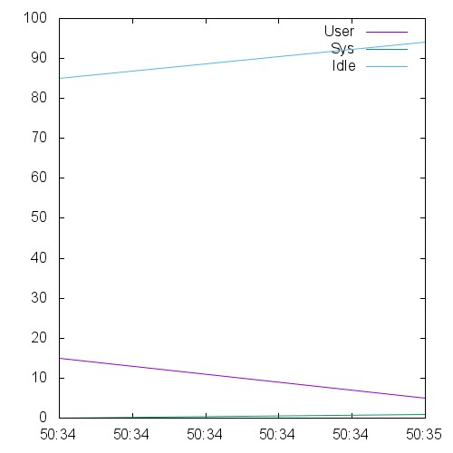  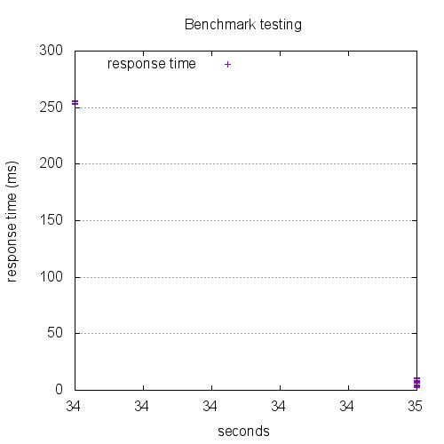

```
This is ApacheBench, Version 2.3 <$Revision: 1528965 $>
Copyright 1996 Adam Twiss, Zeus Technology Ltd, http://www.zeustech.net/
Licensed to The Apache Software Foundation, http://www.apache.org/

Benchmarking 10.129.0.26 (be patient)


Server Software:        nginx/1.4.6
Server Hostname:        10.129.0.26
Server Port:            443
SSL/TLS Protocol:       TLSv1.2,ECDHE-RSA-AES256-SHA,2048,256

Document Path:          /index.html
Document Length:        0 bytes

Concurrency Level:      20
Time taken for tests:   0.380 seconds
Complete requests:      600
Failed requests:        0
Keep-Alive requests:    600
Total transferred:      145200 bytes
HTML transferred:       0 bytes
Requests per second:    1578.46 [#/sec] (mean)
Time per request:       12.671 [ms] (mean)
Time per request:       0.634 [ms] (mean, across all concurrent requests)
Transfer rate:          373.03 [Kbytes/sec] received

Connection Times (ms)
              min  mean[+/-sd] median   max
Connect:        0    8  40.7      0     249
Processing:     2    5   5.3      4      50
Waiting:        1    5   5.3      4      50
Total:          2   13  45.0      4     256

Percentage of the requests served within a certain time (ms)
  50%      4
  66%      5
  75%      6
  80%      6
  90%      7
  95%      9
  98%    254
  99%    256
 100%    256 (longest request)
```

## 6000-conc-200-keepalive

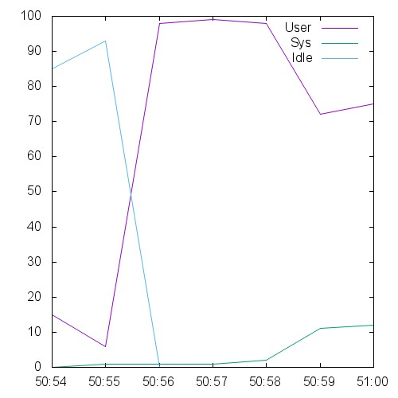 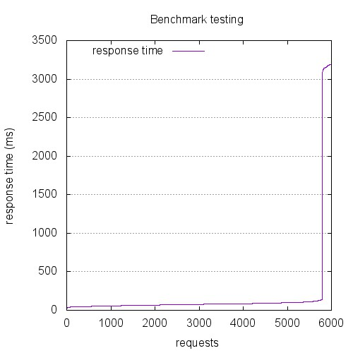 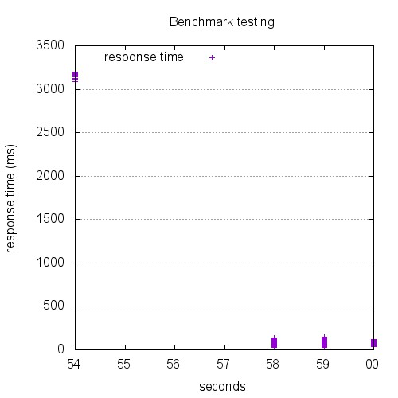

```
This is ApacheBench, Version 2.3 <$Revision: 1528965 $>
Copyright 1996 Adam Twiss, Zeus Technology Ltd, http://www.zeustech.net/
Licensed to The Apache Software Foundation, http://www.apache.org/

Benchmarking 10.129.0.26 (be patient)


Server Software:        nginx/1.4.6
Server Hostname:        10.129.0.26
Server Port:            443
SSL/TLS Protocol:       TLSv1.2,ECDHE-RSA-AES256-SHA,2048,256

Document Path:          /index.html
Document Length:        0 bytes

Concurrency Level:      200
Time taken for tests:   5.402 seconds
Complete requests:      6000
Failed requests:        0
Keep-Alive requests:    6000
Total transferred:      1452000 bytes
HTML transferred:       0 bytes
Requests per second:    1110.75 [#/sec] (mean)
Time per request:       180.058 [ms] (mean)
Time per request:       0.900 [ms] (mean, across all concurrent requests)
Transfer rate:          262.50 [Kbytes/sec] received

Connection Times (ms)
              min  mean[+/-sd] median   max
Connect:        0   82 449.0      0    3105
Processing:    28   97 136.6     76    1594
Waiting:       28   97 136.6     76    1594
Total:         28  179 554.0     76    3199

Percentage of the requests served within a certain time (ms)
  50%     76
  66%     85
  75%     91
  80%     96
  90%    106
  95%    125
  98%   3153
  99%   3176
 100%   3199 (longest request)
```

## 7500-conc-250-keepalive

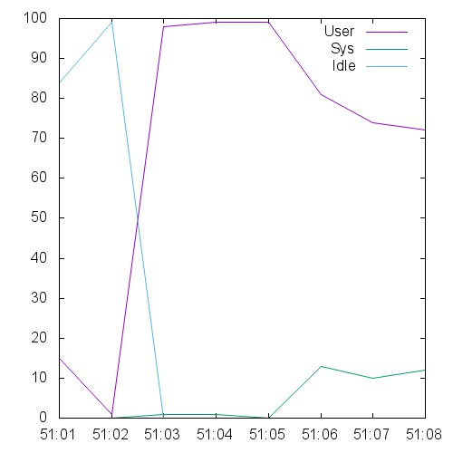 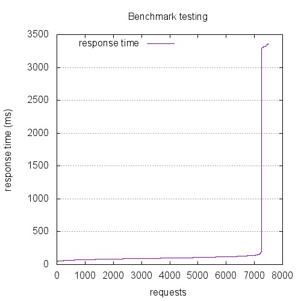 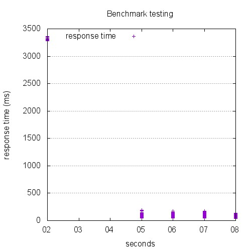

```
This is ApacheBench, Version 2.3 <$Revision: 1528965 $>
Copyright 1996 Adam Twiss, Zeus Technology Ltd, http://www.zeustech.net/
Licensed to The Apache Software Foundation, http://www.apache.org/

Benchmarking 10.129.0.26 (be patient)


Server Software:        nginx/1.4.6
Server Hostname:        10.129.0.26
Server Port:            443
SSL/TLS Protocol:       TLSv1.2,ECDHE-RSA-AES256-SHA,2048,256

Document Path:          /index.html
Document Length:        0 bytes

Concurrency Level:      250
Time taken for tests:   6.195 seconds
Complete requests:      7500
Failed requests:        0
Keep-Alive requests:    7500
Total transferred:      1815000 bytes
HTML transferred:       0 bytes
Requests per second:    1210.67 [#/sec] (mean)
Time per request:       206.498 [ms] (mean)
Time per request:       0.826 [ms] (mean, across all concurrent requests)
Transfer rate:          286.11 [Kbytes/sec] received

Connection Times (ms)
              min  mean[+/-sd] median   max
Connect:        0   98 530.8      0    3269
Processing:    34  107  63.0     97    1535
Waiting:       34  107  63.0     97    1535
Total:         34  205 579.5     97    3363

Percentage of the requests served within a certain time (ms)
  50%     97
  66%    107
  75%    114
  80%    119
  90%    133
  95%    149
  98%   3317
  99%   3343
 100%   3363 (longest request)
```

## 9000-conc-300-keepalive

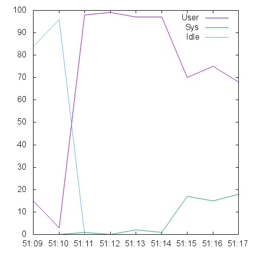 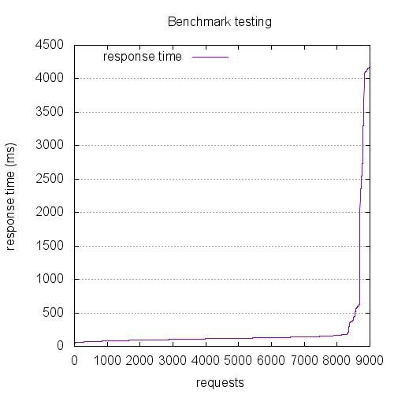 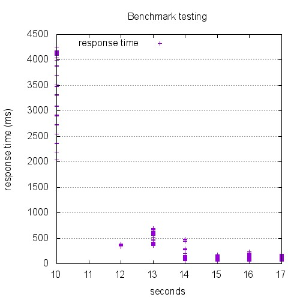

```
This is ApacheBench, Version 2.3 <$Revision: 1528965 $>
Copyright 1996 Adam Twiss, Zeus Technology Ltd, http://www.zeustech.net/
Licensed to The Apache Software Foundation, http://www.apache.org/

Benchmarking 10.129.0.26 (be patient)


Server Software:        nginx/1.4.6
Server Hostname:        10.129.0.26
Server Port:            443
SSL/TLS Protocol:       TLSv1.2,ECDHE-RSA-AES256-SHA,2048,256

Document Path:          /index.html
Document Length:        0 bytes

Concurrency Level:      300
Time taken for tests:   7.294 seconds
Complete requests:      9000
Failed requests:        0
Keep-Alive requests:    9000
Total transferred:      2178000 bytes
HTML transferred:       0 bytes
Requests per second:    1233.86 [#/sec] (mean)
Time per request:       243.139 [ms] (mean)
Time per request:       0.810 [ms] (mean, across all concurrent requests)
Transfer rate:          291.60 [Kbytes/sec] received

Connection Times (ms)
              min  mean[+/-sd] median   max
Connect:        0  103 574.4      0    4122
Processing:    44  139 105.4    115    1662
Waiting:       44  139 105.4    115    1662
Total:         44  242 636.7    115    4254

Percentage of the requests served within a certain time (ms)
  50%    115
  66%    129
  75%    137
  80%    142
  90%    168
  95%    483
  98%   3697
  99%   4126
 100%   4254 (longest request)
```

