# Hipache plain HTTP with Keepalive
## 105000-conc-3500-keepalive

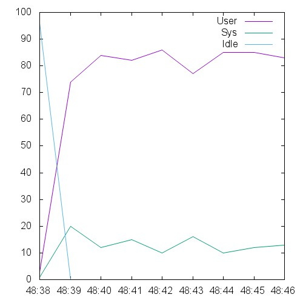  

```
This is ApacheBench, Version 2.3 <$Revision: 1528965 $>
Copyright 1996 Adam Twiss, Zeus Technology Ltd, http://www.zeustech.net/
Licensed to The Apache Software Foundation, http://www.apache.org/

Benchmarking 10.129.0.72 (be patient)
Total of 2180 requests completed
```

## 12000-conc-400-keepalive

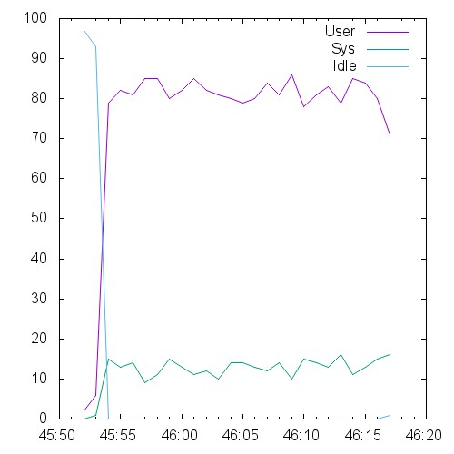 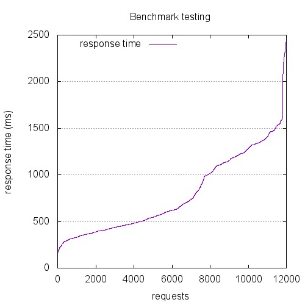 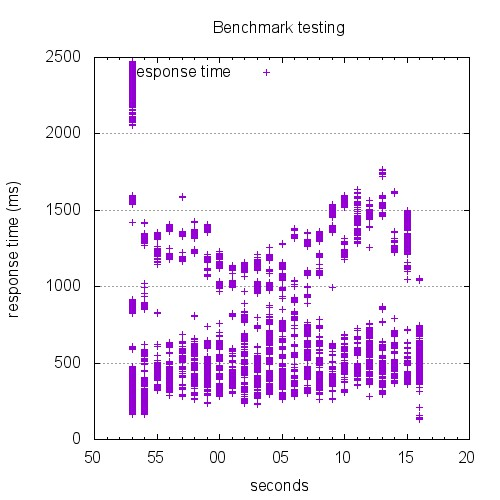

```
This is ApacheBench, Version 2.3 <$Revision: 1528965 $>
Copyright 1996 Adam Twiss, Zeus Technology Ltd, http://www.zeustech.net/
Licensed to The Apache Software Foundation, http://www.apache.org/

Benchmarking 10.129.0.72 (be patient)


Server Software:        
Server Hostname:        10.129.0.72
Server Port:            8080

Document Path:          /index.html
Document Length:        0 bytes

Concurrency Level:      400
Time taken for tests:   23.851 seconds
Complete requests:      12000
Failed requests:        0
Keep-Alive requests:    12000
Total transferred:      2904000 bytes
HTML transferred:       0 bytes
Requests per second:    503.12 [#/sec] (mean)
Time per request:       795.035 [ms] (mean)
Time per request:       1.988 [ms] (mean, across all concurrent requests)
Transfer rate:          118.90 [Kbytes/sec] received

Connection Times (ms)
              min  mean[+/-sd] median   max
Connect:        0   18 131.7      0    1002
Processing:   132  771 396.2    618    1765
Waiting:      132  771 396.2    618    1765
Total:        132  789 434.9    619    2472

Percentage of the requests served within a certain time (ms)
  50%    619
  66%   1006
  75%   1155
  80%   1227
  90%   1373
  95%   1486
  98%   1590
  99%   2254
 100%   2472 (longest request)
```

## 120000-conc-4000-keepalive

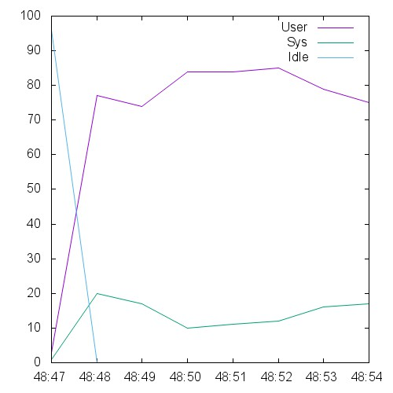  

```
This is ApacheBench, Version 2.3 <$Revision: 1528965 $>
Copyright 1996 Adam Twiss, Zeus Technology Ltd, http://www.zeustech.net/
Licensed to The Apache Software Foundation, http://www.apache.org/

Benchmarking 10.129.0.72 (be patient)
Total of 1352 requests completed
```

## 15000-conc-500-keepalive

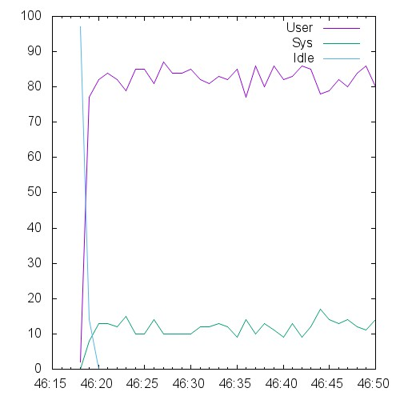  

```
This is ApacheBench, Version 2.3 <$Revision: 1528965 $>
Copyright 1996 Adam Twiss, Zeus Technology Ltd, http://www.zeustech.net/
Licensed to The Apache Software Foundation, http://www.apache.org/

Benchmarking 10.129.0.72 (be patient)


Server Software:        
Server Hostname:        10.129.0.72
Server Port:            8080

Document Path:          /index.html
Document Length:        0 bytes

Concurrency Level:      500
Time taken for tests:   31.319 seconds
Complete requests:      15000
Failed requests:        0
Keep-Alive requests:    15000
Total transferred:      3630000 bytes
HTML transferred:       0 bytes
Requests per second:    478.95 [#/sec] (mean)
Time per request:       1043.951 [ms] (mean)
Time per request:       2.088 [ms] (mean, across all concurrent requests)
Transfer rate:          113.19 [Kbytes/sec] received

Connection Times (ms)
              min  mean[+/-sd] median   max
Connect:        0   15 136.0      0    3005
Processing:   311 1023 308.3   1039    2115
Waiting:      311 1023 308.3   1039    2115
Total:        311 1038 350.2   1040    4372

Percentage of the requests served within a certain time (ms)
  50%   1040
  66%   1158
  75%   1236
  80%   1279
  90%   1430
  95%   1565
  98%   1799
  99%   2185
 100%   4372 (longest request)
```

## 30000-conc-1000-keepalive

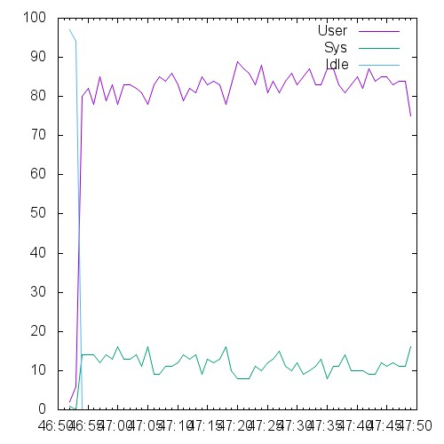 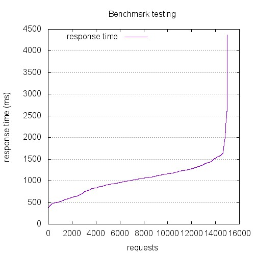 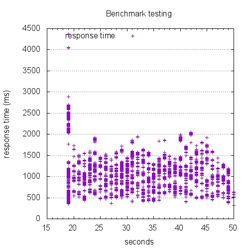

```
This is ApacheBench, Version 2.3 <$Revision: 1528965 $>
Copyright 1996 Adam Twiss, Zeus Technology Ltd, http://www.zeustech.net/
Licensed to The Apache Software Foundation, http://www.apache.org/

Benchmarking 10.129.0.72 (be patient)
Total of 26732 requests completed
```

## 45000-conc-1500-keepalive

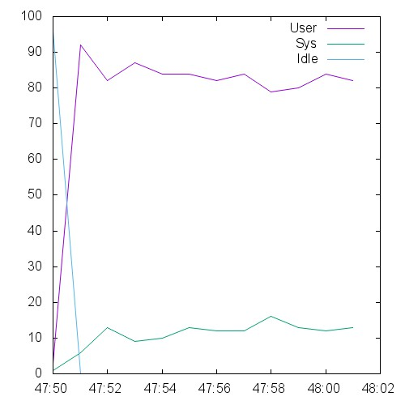  

```
This is ApacheBench, Version 2.3 <$Revision: 1528965 $>
Copyright 1996 Adam Twiss, Zeus Technology Ltd, http://www.zeustech.net/
Licensed to The Apache Software Foundation, http://www.apache.org/

Benchmarking 10.129.0.72 (be patient)
Total of 4011 requests completed
```

## 6000-conc-200-keepalive

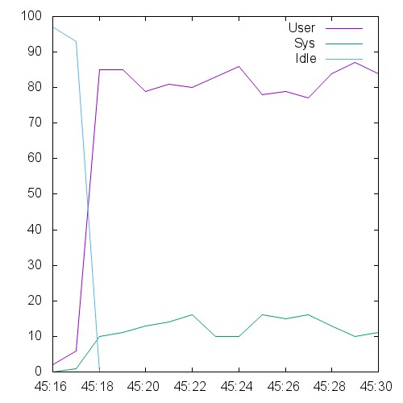 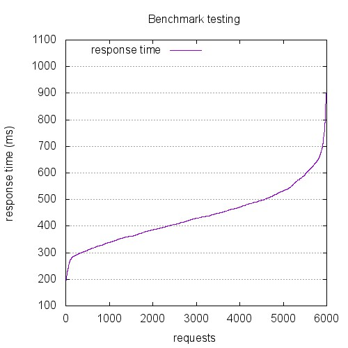 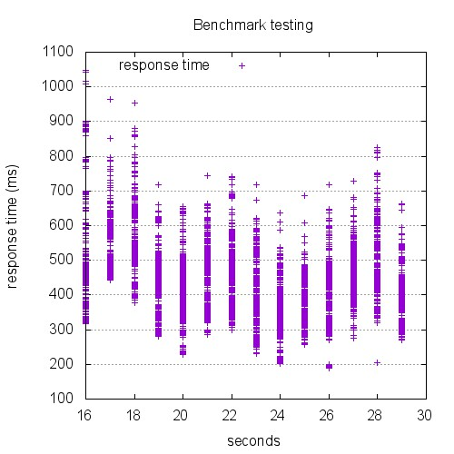

```
This is ApacheBench, Version 2.3 <$Revision: 1528965 $>
Copyright 1996 Adam Twiss, Zeus Technology Ltd, http://www.zeustech.net/
Licensed to The Apache Software Foundation, http://www.apache.org/

Benchmarking 10.129.0.72 (be patient)


Server Software:        
Server Hostname:        10.129.0.72
Server Port:            8080

Document Path:          /index.html
Document Length:        0 bytes

Concurrency Level:      200
Time taken for tests:   13.271 seconds
Complete requests:      6000
Failed requests:        0
Keep-Alive requests:    6000
Total transferred:      1452000 bytes
HTML transferred:       0 bytes
Requests per second:    452.11 [#/sec] (mean)
Time per request:       442.371 [ms] (mean)
Time per request:       2.212 [ms] (mean, across all concurrent requests)
Transfer rate:          106.85 [Kbytes/sec] received

Connection Times (ms)
              min  mean[+/-sd] median   max
Connect:        0    0   0.8      0       7
Processing:   175  439 105.1    429    1042
Waiting:      175  439 105.1    429    1042
Total:        175  439 105.2    429    1048

Percentage of the requests served within a certain time (ms)
  50%    429
  66%    469
  75%    497
  80%    517
  90%    579
  95%    630
  98%    685
  99%    746
 100%   1048 (longest request)
```

## 60000-conc-2000-keepalive

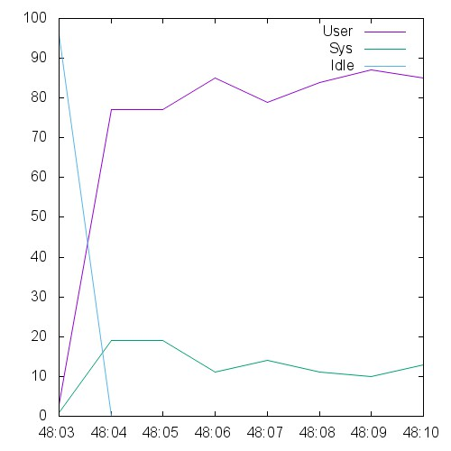  

```
This is ApacheBench, Version 2.3 <$Revision: 1528965 $>
Copyright 1996 Adam Twiss, Zeus Technology Ltd, http://www.zeustech.net/
Licensed to The Apache Software Foundation, http://www.apache.org/

Benchmarking 10.129.0.72 (be patient)
Total of 2389 requests completed
```

## 75000-conc-2500-keepalive

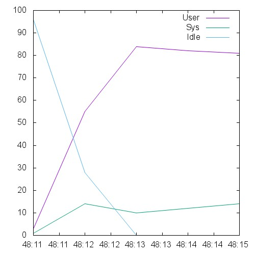  

```
This is ApacheBench, Version 2.3 <$Revision: 1528965 $>
Copyright 1996 Adam Twiss, Zeus Technology Ltd, http://www.zeustech.net/
Licensed to The Apache Software Foundation, http://www.apache.org/

Benchmarking 10.129.0.72 (be patient)
Total of 1437 requests completed
```

## 9000-conc-300-keepalive

 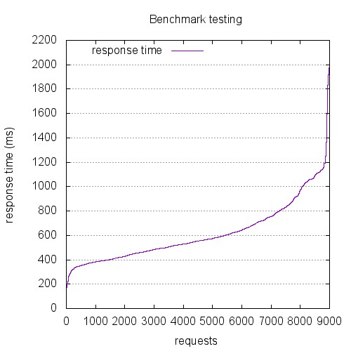 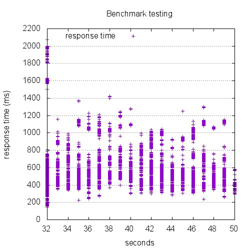

```
This is ApacheBench, Version 2.3 <$Revision: 1528965 $>
Copyright 1996 Adam Twiss, Zeus Technology Ltd, http://www.zeustech.net/
Licensed to The Apache Software Foundation, http://www.apache.org/

Benchmarking 10.129.0.72 (be patient)


Server Software:        
Server Hostname:        10.129.0.72
Server Port:            8080

Document Path:          /index.html
Document Length:        0 bytes

Concurrency Level:      300
Time taken for tests:   18.673 seconds
Complete requests:      9000
Failed requests:        0
Keep-Alive requests:    9000
Total transferred:      2178000 bytes
HTML transferred:       0 bytes
Requests per second:    481.98 [#/sec] (mean)
Time per request:       622.433 [ms] (mean)
Time per request:       2.075 [ms] (mean, across all concurrent requests)
Transfer rate:          113.91 [Kbytes/sec] received

Connection Times (ms)
              min  mean[+/-sd] median   max
Connect:        0   11 102.8      0    1002
Processing:   142  607 221.8    554    1423
Waiting:      142  607 221.8    554    1423
Total:        142  618 253.9    554    2075

Percentage of the requests served within a certain time (ms)
  50%    554
  66%    637
  75%    724
  80%    789
  90%   1008
  95%   1106
  98%   1191
  99%   1579
 100%   2075 (longest request)
```

## 90000-conc-3000-keepalive

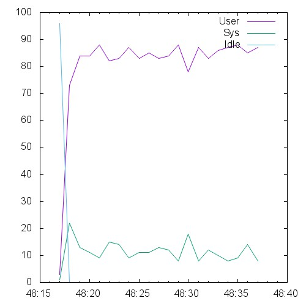  

```
This is ApacheBench, Version 2.3 <$Revision: 1528965 $>
Copyright 1996 Adam Twiss, Zeus Technology Ltd, http://www.zeustech.net/
Licensed to The Apache Software Foundation, http://www.apache.org/

Benchmarking 10.129.0.72 (be patient)
Total of 6508 requests completed
```

