# Vulcand plain HTTP with Keepalive
## 105000-conc-3500-keepalive

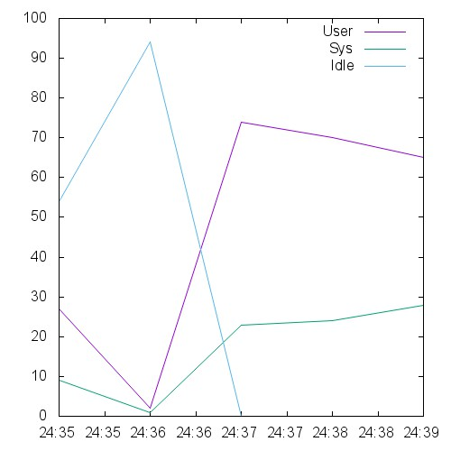  

```
This is ApacheBench, Version 2.3 <$Revision: 1528965 $>
Copyright 1996 Adam Twiss, Zeus Technology Ltd, http://www.zeustech.net/
Licensed to The Apache Software Foundation, http://www.apache.org/

Benchmarking 10.129.0.26 (be patient)
Total of 9634 requests completed
```

## 12000-conc-400-keepalive

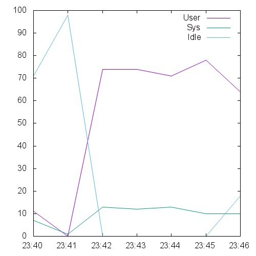 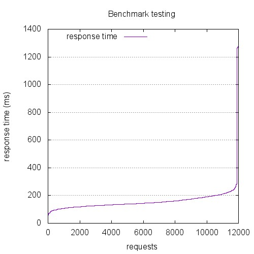 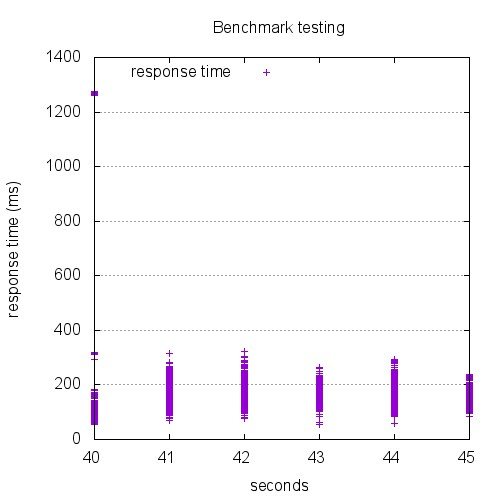

```
This is ApacheBench, Version 2.3 <$Revision: 1528965 $>
Copyright 1996 Adam Twiss, Zeus Technology Ltd, http://www.zeustech.net/
Licensed to The Apache Software Foundation, http://www.apache.org/

Benchmarking 10.129.0.26 (be patient)


Server Software:        nginx/1.4.6
Server Hostname:        10.129.0.26
Server Port:            8080

Document Path:          /index.html
Document Length:        0 bytes

Concurrency Level:      400
Time taken for tests:   4.813 seconds
Complete requests:      12000
Failed requests:        0
Keep-Alive requests:    12000
Total transferred:      2904000 bytes
HTML transferred:       0 bytes
Requests per second:    2493.27 [#/sec] (mean)
Time per request:       160.432 [ms] (mean)
Time per request:       0.401 [ms] (mean, across all concurrent requests)
Transfer rate:          589.23 [Kbytes/sec] received

Connection Times (ms)
              min  mean[+/-sd] median   max
Connect:        0    7  81.8      0    1000
Processing:    50  152  38.8    144     322
Waiting:       50  152  38.8    144     322
Total:         54  159  98.9    144    1277

Percentage of the requests served within a certain time (ms)
  50%    144
  66%    160
  75%    174
  80%    184
  90%    205
  95%    227
  98%    253
  99%    282
 100%   1277 (longest request)
```

## 120000-conc-4000-keepalive

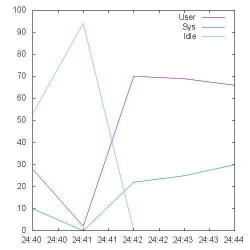  

```
This is ApacheBench, Version 2.3 <$Revision: 1528965 $>
Copyright 1996 Adam Twiss, Zeus Technology Ltd, http://www.zeustech.net/
Licensed to The Apache Software Foundation, http://www.apache.org/

Benchmarking 10.129.0.26 (be patient)
Total of 8965 requests completed
```

## 15000-conc-500-keepalive

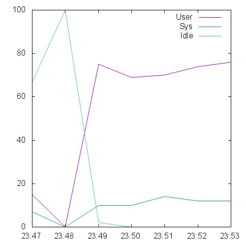 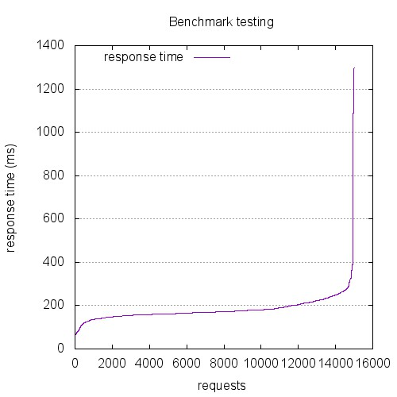 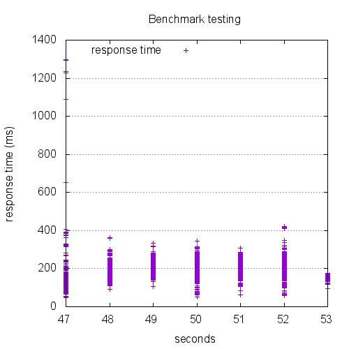

```
This is ApacheBench, Version 2.3 <$Revision: 1528965 $>
Copyright 1996 Adam Twiss, Zeus Technology Ltd, http://www.zeustech.net/
Licensed to The Apache Software Foundation, http://www.apache.org/

Benchmarking 10.129.0.26 (be patient)


Server Software:        nginx/1.4.6
Server Hostname:        10.129.0.26
Server Port:            8080

Document Path:          /index.html
Document Length:        0 bytes

Concurrency Level:      500
Time taken for tests:   5.551 seconds
Complete requests:      15000
Failed requests:        0
Non-2xx responses:      199
Keep-Alive requests:    15000
Total transferred:      3611493 bytes
HTML transferred:       0 bytes
Requests per second:    2702.08 [#/sec] (mean)
Time per request:       185.043 [ms] (mean)
Time per request:       0.370 [ms] (mean, across all concurrent requests)
Transfer rate:          635.32 [Kbytes/sec] received

Connection Times (ms)
              min  mean[+/-sd] median   max
Connect:        0    5  69.6      0    1002
Processing:    49  179  40.9    170     641
Waiting:       49  179  40.9    170     641
Total:         49  184  79.8    170    1297

Percentage of the requests served within a certain time (ms)
  50%    170
  66%    180
  75%    194
  80%    205
  90%    233
  95%    259
  98%    290
  99%    349
 100%   1297 (longest request)
```

## 30000-conc-1000-keepalive

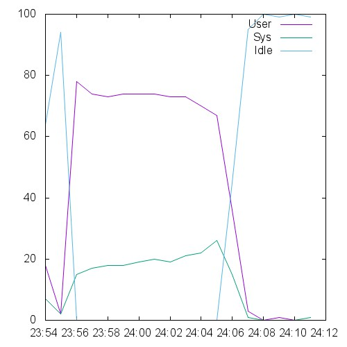  

```
This is ApacheBench, Version 2.3 <$Revision: 1528965 $>
Copyright 1996 Adam Twiss, Zeus Technology Ltd, http://www.zeustech.net/
Licensed to The Apache Software Foundation, http://www.apache.org/

Benchmarking 10.129.0.26 (be patient)


Server Software:        nginx/1.4.6
Server Hostname:        10.129.0.26
Server Port:            8080

Document Path:          /index.html
Document Length:        0 bytes

Concurrency Level:      1000
Time taken for tests:   16.117 seconds
Complete requests:      30000
Failed requests:        0
Non-2xx responses:      12644
Keep-Alive requests:    30000
Total transferred:      6084108 bytes
HTML transferred:       0 bytes
Requests per second:    1861.39 [#/sec] (mean)
Time per request:       537.232 [ms] (mean)
Time per request:       0.537 [ms] (mean, across all concurrent requests)
Transfer rate:          368.65 [Kbytes/sec] received

Connection Times (ms)
              min  mean[+/-sd] median   max
Connect:        0   14 202.4      0    7013
Processing:     1  316 831.4    247   13106
Waiting:        1  316 831.4    247   13106
Total:          1  330 999.0    247   16110

Percentage of the requests served within a certain time (ms)
  50%    247
  66%    295
  75%    316
  80%    326
  90%    353
  95%    378
  98%    444
  99%   1179
 100%  16110 (longest request)
```

## 45000-conc-1500-keepalive

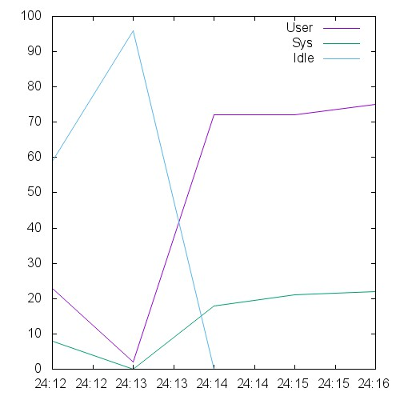  

```
This is ApacheBench, Version 2.3 <$Revision: 1528965 $>
Copyright 1996 Adam Twiss, Zeus Technology Ltd, http://www.zeustech.net/
Licensed to The Apache Software Foundation, http://www.apache.org/

Benchmarking 10.129.0.26 (be patient)
Total of 9240 requests completed
```

## 6000-conc-200-keepalive

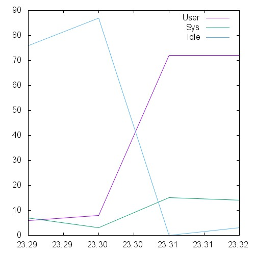 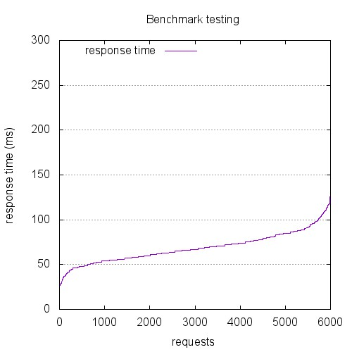 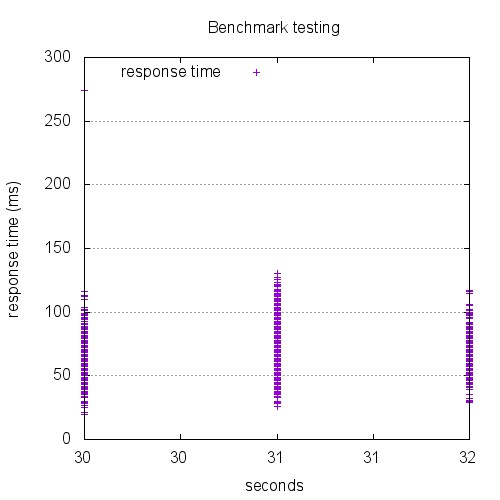

```
This is ApacheBench, Version 2.3 <$Revision: 1528965 $>
Copyright 1996 Adam Twiss, Zeus Technology Ltd, http://www.zeustech.net/
Licensed to The Apache Software Foundation, http://www.apache.org/

Benchmarking 10.129.0.26 (be patient)


Server Software:        nginx/1.4.6
Server Hostname:        10.129.0.26
Server Port:            8080

Document Path:          /index.html
Document Length:        0 bytes

Concurrency Level:      200
Time taken for tests:   2.079 seconds
Complete requests:      6000
Failed requests:        0
Keep-Alive requests:    6000
Total transferred:      1452000 bytes
HTML transferred:       0 bytes
Requests per second:    2885.31 [#/sec] (mean)
Time per request:       69.317 [ms] (mean)
Time per request:       0.347 [ms] (mean, across all concurrent requests)
Transfer rate:          681.88 [Kbytes/sec] received

Connection Times (ms)
              min  mean[+/-sd] median   max
Connect:        0    0   0.4      0       4
Processing:    20   69  16.7     67     272
Waiting:       20   69  16.7     67     272
Total:         20   69  16.8     67     274

Percentage of the requests served within a certain time (ms)
  50%     67
  66%     73
  75%     78
  80%     83
  90%     89
  95%     99
  98%    110
  99%    116
 100%    274 (longest request)
```

## 60000-conc-2000-keepalive

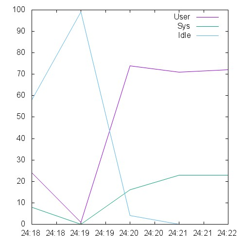  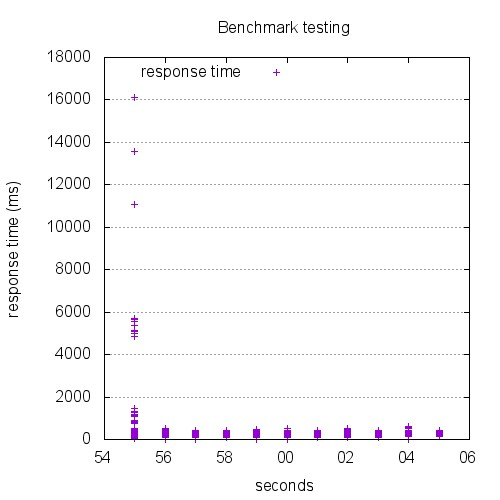

```
This is ApacheBench, Version 2.3 <$Revision: 1528965 $>
Copyright 1996 Adam Twiss, Zeus Technology Ltd, http://www.zeustech.net/
Licensed to The Apache Software Foundation, http://www.apache.org/

Benchmarking 10.129.0.26 (be patient)
Total of 8874 requests completed
```

## 75000-conc-2500-keepalive

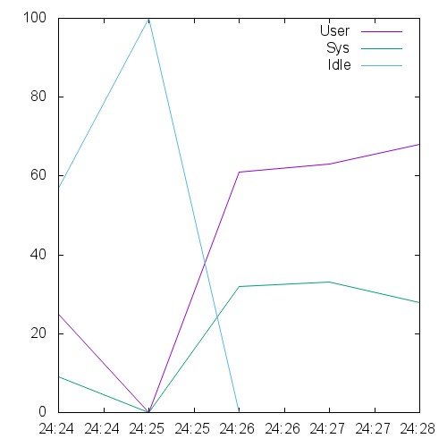  

```
This is ApacheBench, Version 2.3 <$Revision: 1528965 $>
Copyright 1996 Adam Twiss, Zeus Technology Ltd, http://www.zeustech.net/
Licensed to The Apache Software Foundation, http://www.apache.org/

Benchmarking 10.129.0.26 (be patient)
Total of 8756 requests completed
```

## 9000-conc-300-keepalive

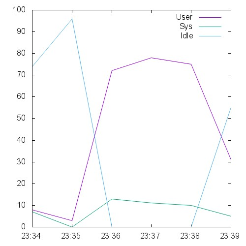 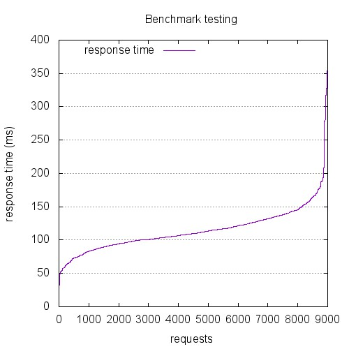 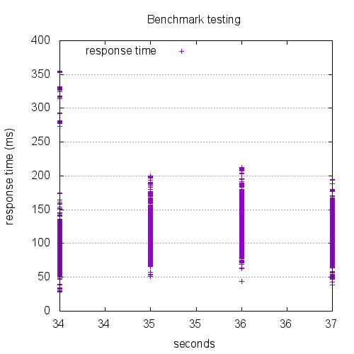

```
This is ApacheBench, Version 2.3 <$Revision: 1528965 $>
Copyright 1996 Adam Twiss, Zeus Technology Ltd, http://www.zeustech.net/
Licensed to The Apache Software Foundation, http://www.apache.org/

Benchmarking 10.129.0.26 (be patient)


Server Software:        nginx/1.4.6
Server Hostname:        10.129.0.26
Server Port:            8080

Document Path:          /index.html
Document Length:        0 bytes

Concurrency Level:      300
Time taken for tests:   3.489 seconds
Complete requests:      9000
Failed requests:        0
Keep-Alive requests:    9000
Total transferred:      2178000 bytes
HTML transferred:       0 bytes
Requests per second:    2579.80 [#/sec] (mean)
Time per request:       116.288 [ms] (mean)
Time per request:       0.388 [ms] (mean, across all concurrent requests)
Transfer rate:          609.68 [Kbytes/sec] received

Connection Times (ms)
              min  mean[+/-sd] median   max
Connect:        0    0   0.7      0       7
Processing:    21  115  34.3    110     350
Waiting:       21  115  34.3    110     350
Total:         21  115  34.5    110     355

Percentage of the requests served within a certain time (ms)
  50%    110
  66%    120
  75%    130
  80%    134
  90%    149
  95%    166
  98%    189
  99%    280
 100%    355 (longest request)
```

## 90000-conc-3000-keepalive

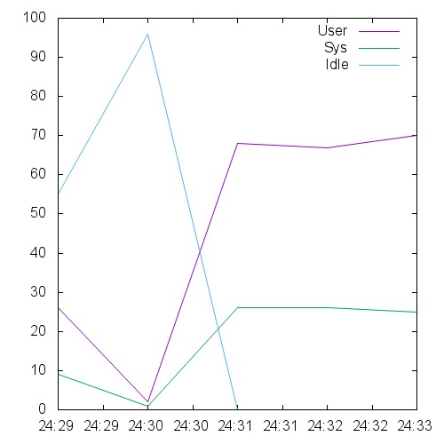  

```
This is ApacheBench, Version 2.3 <$Revision: 1528965 $>
Copyright 1996 Adam Twiss, Zeus Technology Ltd, http://www.zeustech.net/
Licensed to The Apache Software Foundation, http://www.apache.org/

Benchmarking 10.129.0.26 (be patient)
Total of 9321 requests completed
```

