# Vulcand+CloudFlare patch SSL no Keepalive
## 10500-conc-350

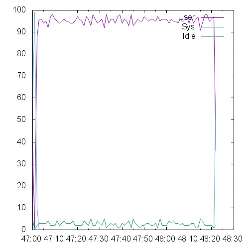 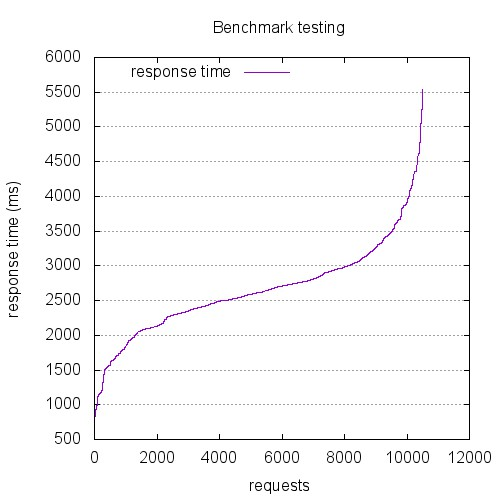 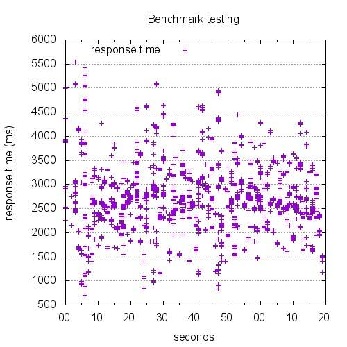

```
This is ApacheBench, Version 2.3 <$Revision: 1528965 $>
Copyright 1996 Adam Twiss, Zeus Technology Ltd, http://www.zeustech.net/
Licensed to The Apache Software Foundation, http://www.apache.org/

Benchmarking 10.129.0.26 (be patient)


Server Software:        nginx/1.4.6
Server Hostname:        10.129.0.26
Server Port:            443
SSL/TLS Protocol:       TLSv1.2,ECDHE-RSA-AES256-SHA,2048,256

Document Path:          /index.html
Document Length:        0 bytes

Concurrency Level:      350
Time taken for tests:   80.280 seconds
Complete requests:      10500
Failed requests:        0
Total transferred:      2289000 bytes
HTML transferred:       0 bytes
Requests per second:    130.79 [#/sec] (mean)
Time per request:       2676.014 [ms] (mean)
Time per request:       7.646 [ms] (mean, across all concurrent requests)
Transfer rate:          27.84 [Kbytes/sec] received

Connection Times (ms)
              min  mean[+/-sd] median   max
Connect:      144 1181 531.8   1049    3633
Processing:    86 1476 515.3   1455    3710
Waiting:       86 1476 515.2   1455    3706
Total:        700 2657 672.4   2616    5545

Percentage of the requests served within a certain time (ms)
  50%   2616
  66%   2799
  75%   2963
  80%   3054
  90%   3465
  95%   3884
  98%   4365
  99%   4635
 100%   5545 (longest request)
```

## 1200-conc-40

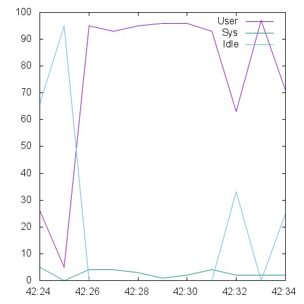 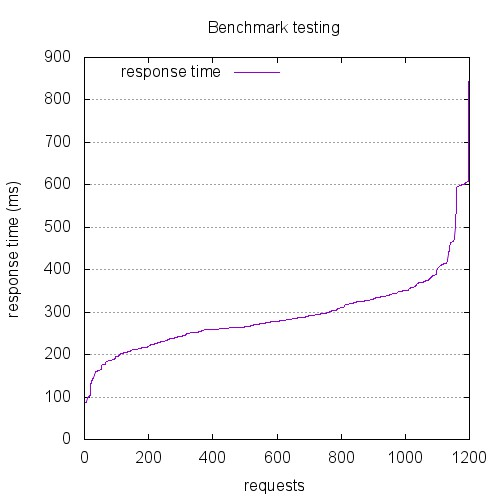 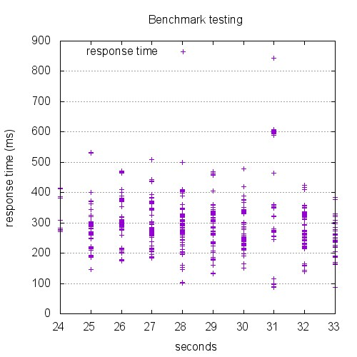

```
This is ApacheBench, Version 2.3 <$Revision: 1528965 $>
Copyright 1996 Adam Twiss, Zeus Technology Ltd, http://www.zeustech.net/
Licensed to The Apache Software Foundation, http://www.apache.org/

Benchmarking 10.129.0.26 (be patient)


Server Software:        nginx/1.4.6
Server Hostname:        10.129.0.26
Server Port:            443
SSL/TLS Protocol:       TLSv1.2,ECDHE-RSA-AES256-SHA,2048,256

Document Path:          /index.html
Document Length:        0 bytes

Concurrency Level:      40
Time taken for tests:   8.787 seconds
Complete requests:      1200
Failed requests:        0
Total transferred:      261600 bytes
HTML transferred:       0 bytes
Requests per second:    136.56 [#/sec] (mean)
Time per request:       292.913 [ms] (mean)
Time per request:       7.323 [ms] (mean, across all concurrent requests)
Transfer rate:          29.07 [Kbytes/sec] received

Connection Times (ms)
              min  mean[+/-sd] median   max
Connect:       23  147  89.8    126     594
Processing:     4  146  57.8    148     343
Waiting:        4  145  57.7    148     343
Total:         85  292  90.5    278     844

Percentage of the requests served within a certain time (ms)
  50%    278
  66%    308
  75%    330
  80%    343
  90%    381
  95%    458
  98%    600
  99%    603
 100%    844 (longest request)
```

## 12000-conc-400

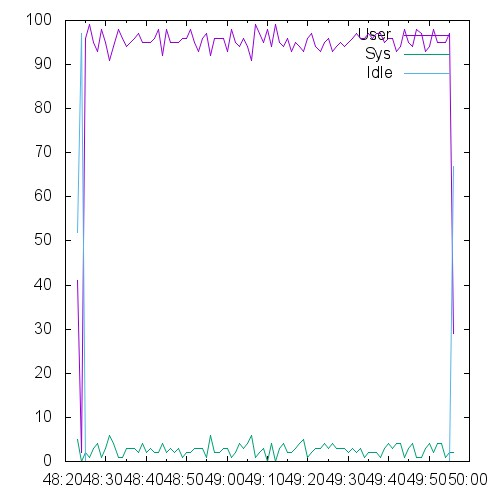 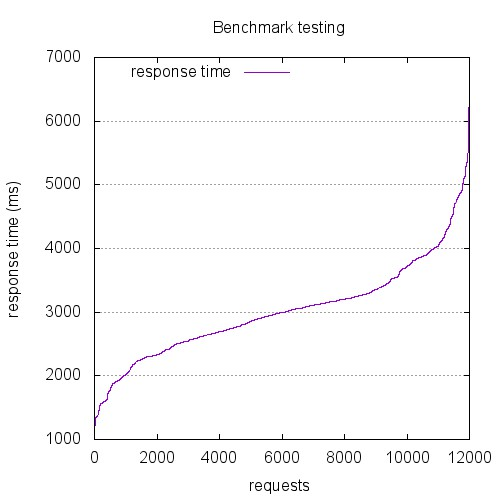 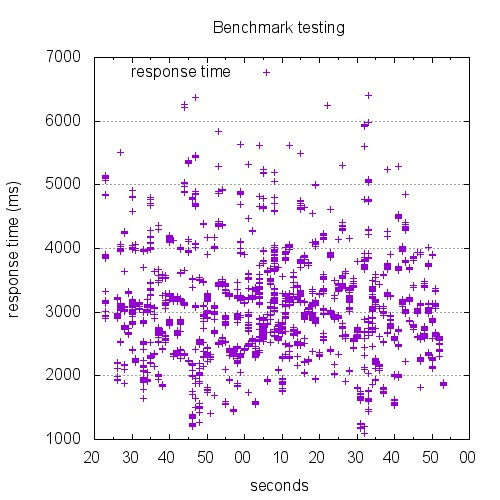

```
This is ApacheBench, Version 2.3 <$Revision: 1528965 $>
Copyright 1996 Adam Twiss, Zeus Technology Ltd, http://www.zeustech.net/
Licensed to The Apache Software Foundation, http://www.apache.org/

Benchmarking 10.129.0.26 (be patient)


Server Software:        nginx/1.4.6
Server Hostname:        10.129.0.26
Server Port:            443
SSL/TLS Protocol:       TLSv1.2,ECDHE-RSA-AES256-SHA,2048,256

Document Path:          /index.html
Document Length:        0 bytes

Concurrency Level:      400
Time taken for tests:   91.366 seconds
Complete requests:      12000
Failed requests:        0
Total transferred:      2616000 bytes
HTML transferred:       0 bytes
Requests per second:    131.34 [#/sec] (mean)
Time per request:       3045.523 [ms] (mean)
Time per request:       7.614 [ms] (mean, across all concurrent requests)
Transfer rate:          27.96 [Kbytes/sec] received

Connection Times (ms)
              min  mean[+/-sd] median   max
Connect:      144 1369 644.1   1246    5110
Processing:    65 1651 576.4   1607    4759
Waiting:       65 1651 576.4   1607    4758
Total:       1095 3021 759.4   2990    6397

Percentage of the requests served within a certain time (ms)
  50%   2990
  66%   3198
  75%   3353
  80%   3534
  90%   3979
  95%   4430
  98%   4906
  99%   5189
 100%   6397 (longest request)
```

## 13500-conc-450

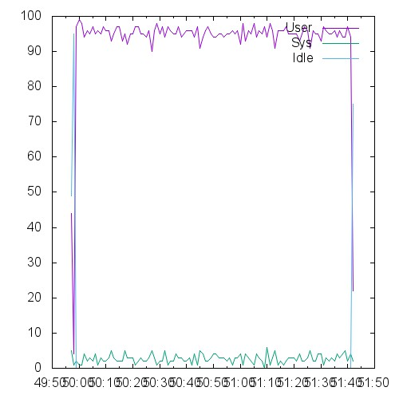 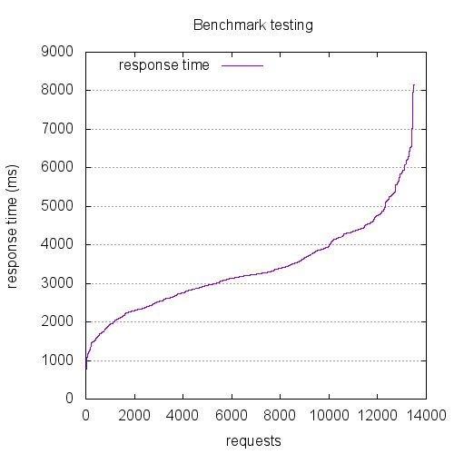 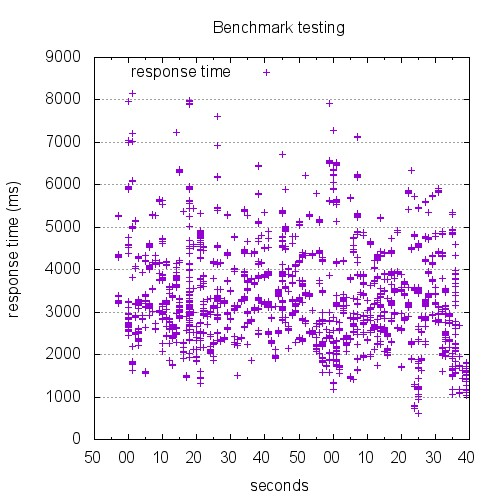

```
This is ApacheBench, Version 2.3 <$Revision: 1528965 $>
Copyright 1996 Adam Twiss, Zeus Technology Ltd, http://www.zeustech.net/
Licensed to The Apache Software Foundation, http://www.apache.org/

Benchmarking 10.129.0.26 (be patient)


Server Software:        nginx/1.4.6
Server Hostname:        10.129.0.26
Server Port:            443
SSL/TLS Protocol:       TLSv1.2,ECDHE-RSA-AES256-SHA,2048,256

Document Path:          /index.html
Document Length:        0 bytes

Concurrency Level:      450
Time taken for tests:   103.296 seconds
Complete requests:      13500
Failed requests:        0
Total transferred:      2943000 bytes
HTML transferred:       0 bytes
Requests per second:    130.69 [#/sec] (mean)
Time per request:       3443.201 [ms] (mean)
Time per request:       7.652 [ms] (mean, across all concurrent requests)
Transfer rate:          27.82 [Kbytes/sec] received

Connection Times (ms)
              min  mean[+/-sd] median   max
Connect:      193 1625 888.8   1393    6084
Processing:   170 1757 785.2   1675    5585
Waiting:      170 1757 785.0   1675    5584
Total:        603 3382 1141.5   3215    8157

Percentage of the requests served within a certain time (ms)
  50%   3215
  66%   3620
  75%   4084
  80%   4312
  90%   4827
  95%   5615
  98%   6227
  99%   6535
 100%   8157 (longest request)
```

## 15000-conc-500

 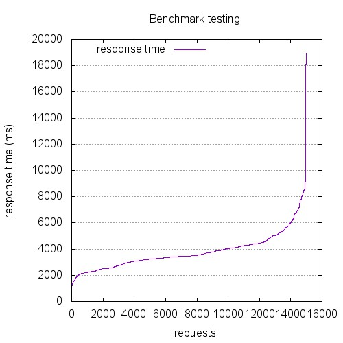 

```
This is ApacheBench, Version 2.3 <$Revision: 1528965 $>
Copyright 1996 Adam Twiss, Zeus Technology Ltd, http://www.zeustech.net/
Licensed to The Apache Software Foundation, http://www.apache.org/

Benchmarking 10.129.0.26 (be patient)


Server Software:        nginx/1.4.6
Server Hostname:        10.129.0.26
Server Port:            443
SSL/TLS Protocol:       TLSv1.2,ECDHE-RSA-AES256-SHA,2048,256

Document Path:          /index.html
Document Length:        0 bytes

Concurrency Level:      500
Time taken for tests:   114.419 seconds
Complete requests:      15000
Failed requests:        0
Total transferred:      3270000 bytes
HTML transferred:       0 bytes
Requests per second:    131.10 [#/sec] (mean)
Time per request:       3813.961 [ms] (mean)
Time per request:       7.628 [ms] (mean, across all concurrent requests)
Transfer rate:          27.91 [Kbytes/sec] received

Connection Times (ms)
              min  mean[+/-sd] median   max
Connect:      162 1897 1307.1   1665   16026
Processing:   110 1899 769.9   1878    7172
Waiting:      110 1899 769.7   1877    7171
Total:        756 3797 1465.7   3472   18944

Percentage of the requests served within a certain time (ms)
  50%   3472
  66%   4021
  75%   4290
  80%   4445
  90%   5367
  95%   6667
  98%   7893
  99%   8467
 100%  18944 (longest request)
```

## 1800-conc-60

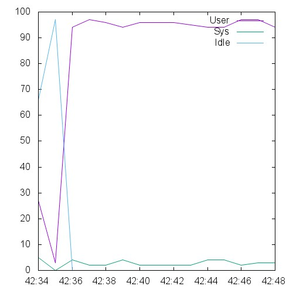 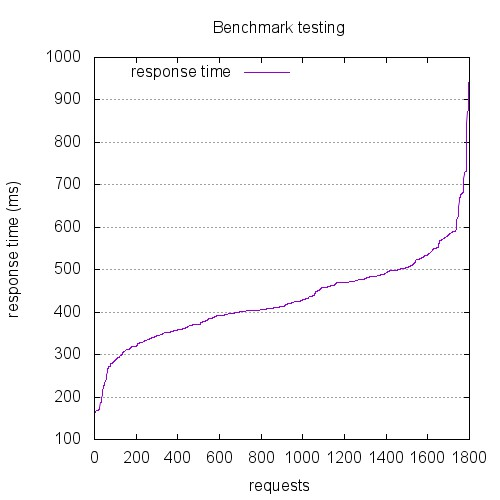 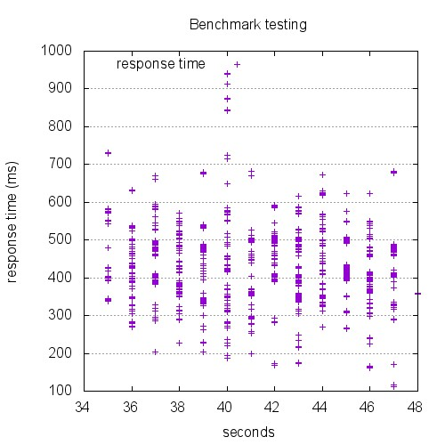

```
This is ApacheBench, Version 2.3 <$Revision: 1528965 $>
Copyright 1996 Adam Twiss, Zeus Technology Ltd, http://www.zeustech.net/
Licensed to The Apache Software Foundation, http://www.apache.org/

Benchmarking 10.129.0.26 (be patient)


Server Software:        nginx/1.4.6
Server Hostname:        10.129.0.26
Server Port:            443
SSL/TLS Protocol:       TLSv1.2,ECDHE-RSA-AES256-SHA,2048,256

Document Path:          /index.html
Document Length:        0 bytes

Concurrency Level:      60
Time taken for tests:   13.045 seconds
Complete requests:      1800
Failed requests:        0
Total transferred:      392400 bytes
HTML transferred:       0 bytes
Requests per second:    137.98 [#/sec] (mean)
Time per request:       434.849 [ms] (mean)
Time per request:       7.247 [ms] (mean, across all concurrent requests)
Transfer rate:          29.37 [Kbytes/sec] received

Connection Times (ms)
              min  mean[+/-sd] median   max
Connect:       32  184  75.7    174     518
Processing:    14  245  93.0    253     717
Waiting:       14  245  93.0    253     717
Total:        110  428 102.6    413     941

Percentage of the requests served within a certain time (ms)
  50%    413
  66%    470
  75%    485
  80%    499
  90%    544
  95%    586
  98%    679
  99%    731
 100%    941 (longest request)
```

## 2400-conc-80

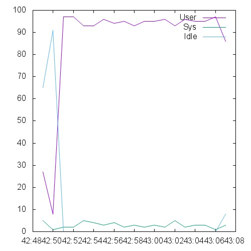 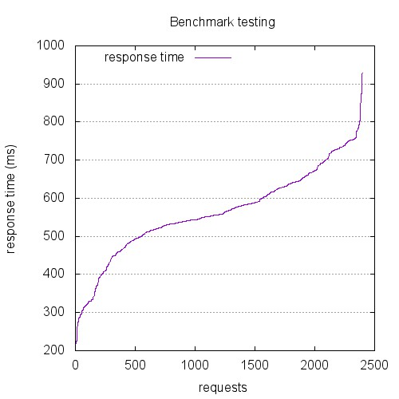 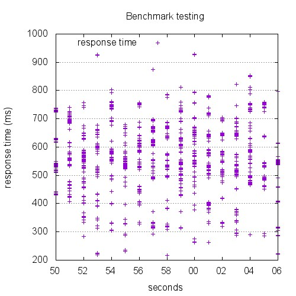

```
This is ApacheBench, Version 2.3 <$Revision: 1528965 $>
Copyright 1996 Adam Twiss, Zeus Technology Ltd, http://www.zeustech.net/
Licensed to The Apache Software Foundation, http://www.apache.org/

Benchmarking 10.129.0.26 (be patient)


Server Software:        nginx/1.4.6
Server Hostname:        10.129.0.26
Server Port:            443
SSL/TLS Protocol:       TLSv1.2,ECDHE-RSA-AES256-SHA,2048,256

Document Path:          /index.html
Document Length:        0 bytes

Concurrency Level:      80
Time taken for tests:   16.968 seconds
Complete requests:      2400
Failed requests:        0
Total transferred:      523200 bytes
HTML transferred:       0 bytes
Requests per second:    141.44 [#/sec] (mean)
Time per request:       565.607 [ms] (mean)
Time per request:       7.070 [ms] (mean, across all concurrent requests)
Transfer rate:          30.11 [Kbytes/sec] received

Connection Times (ms)
              min  mean[+/-sd] median   max
Connect:       21  241  99.4    241     503
Processing:    23  322 108.2    326     669
Waiting:       22  322 108.2    326     669
Total:        215  564 116.3    557     928

Percentage of the requests served within a certain time (ms)
  50%    557
  66%    604
  75%    638
  80%    657
  90%    725
  95%    750
  98%    776
  99%    804
 100%    928 (longest request)
```

## 300-conc-10

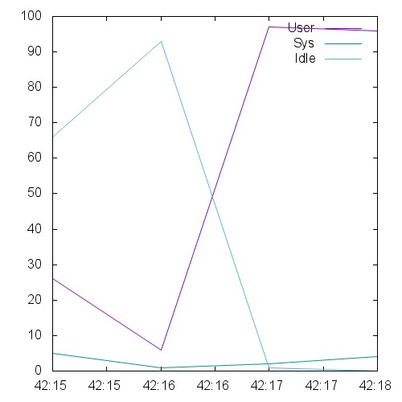 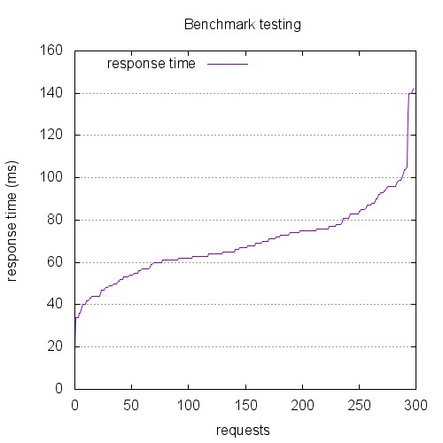 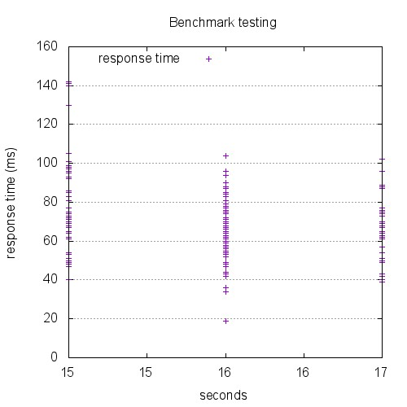

```
This is ApacheBench, Version 2.3 <$Revision: 1528965 $>
Copyright 1996 Adam Twiss, Zeus Technology Ltd, http://www.zeustech.net/
Licensed to The Apache Software Foundation, http://www.apache.org/

Benchmarking 10.129.0.26 (be patient)


Server Software:        nginx/1.4.6
Server Hostname:        10.129.0.26
Server Port:            443
SSL/TLS Protocol:       TLSv1.2,ECDHE-RSA-AES256-SHA,2048,256

Document Path:          /index.html
Document Length:        0 bytes

Concurrency Level:      10
Time taken for tests:   2.078 seconds
Complete requests:      300
Failed requests:        0
Total transferred:      65400 bytes
HTML transferred:       0 bytes
Requests per second:    144.37 [#/sec] (mean)
Time per request:       69.267 [ms] (mean)
Time per request:       6.927 [ms] (mean, across all concurrent requests)
Transfer rate:          30.73 [Kbytes/sec] received

Connection Times (ms)
              min  mean[+/-sd] median   max
Connect:        8   42  16.6     39      96
Processing:     1   27  15.6     26      80
Waiting:        1   27  15.6     26      80
Total:         19   69  18.2     67     142

Percentage of the requests served within a certain time (ms)
  50%     67
  66%     74
  75%     77
  80%     81
  90%     93
  95%     98
  98%    130
  99%    140
 100%    142 (longest request)
```

## 3000-conc-100

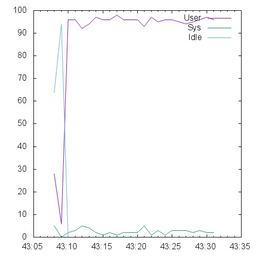 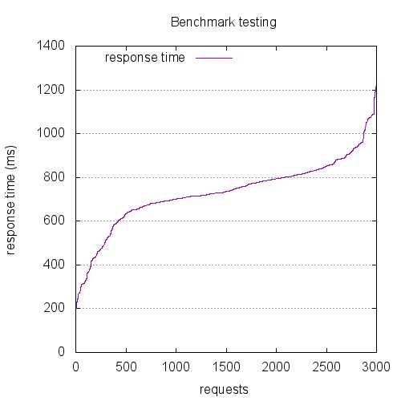 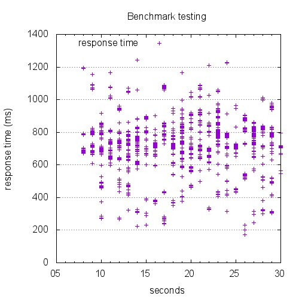

```
This is ApacheBench, Version 2.3 <$Revision: 1528965 $>
Copyright 1996 Adam Twiss, Zeus Technology Ltd, http://www.zeustech.net/
Licensed to The Apache Software Foundation, http://www.apache.org/

Benchmarking 10.129.0.26 (be patient)


Server Software:        nginx/1.4.6
Server Hostname:        10.129.0.26
Server Port:            443
SSL/TLS Protocol:       TLSv1.2,ECDHE-RSA-AES256-SHA,2048,256

Document Path:          /index.html
Document Length:        0 bytes

Concurrency Level:      100
Time taken for tests:   22.258 seconds
Complete requests:      3000
Failed requests:        0
Total transferred:      654000 bytes
HTML transferred:       0 bytes
Requests per second:    134.78 [#/sec] (mean)
Time per request:       741.945 [ms] (mean)
Time per request:       7.419 [ms] (mean, across all concurrent requests)
Transfer rate:          28.69 [Kbytes/sec] received

Connection Times (ms)
              min  mean[+/-sd] median   max
Connect:       39  358 161.5    354     703
Processing:    24  373 153.6    364     828
Waiting:       24  373 153.6    363     828
Total:        172  731 160.4    735    1244

Percentage of the requests served within a certain time (ms)
  50%    735
  66%    792
  75%    814
  80%    833
  90%    901
  95%    959
  98%   1074
  99%   1089
 100%   1244 (longest request)
```

## 4500-conc-150

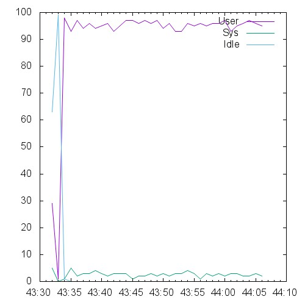 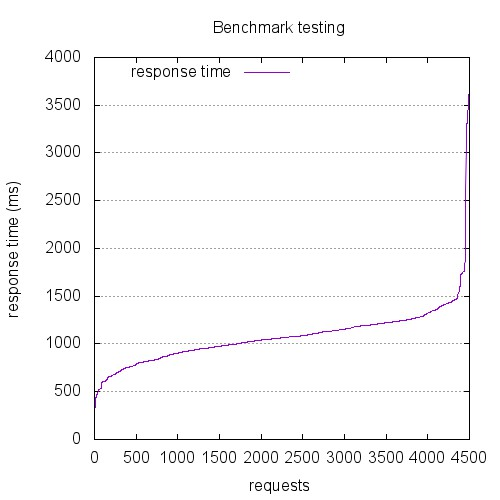 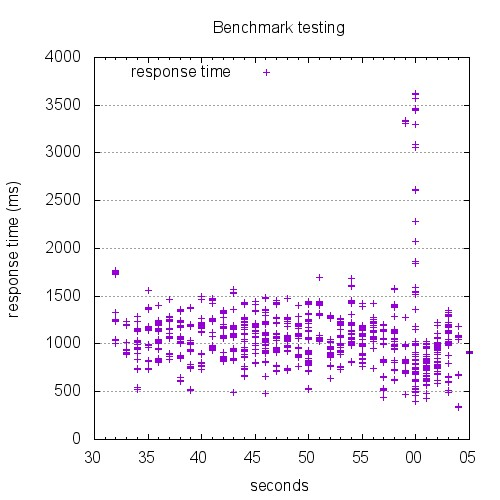

```
This is ApacheBench, Version 2.3 <$Revision: 1528965 $>
Copyright 1996 Adam Twiss, Zeus Technology Ltd, http://www.zeustech.net/
Licensed to The Apache Software Foundation, http://www.apache.org/

Benchmarking 10.129.0.26 (be patient)


Server Software:        nginx/1.4.6
Server Hostname:        10.129.0.26
Server Port:            443
SSL/TLS Protocol:       TLSv1.2,ECDHE-RSA-AES256-SHA,2048,256

Document Path:          /index.html
Document Length:        0 bytes

Concurrency Level:      150
Time taken for tests:   33.163 seconds
Complete requests:      4500
Failed requests:        0
Total transferred:      981000 bytes
HTML transferred:       0 bytes
Requests per second:    135.69 [#/sec] (mean)
Time per request:       1105.423 [ms] (mean)
Time per request:       7.369 [ms] (mean, across all concurrent requests)
Transfer rate:          28.89 [Kbytes/sec] received

Connection Times (ms)
              min  mean[+/-sd] median   max
Connect:       42  457 270.3    424    3059
Processing:    53  624 231.9    622    2900
Waiting:       53  624 231.9    622    2900
Total:        316 1081 322.4   1064    3626

Percentage of the requests served within a certain time (ms)
  50%   1064
  66%   1150
  75%   1206
  80%   1233
  90%   1345
  95%   1437
  98%   1742
  99%   2609
 100%   3626 (longest request)
```

## 600-conc-20

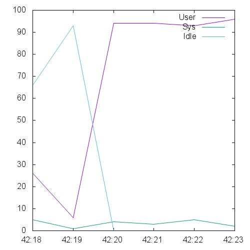 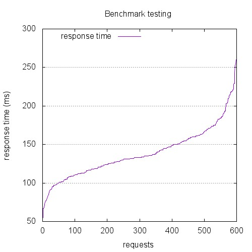 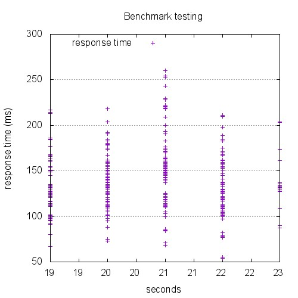

```
This is ApacheBench, Version 2.3 <$Revision: 1528965 $>
Copyright 1996 Adam Twiss, Zeus Technology Ltd, http://www.zeustech.net/
Licensed to The Apache Software Foundation, http://www.apache.org/

Benchmarking 10.129.0.26 (be patient)


Server Software:        nginx/1.4.6
Server Hostname:        10.129.0.26
Server Port:            443
SSL/TLS Protocol:       TLSv1.2,ECDHE-RSA-AES256-SHA,2048,256

Document Path:          /index.html
Document Length:        0 bytes

Concurrency Level:      20
Time taken for tests:   4.181 seconds
Complete requests:      600
Failed requests:        0
Total transferred:      130800 bytes
HTML transferred:       0 bytes
Requests per second:    143.50 [#/sec] (mean)
Time per request:       139.372 [ms] (mean)
Time per request:       6.969 [ms] (mean, across all concurrent requests)
Transfer rate:          30.55 [Kbytes/sec] received

Connection Times (ms)
              min  mean[+/-sd] median   max
Connect:       16   77  24.3     77     138
Processing:     4   62  30.5     59     165
Waiting:        4   61  30.5     59     165
Total:         53  138  32.4    133     260

Percentage of the requests served within a certain time (ms)
  50%    133
  66%    147
  75%    157
  80%    161
  90%    180
  95%    203
  98%    220
  99%    229
 100%    260 (longest request)
```

## 6000-conc-200

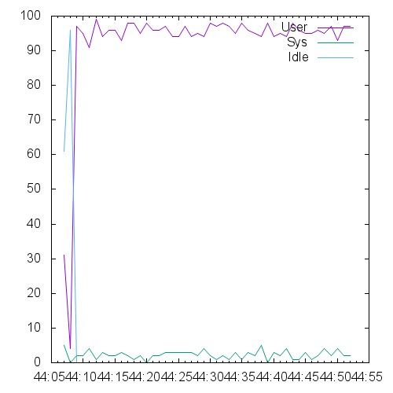 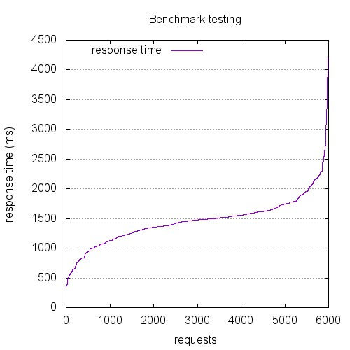 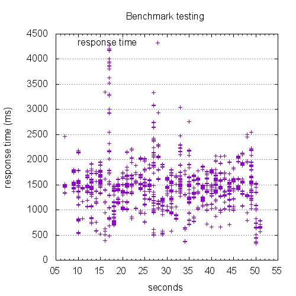

```
This is ApacheBench, Version 2.3 <$Revision: 1528965 $>
Copyright 1996 Adam Twiss, Zeus Technology Ltd, http://www.zeustech.net/
Licensed to The Apache Software Foundation, http://www.apache.org/

Benchmarking 10.129.0.26 (be patient)


Server Software:        nginx/1.4.6
Server Hostname:        10.129.0.26
Server Port:            443
SSL/TLS Protocol:       TLSv1.2,ECDHE-RSA-AES256-SHA,2048,256

Document Path:          /index.html
Document Length:        0 bytes

Concurrency Level:      200
Time taken for tests:   44.143 seconds
Complete requests:      6000
Failed requests:        0
Total transferred:      1308000 bytes
HTML transferred:       0 bytes
Requests per second:    135.92 [#/sec] (mean)
Time per request:       1471.421 [ms] (mean)
Time per request:       7.357 [ms] (mean, across all concurrent requests)
Transfer rate:          28.94 [Kbytes/sec] received

Connection Times (ms)
              min  mean[+/-sd] median   max
Connect:      105  718 414.1    690    3272
Processing:    51  749 311.4    748    3217
Waiting:       51  749 311.4    748    3217
Total:        254 1467 431.2   1477    4281

Percentage of the requests served within a certain time (ms)
  50%   1477
  66%   1554
  75%   1619
  80%   1679
  90%   1900
  95%   2158
  98%   2462
  99%   3002
 100%   4281 (longest request)
```

## 7500-conc-250

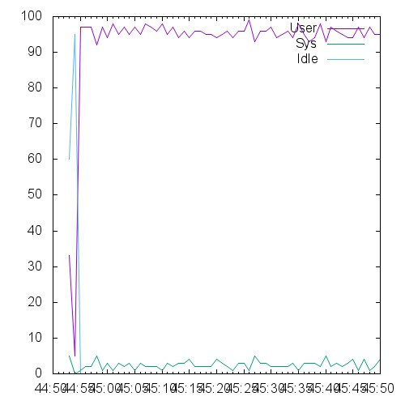 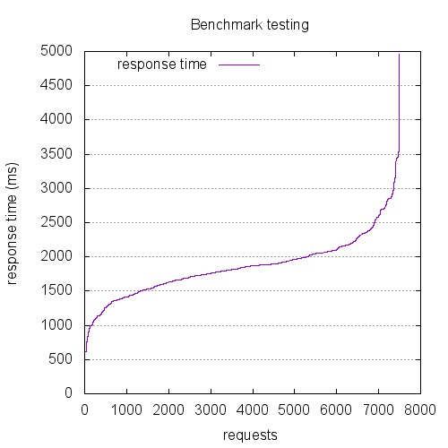 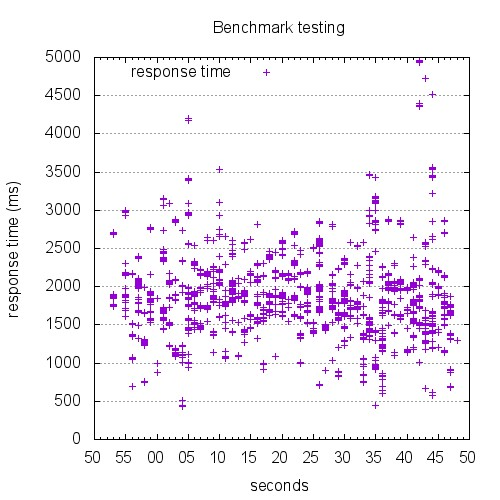

```
This is ApacheBench, Version 2.3 <$Revision: 1528965 $>
Copyright 1996 Adam Twiss, Zeus Technology Ltd, http://www.zeustech.net/
Licensed to The Apache Software Foundation, http://www.apache.org/

Benchmarking 10.129.0.26 (be patient)


Server Software:        nginx/1.4.6
Server Hostname:        10.129.0.26
Server Port:            443
SSL/TLS Protocol:       TLSv1.2,ECDHE-RSA-AES256-SHA,2048,256

Document Path:          /index.html
Document Length:        0 bytes

Concurrency Level:      250
Time taken for tests:   56.055 seconds
Complete requests:      7500
Failed requests:        0
Total transferred:      1635000 bytes
HTML transferred:       0 bytes
Requests per second:    133.80 [#/sec] (mean)
Time per request:       1868.507 [ms] (mean)
Time per request:       7.474 [ms] (mean, across all concurrent requests)
Transfer rate:          28.48 [Kbytes/sec] received

Connection Times (ms)
              min  mean[+/-sd] median   max
Connect:       76  880 380.6    855    2706
Processing:    89  979 402.7    965    3729
Waiting:       89  979 402.7    965    3729
Total:        433 1859 453.4   1845    4958

Percentage of the requests served within a certain time (ms)
  50%   1845
  66%   1956
  75%   2057
  80%   2104
  90%   2382
  95%   2702
  98%   2973
  99%   3416
 100%   4958 (longest request)
```

## 9000-conc-300

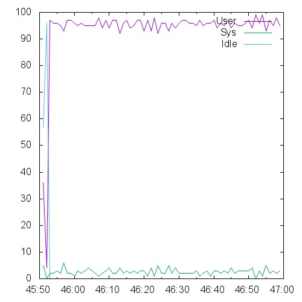 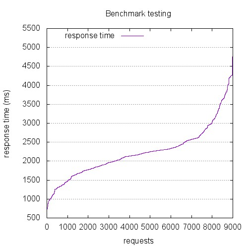 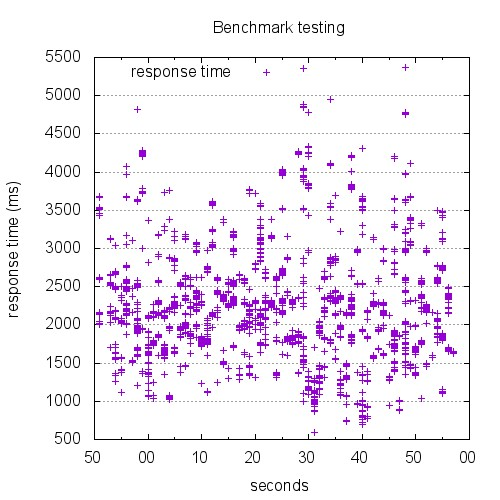

```
This is ApacheBench, Version 2.3 <$Revision: 1528965 $>
Copyright 1996 Adam Twiss, Zeus Technology Ltd, http://www.zeustech.net/
Licensed to The Apache Software Foundation, http://www.apache.org/

Benchmarking 10.129.0.26 (be patient)


Server Software:        nginx/1.4.6
Server Hostname:        10.129.0.26
Server Port:            443
SSL/TLS Protocol:       TLSv1.2,ECDHE-RSA-AES256-SHA,2048,256

Document Path:          /index.html
Document Length:        0 bytes

Concurrency Level:      300
Time taken for tests:   67.200 seconds
Complete requests:      9000
Failed requests:        0
Total transferred:      1962000 bytes
HTML transferred:       0 bytes
Requests per second:    133.93 [#/sec] (mean)
Time per request:       2240.005 [ms] (mean)
Time per request:       7.467 [ms] (mean, across all concurrent requests)
Transfer rate:          28.51 [Kbytes/sec] received

Connection Times (ms)
              min  mean[+/-sd] median   max
Connect:      141 1060 524.3    948    3914
Processing:    92 1174 483.3   1149    3612
Waiting:       92 1174 483.3   1149    3612
Total:        583 2234 674.6   2186    5364

Percentage of the requests served within a certain time (ms)
  50%   2186
  66%   2322
  75%   2528
  80%   2601
  90%   3119
  95%   3649
  98%   4196
  99%   4247
 100%   5364 (longest request)
```

