# Vulcand+CloudFlare patch SSL with Keepalive
## 10500-conc-350-keepalive

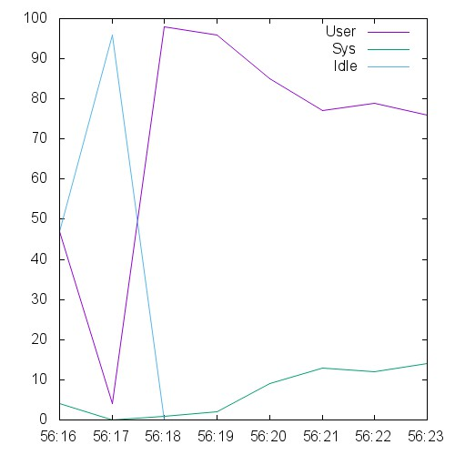 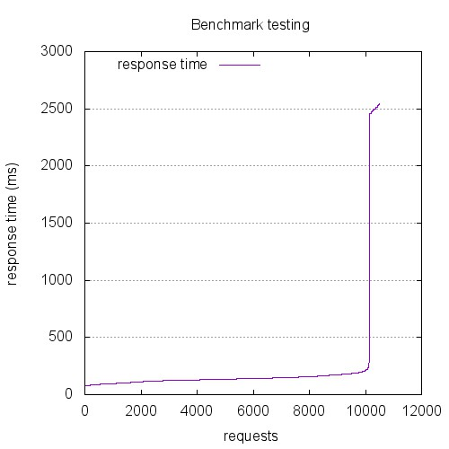 

```
This is ApacheBench, Version 2.3 <$Revision: 1528965 $>
Copyright 1996 Adam Twiss, Zeus Technology Ltd, http://www.zeustech.net/
Licensed to The Apache Software Foundation, http://www.apache.org/

Benchmarking 10.129.0.26 (be patient)


Server Software:        nginx/1.4.6
Server Hostname:        10.129.0.26
Server Port:            443
SSL/TLS Protocol:       TLSv1.2,ECDHE-RSA-AES256-SHA,2048,256

Document Path:          /index.html
Document Length:        0 bytes

Concurrency Level:      350
Time taken for tests:   6.515 seconds
Complete requests:      10500
Failed requests:        0
Keep-Alive requests:    10500
Total transferred:      2541000 bytes
HTML transferred:       0 bytes
Requests per second:    1611.78 [#/sec] (mean)
Time per request:       217.152 [ms] (mean)
Time per request:       0.620 [ms] (mean, across all concurrent requests)
Transfer rate:          380.91 [Kbytes/sec] received

Connection Times (ms)
              min  mean[+/-sd] median   max
Connect:        0   72 392.4      0    2438
Processing:    37  143  62.0    136    1289
Waiting:       37  143  62.0    136    1289
Total:         37  216 424.5    136    2542

Percentage of the requests served within a certain time (ms)
  50%    136
  66%    148
  75%    156
  80%    162
  90%    183
  95%    209
  98%   2488
  99%   2513
 100%   2542 (longest request)
```

## 1200-conc-40-keepalive

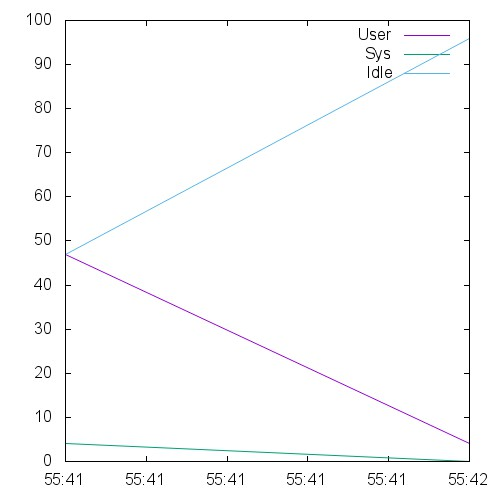 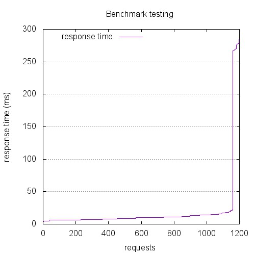 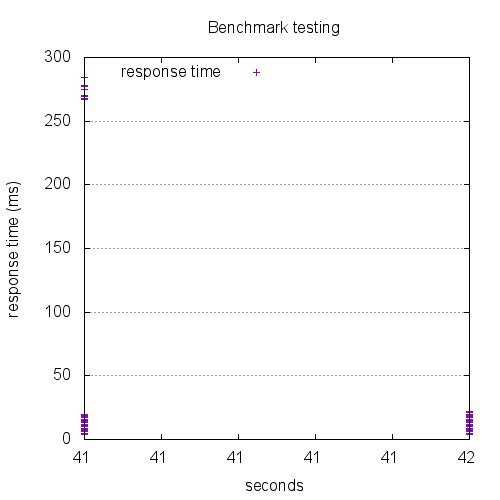

```
This is ApacheBench, Version 2.3 <$Revision: 1528965 $>
Copyright 1996 Adam Twiss, Zeus Technology Ltd, http://www.zeustech.net/
Licensed to The Apache Software Foundation, http://www.apache.org/

Benchmarking 10.129.0.26 (be patient)


Server Software:        nginx/1.4.6
Server Hostname:        10.129.0.26
Server Port:            443
SSL/TLS Protocol:       TLSv1.2,ECDHE-RSA-AES256-SHA,2048,256

Document Path:          /index.html
Document Length:        0 bytes

Concurrency Level:      40
Time taken for tests:   0.563 seconds
Complete requests:      1200
Failed requests:        0
Keep-Alive requests:    1200
Total transferred:      290400 bytes
HTML transferred:       0 bytes
Requests per second:    2130.78 [#/sec] (mean)
Time per request:       18.772 [ms] (mean)
Time per request:       0.469 [ms] (mean, across all concurrent requests)
Transfer rate:          503.56 [Kbytes/sec] received

Connection Times (ms)
              min  mean[+/-sd] median   max
Connect:        0    9  46.1      0     263
Processing:     4   10   3.8     10      26
Waiting:        4   10   3.8     10      26
Total:          4   19  47.2     10     284

Percentage of the requests served within a certain time (ms)
  50%     10
  66%     11
  75%     13
  80%     14
  90%     16
  95%     19
  98%    269
  99%    277
 100%    284 (longest request)
```

## 12000-conc-400-keepalive

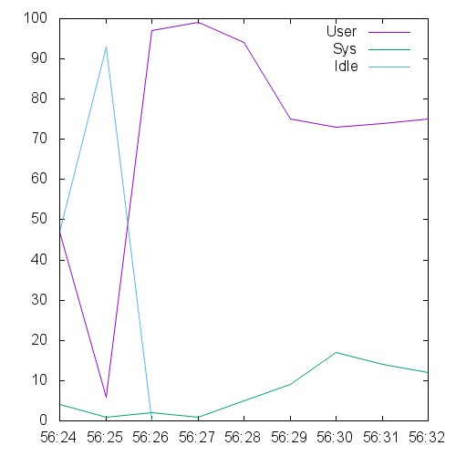  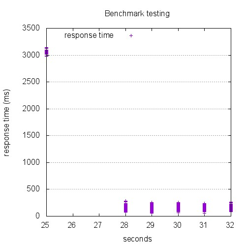

```
This is ApacheBench, Version 2.3 <$Revision: 1528965 $>
Copyright 1996 Adam Twiss, Zeus Technology Ltd, http://www.zeustech.net/
Licensed to The Apache Software Foundation, http://www.apache.org/

Benchmarking 10.129.0.26 (be patient)


Server Software:        nginx/1.4.6
Server Hostname:        10.129.0.26
Server Port:            443
SSL/TLS Protocol:       TLSv1.2,ECDHE-RSA-AES256-SHA,2048,256

Document Path:          /index.html
Document Length:        0 bytes

Concurrency Level:      400
Time taken for tests:   7.503 seconds
Complete requests:      12000
Failed requests:        0
Keep-Alive requests:    12000
Total transferred:      2904000 bytes
HTML transferred:       0 bytes
Requests per second:    1599.37 [#/sec] (mean)
Time per request:       250.099 [ms] (mean)
Time per request:       0.625 [ms] (mean, across all concurrent requests)
Transfer rate:          377.98 [Kbytes/sec] received

Connection Times (ms)
              min  mean[+/-sd] median   max
Connect:        0   89 482.9      0    2964
Processing:    47  160  84.9    151    1756
Waiting:       47  160  84.9    151    1755
Total:         47  248 525.6    151    3144

Percentage of the requests served within a certain time (ms)
  50%    151
  66%    164
  75%    172
  80%    181
  90%    206
  95%    227
  98%   3057
  99%   3086
 100%   3144 (longest request)
```

## 13500-conc-450-keepalive

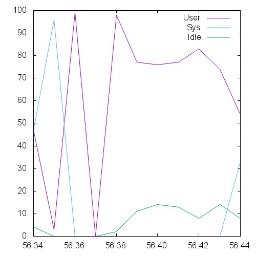 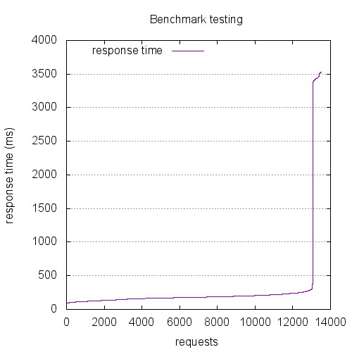 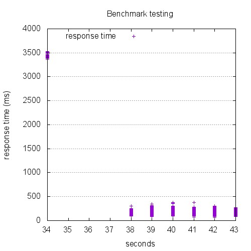

```
This is ApacheBench, Version 2.3 <$Revision: 1528965 $>
Copyright 1996 Adam Twiss, Zeus Technology Ltd, http://www.zeustech.net/
Licensed to The Apache Software Foundation, http://www.apache.org/

Benchmarking 10.129.0.26 (be patient)


Server Software:        nginx/1.4.6
Server Hostname:        10.129.0.26
Server Port:            443
SSL/TLS Protocol:       TLSv1.2,ECDHE-RSA-AES256-SHA,2048,256

Document Path:          /index.html
Document Length:        0 bytes

Concurrency Level:      450
Time taken for tests:   8.690 seconds
Complete requests:      13500
Failed requests:        0
Keep-Alive requests:    13500
Total transferred:      3267000 bytes
HTML transferred:       0 bytes
Requests per second:    1553.51 [#/sec] (mean)
Time per request:       289.666 [ms] (mean)
Time per request:       0.644 [ms] (mean, across all concurrent requests)
Transfer rate:          367.14 [Kbytes/sec] received

Connection Times (ms)
              min  mean[+/-sd] median   max
Connect:        0  105 566.7      0    3364
Processing:    52  183  53.9    179    1031
Waiting:       52  183  53.9    179    1031
Total:         52  288 587.9    179    3532

Percentage of the requests served within a certain time (ms)
  50%    179
  66%    194
  75%    206
  80%    215
  90%    243
  95%    275
  98%   3432
  99%   3458
 100%   3532 (longest request)
```

## 15000-conc-500-keepalive

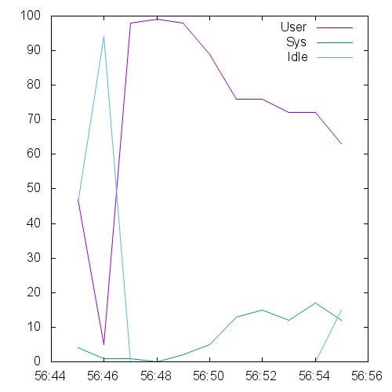 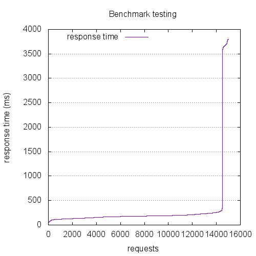 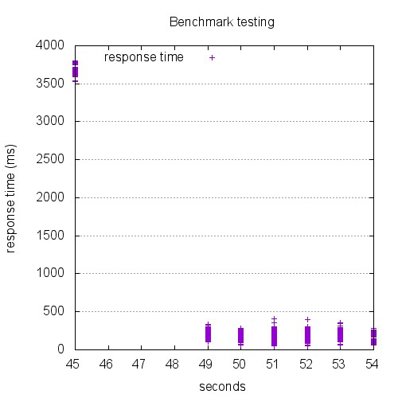

```
This is ApacheBench, Version 2.3 <$Revision: 1528965 $>
Copyright 1996 Adam Twiss, Zeus Technology Ltd, http://www.zeustech.net/
Licensed to The Apache Software Foundation, http://www.apache.org/

Benchmarking 10.129.0.26 (be patient)


Server Software:        nginx/1.4.6
Server Hostname:        10.129.0.26
Server Port:            443
SSL/TLS Protocol:       TLSv1.2,ECDHE-RSA-AES256-SHA,2048,256

Document Path:          /index.html
Document Length:        0 bytes

Concurrency Level:      500
Time taken for tests:   8.874 seconds
Complete requests:      15000
Failed requests:        0
Non-2xx responses:      269
Keep-Alive requests:    15000
Total transferred:      3604983 bytes
HTML transferred:       0 bytes
Requests per second:    1690.35 [#/sec] (mean)
Time per request:       295.797 [ms] (mean)
Time per request:       0.592 [ms] (mean, across all concurrent requests)
Transfer rate:          396.72 [Kbytes/sec] received

Connection Times (ms)
              min  mean[+/-sd] median   max
Connect:        0   99 538.3      0    3617
Processing:    50  195 132.6    180    1865
Waiting:       50  195 132.6    180    1865
Total:         50  294 630.7    180    3806

Percentage of the requests served within a certain time (ms)
  50%    180
  66%    191
  75%    201
  80%    210
  90%    241
  95%    273
  98%   3662
  99%   3699
 100%   3806 (longest request)
```

## 1800-conc-60-keepalive

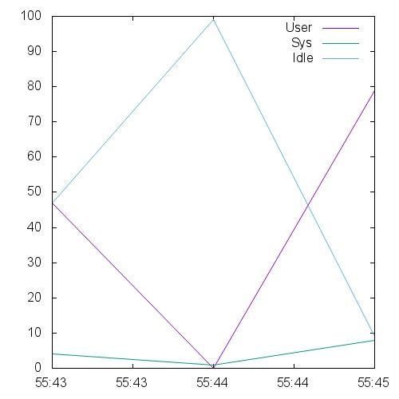 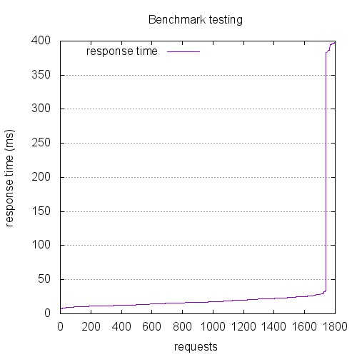 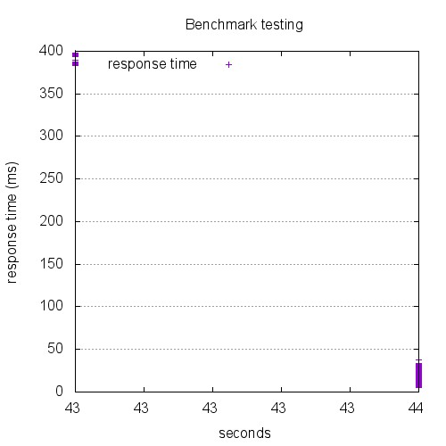

```
This is ApacheBench, Version 2.3 <$Revision: 1528965 $>
Copyright 1996 Adam Twiss, Zeus Technology Ltd, http://www.zeustech.net/
Licensed to The Apache Software Foundation, http://www.apache.org/

Benchmarking 10.129.0.26 (be patient)


Server Software:        nginx/1.4.6
Server Hostname:        10.129.0.26
Server Port:            443
SSL/TLS Protocol:       TLSv1.2,ECDHE-RSA-AES256-SHA,2048,256

Document Path:          /index.html
Document Length:        0 bytes

Concurrency Level:      60
Time taken for tests:   0.899 seconds
Complete requests:      1800
Failed requests:        0
Keep-Alive requests:    1800
Total transferred:      435600 bytes
HTML transferred:       0 bytes
Requests per second:    2002.62 [#/sec] (mean)
Time per request:       29.961 [ms] (mean)
Time per request:       0.499 [ms] (mean, across all concurrent requests)
Transfer rate:          473.28 [Kbytes/sec] received

Connection Times (ms)
              min  mean[+/-sd] median   max
Connect:        0   12  65.0      0     373
Processing:     5   18   7.5     17     223
Waiting:        5   18   7.5     17     223
Total:          5   30  67.3     17     398

Percentage of the requests served within a certain time (ms)
  50%     17
  66%     20
  75%     22
  80%     23
  90%     26
  95%     29
  98%    387
  99%    396
 100%    398 (longest request)
```

## 2400-conc-80-keepalive

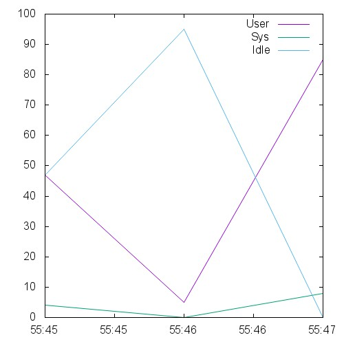 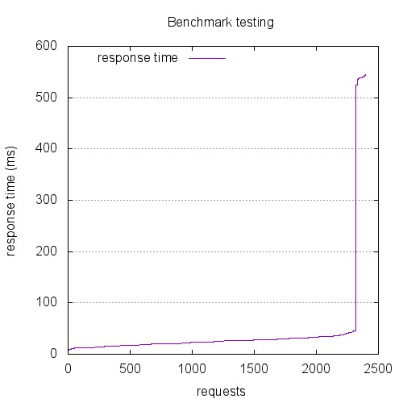 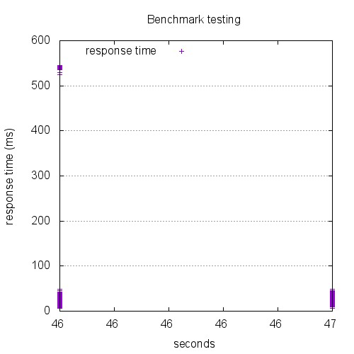

```
This is ApacheBench, Version 2.3 <$Revision: 1528965 $>
Copyright 1996 Adam Twiss, Zeus Technology Ltd, http://www.zeustech.net/
Licensed to The Apache Software Foundation, http://www.apache.org/

Benchmarking 10.129.0.26 (be patient)


Server Software:        nginx/1.4.6
Server Hostname:        10.129.0.26
Server Port:            443
SSL/TLS Protocol:       TLSv1.2,ECDHE-RSA-AES256-SHA,2048,256

Document Path:          /index.html
Document Length:        0 bytes

Concurrency Level:      80
Time taken for tests:   1.255 seconds
Complete requests:      2400
Failed requests:        0
Keep-Alive requests:    2400
Total transferred:      580800 bytes
HTML transferred:       0 bytes
Requests per second:    1912.31 [#/sec] (mean)
Time per request:       41.834 [ms] (mean)
Time per request:       0.523 [ms] (mean, across all concurrent requests)
Transfer rate:          451.93 [Kbytes/sec] received

Connection Times (ms)
              min  mean[+/-sd] median   max
Connect:        0   17  89.7      0     513
Processing:     5   25   8.2     25      61
Waiting:        5   25   8.2     25      61
Total:          5   42  92.4     25     545

Percentage of the requests served within a certain time (ms)
  50%     25
  66%     28
  75%     31
  80%     32
  90%     36
  95%     42
  98%    538
  99%    540
 100%    545 (longest request)
```

## 3000-conc-100-keepalive

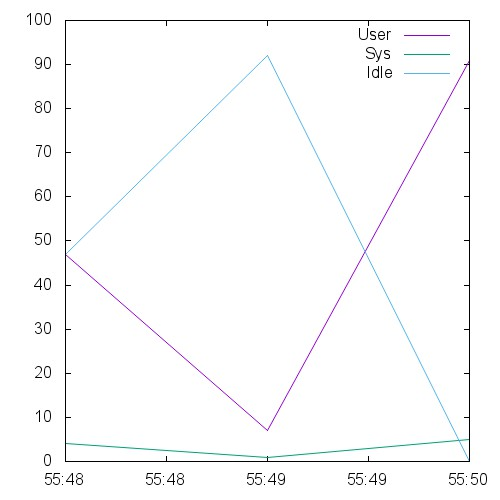 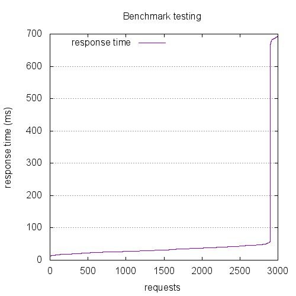 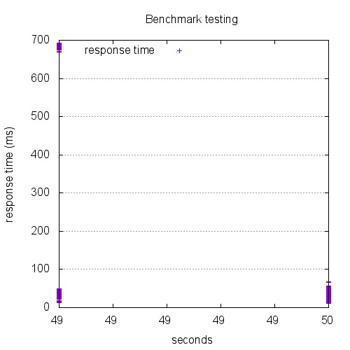

```
This is ApacheBench, Version 2.3 <$Revision: 1528965 $>
Copyright 1996 Adam Twiss, Zeus Technology Ltd, http://www.zeustech.net/
Licensed to The Apache Software Foundation, http://www.apache.org/

Benchmarking 10.129.0.26 (be patient)


Server Software:        nginx/1.4.6
Server Hostname:        10.129.0.26
Server Port:            443
SSL/TLS Protocol:       TLSv1.2,ECDHE-RSA-AES256-SHA,2048,256

Document Path:          /index.html
Document Length:        0 bytes

Concurrency Level:      100
Time taken for tests:   1.619 seconds
Complete requests:      3000
Failed requests:        0
Keep-Alive requests:    3000
Total transferred:      726000 bytes
HTML transferred:       0 bytes
Requests per second:    1852.55 [#/sec] (mean)
Time per request:       53.980 [ms] (mean)
Time per request:       0.540 [ms] (mean, across all concurrent requests)
Transfer rate:          437.81 [Kbytes/sec] received

Connection Times (ms)
              min  mean[+/-sd] median   max
Connect:        0   20 111.4      0     668
Processing:     6   34  27.2     32     609
Waiting:        6   34  27.2     32     609
Total:          6   54 117.6     32     692

Percentage of the requests served within a certain time (ms)
  50%     32
  66%     37
  75%     40
  80%     42
  90%     46
  95%     52
  98%    685
  99%    689
 100%    692 (longest request)
```

## 4500-conc-150-keepalive

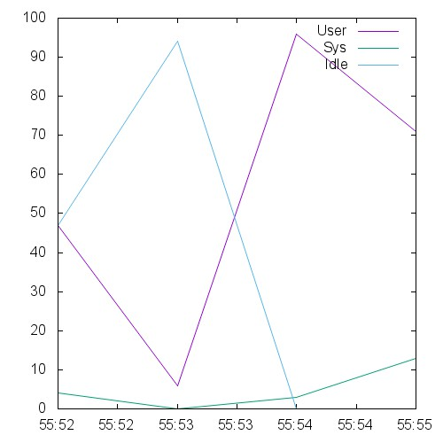 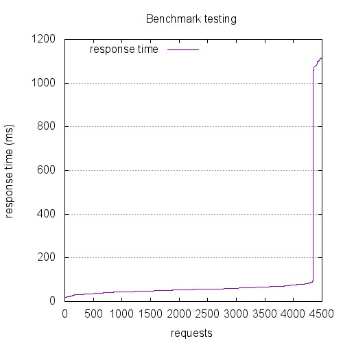 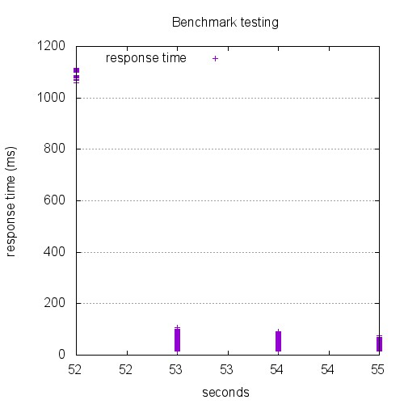

```
This is ApacheBench, Version 2.3 <$Revision: 1528965 $>
Copyright 1996 Adam Twiss, Zeus Technology Ltd, http://www.zeustech.net/
Licensed to The Apache Software Foundation, http://www.apache.org/

Benchmarking 10.129.0.26 (be patient)


Server Software:        nginx/1.4.6
Server Hostname:        10.129.0.26
Server Port:            443
SSL/TLS Protocol:       TLSv1.2,ECDHE-RSA-AES256-SHA,2048,256

Document Path:          /index.html
Document Length:        0 bytes

Concurrency Level:      150
Time taken for tests:   2.684 seconds
Complete requests:      4500
Failed requests:        0
Keep-Alive requests:    4500
Total transferred:      1089000 bytes
HTML transferred:       0 bytes
Requests per second:    1676.79 [#/sec] (mean)
Time per request:       89.457 [ms] (mean)
Time per request:       0.596 [ms] (mean, across all concurrent requests)
Transfer rate:          396.27 [Kbytes/sec] received

Connection Times (ms)
              min  mean[+/-sd] median   max
Connect:        0   26 147.7      0    1056
Processing:    13   62  62.7     54     910
Waiting:       13   62  62.7     54     910
Total:         13   89 187.2     54    1116

Percentage of the requests served within a certain time (ms)
  50%     54
  66%     61
  75%     65
  80%     68
  90%     76
  95%     85
  98%   1083
  99%   1105
 100%   1116 (longest request)
```

## 600-conc-20-keepalive

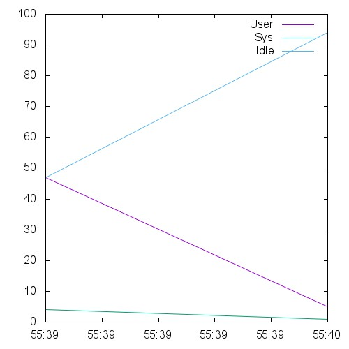 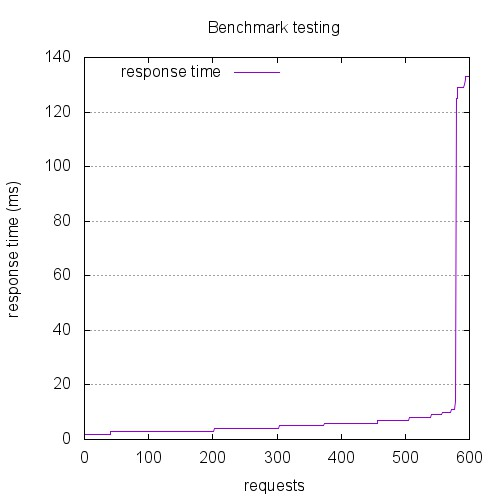 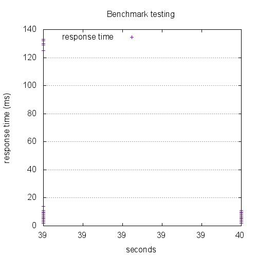

```
This is ApacheBench, Version 2.3 <$Revision: 1528965 $>
Copyright 1996 Adam Twiss, Zeus Technology Ltd, http://www.zeustech.net/
Licensed to The Apache Software Foundation, http://www.apache.org/

Benchmarking 10.129.0.26 (be patient)


Server Software:        nginx/1.4.6
Server Hostname:        10.129.0.26
Server Port:            443
SSL/TLS Protocol:       TLSv1.2,ECDHE-RSA-AES256-SHA,2048,256

Document Path:          /index.html
Document Length:        0 bytes

Concurrency Level:      20
Time taken for tests:   0.273 seconds
Complete requests:      600
Failed requests:        0
Keep-Alive requests:    600
Total transferred:      145200 bytes
HTML transferred:       0 bytes
Requests per second:    2200.93 [#/sec] (mean)
Time per request:       9.087 [ms] (mean)
Time per request:       0.454 [ms] (mean, across all concurrent requests)
Transfer rate:          520.14 [Kbytes/sec] received

Connection Times (ms)
              min  mean[+/-sd] median   max
Connect:        0    4  20.6      0     124
Processing:     2    5   5.9      4     100
Waiting:        2    5   5.9      4     100
Total:          2    9  22.5      4     133

Percentage of the requests served within a certain time (ms)
  50%      4
  66%      6
  75%      6
  80%      7
  90%      8
  95%     10
  98%    129
  99%    132
 100%    133 (longest request)
```

## 6000-conc-200-keepalive

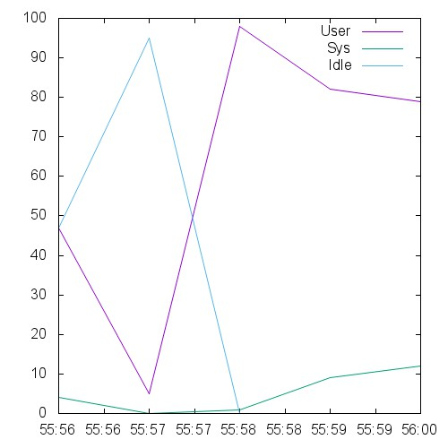 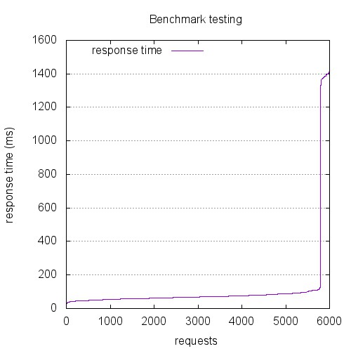 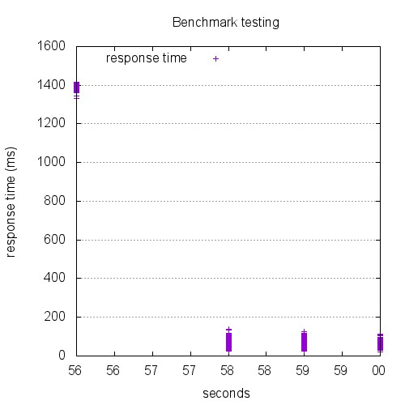

```
This is ApacheBench, Version 2.3 <$Revision: 1528965 $>
Copyright 1996 Adam Twiss, Zeus Technology Ltd, http://www.zeustech.net/
Licensed to The Apache Software Foundation, http://www.apache.org/

Benchmarking 10.129.0.26 (be patient)


Server Software:        nginx/1.4.6
Server Hostname:        10.129.0.26
Server Port:            443
SSL/TLS Protocol:       TLSv1.2,ECDHE-RSA-AES256-SHA,2048,256

Document Path:          /index.html
Document Length:        0 bytes

Concurrency Level:      200
Time taken for tests:   3.430 seconds
Complete requests:      6000
Failed requests:        0
Keep-Alive requests:    6000
Total transferred:      1452000 bytes
HTML transferred:       0 bytes
Requests per second:    1749.35 [#/sec] (mean)
Time per request:       114.328 [ms] (mean)
Time per request:       0.572 [ms] (mean, across all concurrent requests)
Transfer rate:          413.42 [Kbytes/sec] received

Connection Times (ms)
              min  mean[+/-sd] median   max
Connect:        0   33 189.7      0    1336
Processing:    21   80  88.9     69     833
Waiting:       21   80  88.9     69     833
Total:         21  113 237.0     69    1417

Percentage of the requests served within a certain time (ms)
  50%     69
  66%     76
  75%     81
  80%     85
  90%     96
  95%    109
  98%   1383
  99%   1397
 100%   1417 (longest request)
```

## 7500-conc-250-keepalive

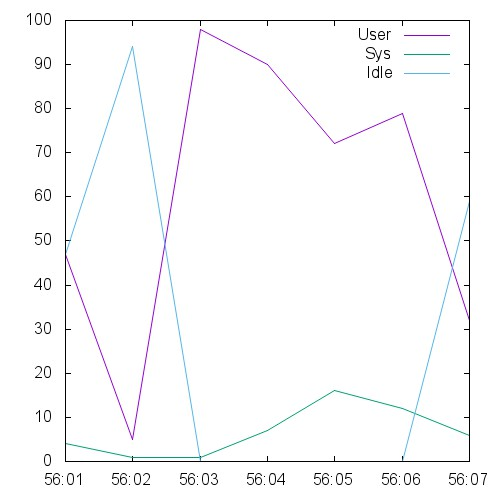 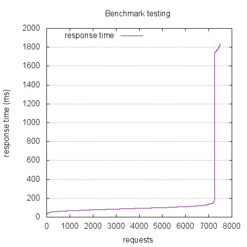 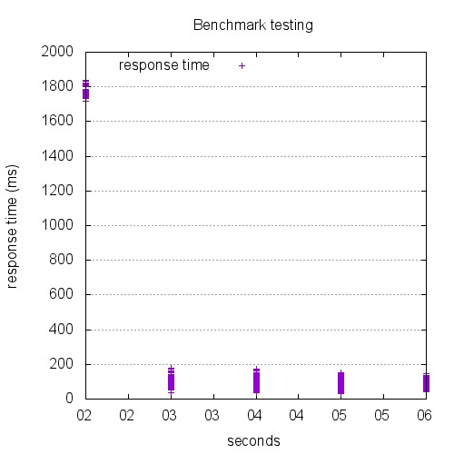

```
This is ApacheBench, Version 2.3 <$Revision: 1528965 $>
Copyright 1996 Adam Twiss, Zeus Technology Ltd, http://www.zeustech.net/
Licensed to The Apache Software Foundation, http://www.apache.org/

Benchmarking 10.129.0.26 (be patient)


Server Software:        nginx/1.4.6
Server Hostname:        10.129.0.26
Server Port:            443
SSL/TLS Protocol:       TLSv1.2,ECDHE-RSA-AES256-SHA,2048,256

Document Path:          /index.html
Document Length:        0 bytes

Concurrency Level:      250
Time taken for tests:   4.450 seconds
Complete requests:      7500
Failed requests:        0
Keep-Alive requests:    7500
Total transferred:      1815000 bytes
HTML transferred:       0 bytes
Requests per second:    1685.45 [#/sec] (mean)
Time per request:       148.328 [ms] (mean)
Time per request:       0.593 [ms] (mean, across all concurrent requests)
Transfer rate:          398.32 [Kbytes/sec] received

Connection Times (ms)
              min  mean[+/-sd] median   max
Connect:        0   45 250.0      0    1718
Processing:    26  102  85.7     91    1155
Waiting:       26  102  85.7     91    1155
Total:         26  147 303.4     91    1839

Percentage of the requests served within a certain time (ms)
  50%     91
  66%    100
  75%    107
  80%    111
  90%    125
  95%    146
  98%   1769
  99%   1784
 100%   1839 (longest request)
```

## 9000-conc-300-keepalive

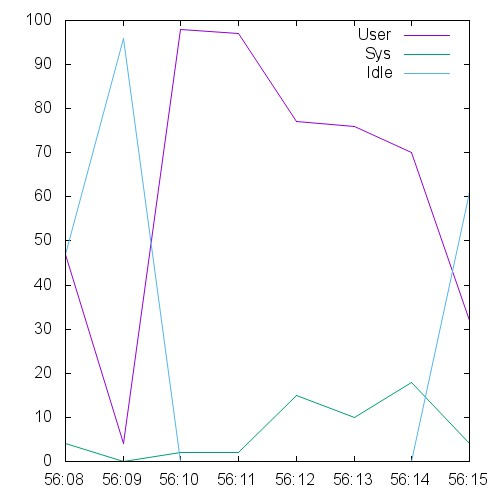 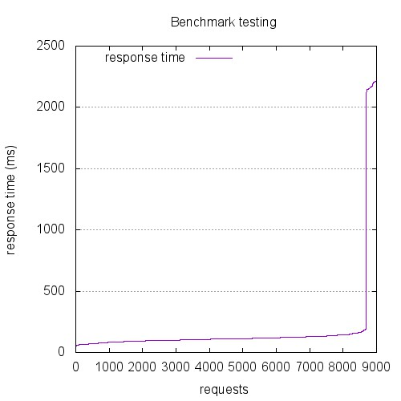 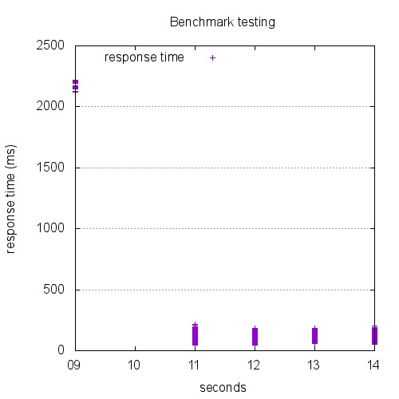

```
This is ApacheBench, Version 2.3 <$Revision: 1528965 $>
Copyright 1996 Adam Twiss, Zeus Technology Ltd, http://www.zeustech.net/
Licensed to The Apache Software Foundation, http://www.apache.org/

Benchmarking 10.129.0.26 (be patient)


Server Software:        nginx/1.4.6
Server Hostname:        10.129.0.26
Server Port:            443
SSL/TLS Protocol:       TLSv1.2,ECDHE-RSA-AES256-SHA,2048,256

Document Path:          /index.html
Document Length:        0 bytes

Concurrency Level:      300
Time taken for tests:   5.409 seconds
Complete requests:      9000
Failed requests:        0
Keep-Alive requests:    9000
Total transferred:      2178000 bytes
HTML transferred:       0 bytes
Requests per second:    1663.94 [#/sec] (mean)
Time per request:       180.295 [ms] (mean)
Time per request:       0.601 [ms] (mean, across all concurrent requests)
Transfer rate:          393.23 [Kbytes/sec] received

Connection Times (ms)
              min  mean[+/-sd] median   max
Connect:        0   62 336.1      0    2099
Processing:    36  117  59.4    110    1112
Waiting:       36  117  59.4    110    1112
Total:         36  179 371.5    110    2216

Percentage of the requests served within a certain time (ms)
  50%    110
  66%    120
  75%    126
  80%    130
  90%    145
  95%    168
  98%   2164
  99%   2204
 100%   2216 (longest request)
```

